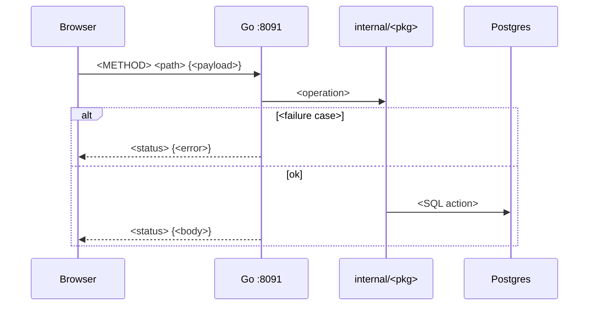

# Workflow section template — append to 02-workflow.md

```markdown
## N. <Flow title> (Sprint N)



### State: <entity> (if applicable)

| Status | Meaning |
| --- | --- |
| `active` | … |
| `ended` | … |
```