# Workflows — Monti Jarvis

## 1. Portal load

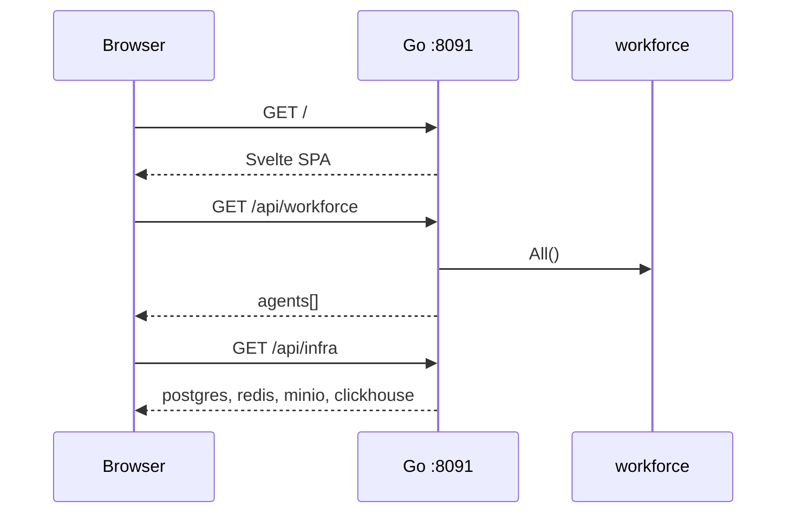

## 2. Text chat (with RAG)

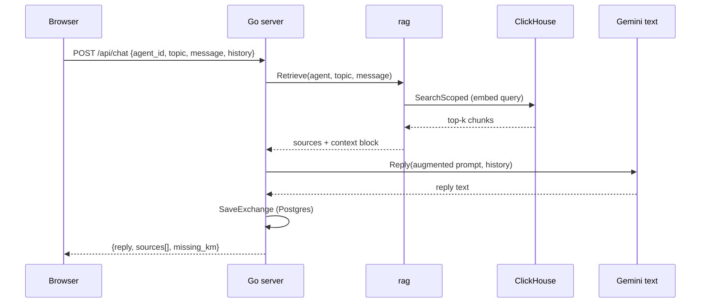

## 3. Voice call

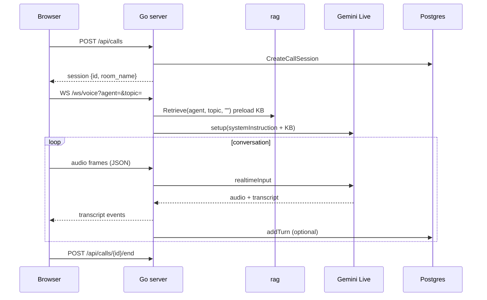

## 4. KM ingest (per avatar)

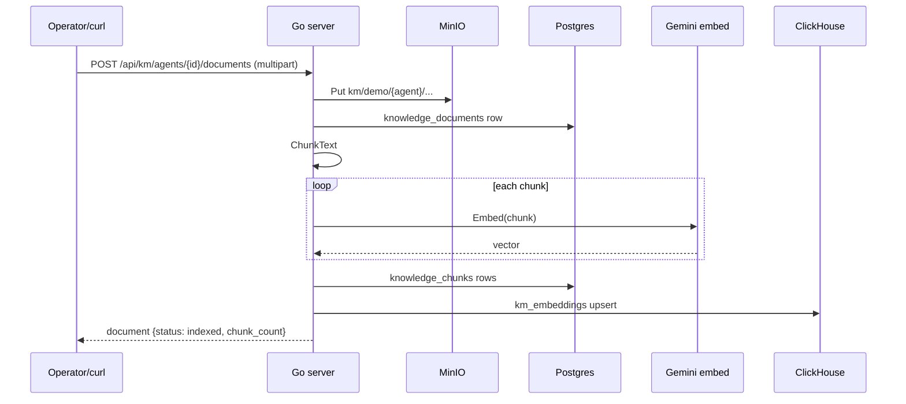

## 5. KM reset (per avatar)

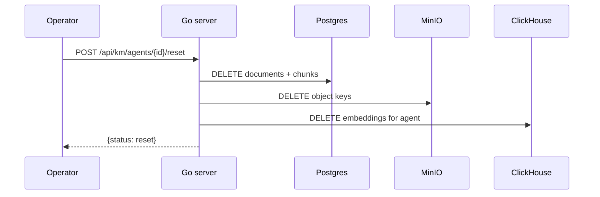

## 6. Call events (SSE)

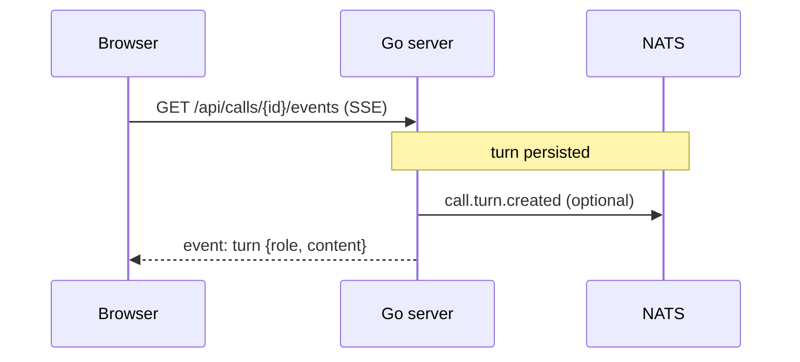

## 6. Auth login (Sprint 3 — draft)

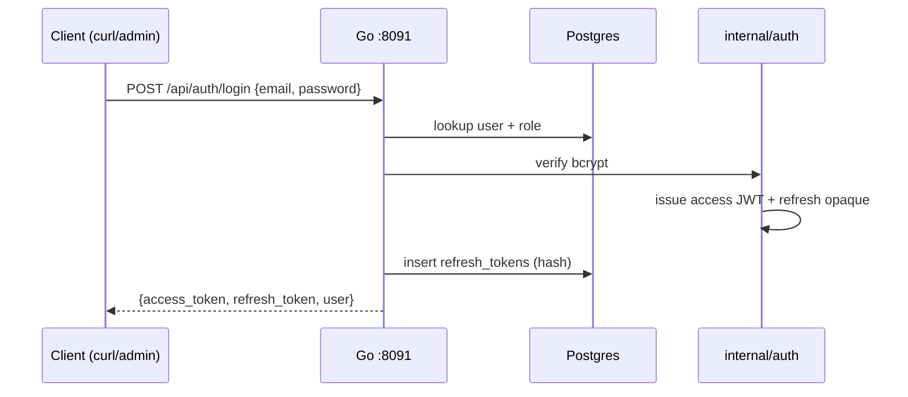

## 7. Protected KM upload (auth enabled)

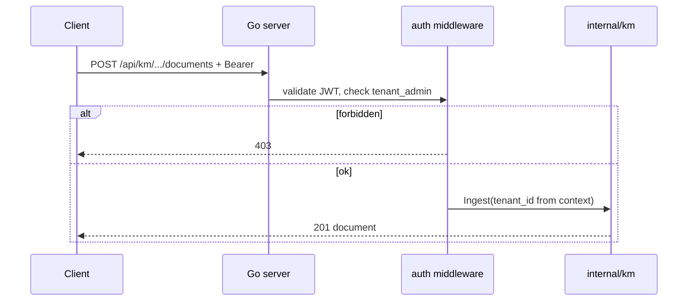

## 8. Dev bypass (`AUTH_DISABLED=true`)

No login required. All handlers use `tenant_id = DEMO_TENANT_ID`. Identical to v0.3.0 flows above.

## State: call session

| Status | Meaning |
| --- | --- |
| `active` | Call in progress; Redis key `monti_jarvis:call:active:{id}` |
| `ended` | `ended_at` set; Redis key removed |

## State: knowledge document

| Status | Meaning |
| --- | --- |
| `uploaded` | MinIO object stored |
| `indexing` | Chunk + embed in progress |
| `indexed` | Postgres + ClickHouse ready |
| `failed` | Embed or index error |

## 9. Package catalog CRUD (Sprint 4)

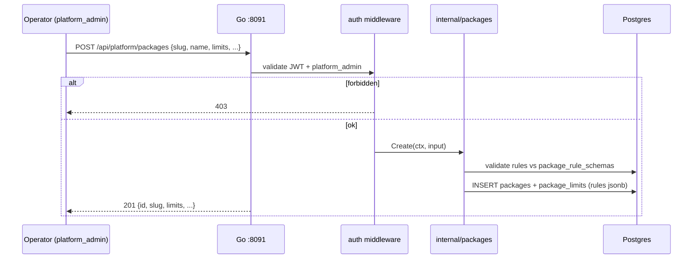

## 10. Assign tenant entitlement (Sprint 4)

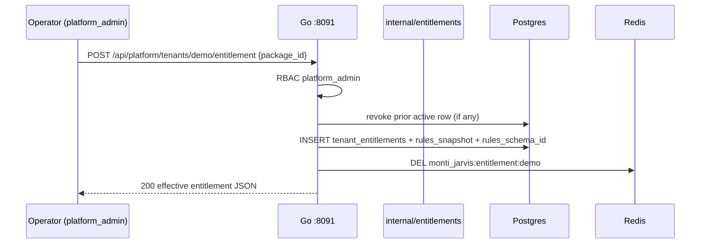

## 11. Entitlement resolve + cache (Sprint 4)

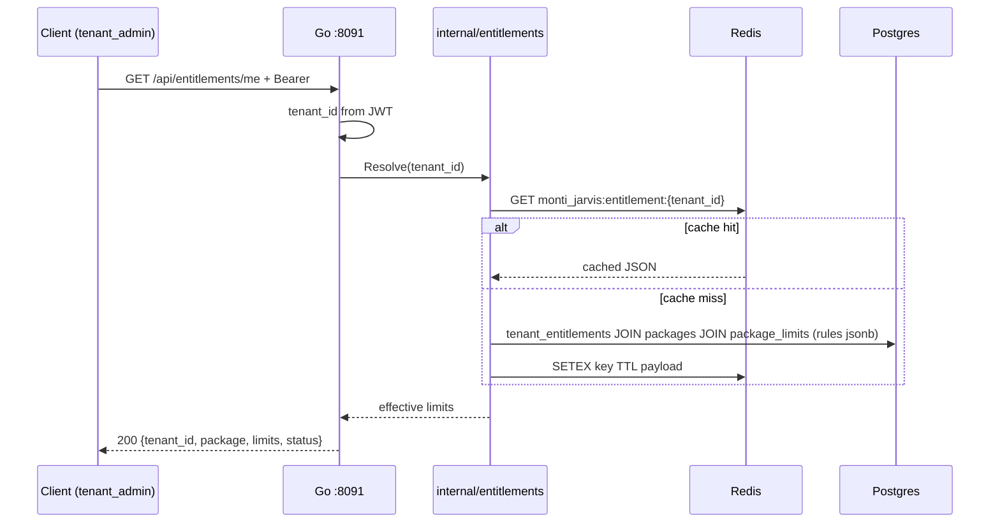

## State: package (Sprint 4)

| Status | Meaning |
| --- | --- |
| `draft` | Not assignable; hidden from default list |
| `active` | Assignable to tenants |
| `archived` | No new assignments; existing entitlements honored until revoked |

## State: tenant entitlement (Sprint 4)

| Status | Meaning |
| --- | --- |
| `active` | Tenant receives package limits (at most one per tenant) |
| `suspended` | Limits withheld; row kept for audit |
| `revoked` | Operator ended entitlement; resolver returns fallback |
| `expired` | `valid_until` passed (Sprint 9+ subscriptions) |

## 12. Platform admin login (Sprint 4)

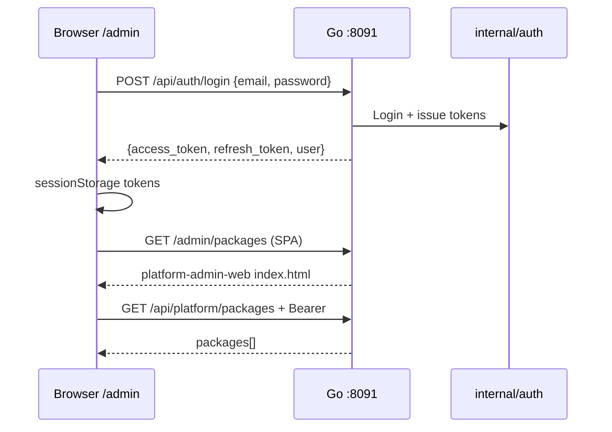

## 13. Platform admin logout (Sprint 4)

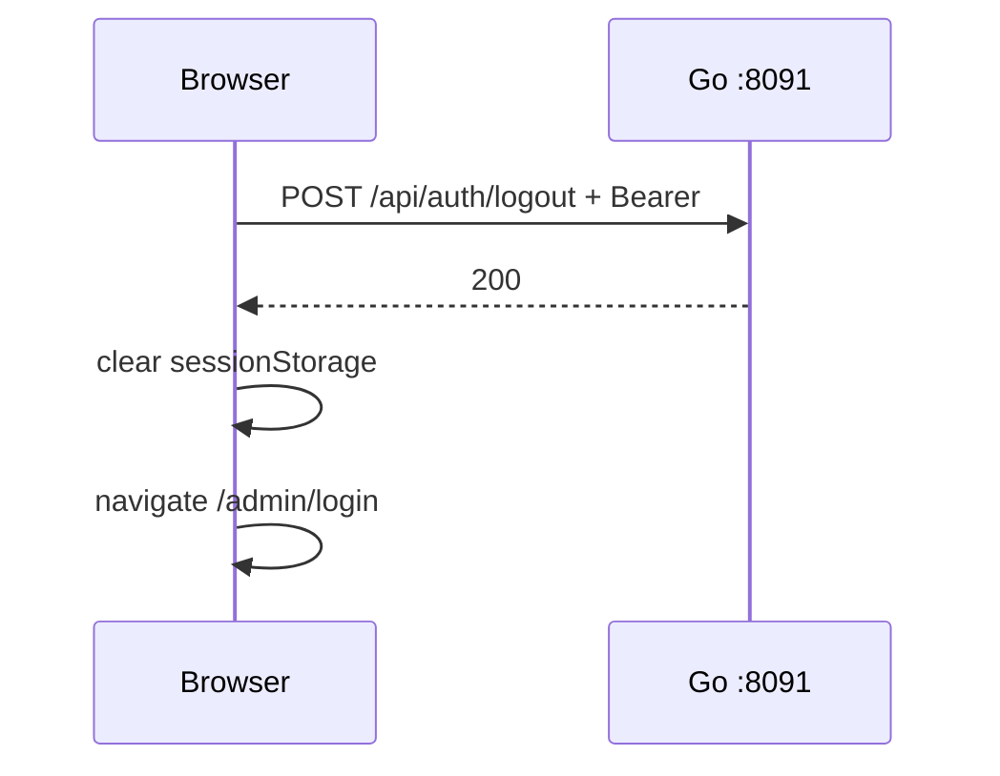

## 14. Avatar catalog CRUD (Sprint 5)

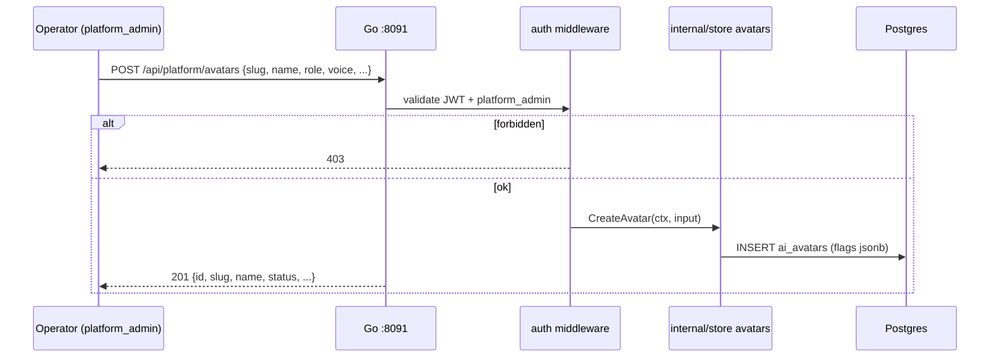

## 15. Assign tenant avatar (Sprint 5)

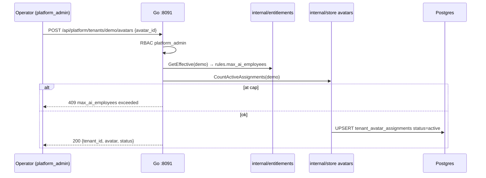

## 16. Workforce resolve (Sprint 5)

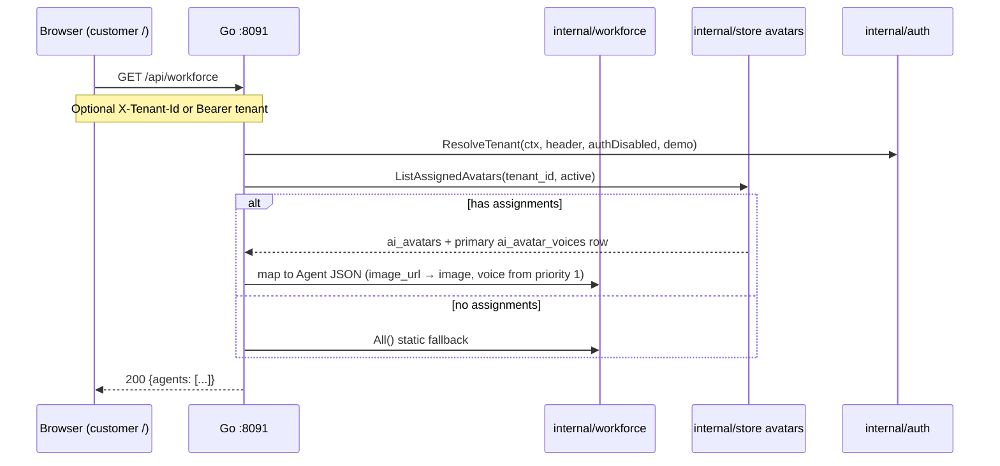

## State: avatar (Sprint 5)

| Status | Meaning |
| --- | --- |
| `draft` | Not assignable; hidden from default platform list |
| `active` | Assignable to tenants; eligible for workforce when assigned |
| `archived` | No new assignments; existing assignments may be disabled by operator |

## State: tenant avatar assignment (Sprint 5)

| Status | Meaning |
| --- | --- |
| `active` | Avatar appears in tenant `/api/workforce` list |
| `disabled` | Assignment revoked; avatar hidden from tenant workforce |

## State: avatar voice profile (Sprint 5)

| Status | Meaning |
| --- | --- |
| `active` | Eligible for primary selection or failover (by `priority`) |
| `disabled` | Skipped by resolver; kept for audit / future enable |

**Failover order:** ascending `priority` among `active` rows for the same `avatar_id`. Sprint 21 applies this during live calls.

## 17. Customer portal agent pick (unchanged UI, Sprint 5 data)

Customer portal still calls `GET /api/workforce` on load. Sprint 5 only changes **data source** when tenant has assignments; UI components unchanged.

## 18. Tenant self-registration (Sprint 6)

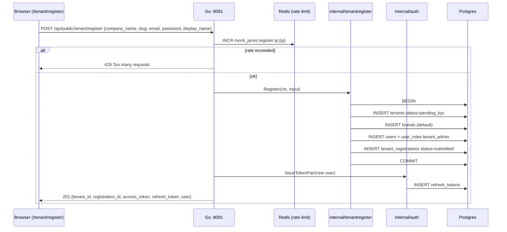

## 19. Registration validation errors (Sprint 6)

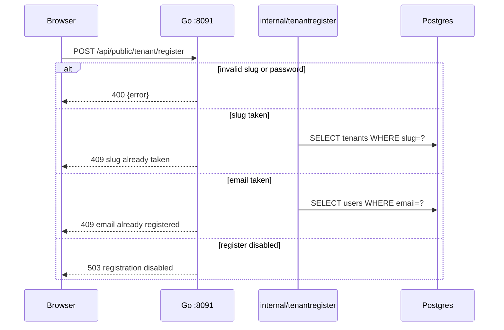

## 20. Platform list pending tenants (Sprint 6)

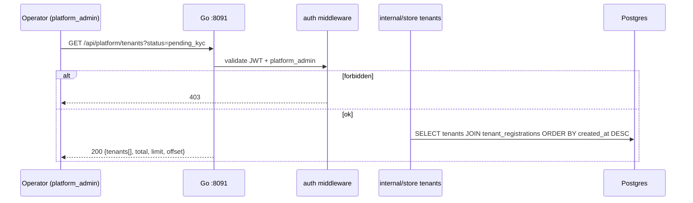

## 21. Pending tenant login (Sprint 6)

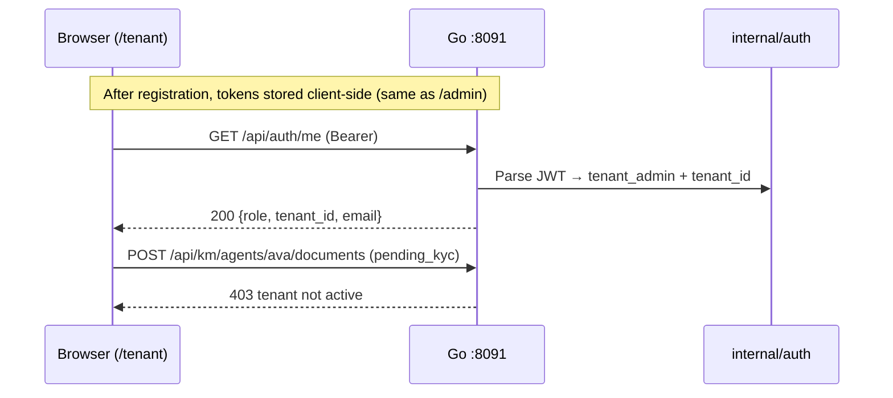

## State: tenant (Sprint 6 extension)

| Status | Meaning |
| --- | --- |
| `pending_kyc` | Self-registered; login OK; KM writes blocked; awaits Sprint 7 approval |
| `active` | Production tenant (seeds, post-KYC) |
| `suspended` | Operator block |

## State: tenant_registration (Sprint 6)

| Status | Meaning |
| --- | --- |
| `submitted` | Signup complete; visible in platform tenant list |

Sprint 7 adds `approved`, `rejected`, reviewer metadata.

## 22. Platform review KYC package (Sprint 7)

```mermaid
sequenceDiagram
  participant Op as Operator (platform_admin)
  participant B as Browser (/admin)
  participant G as Go :8091
  participant M as auth middleware
  participant S as internal/store
  participant DB as Postgres

  Op->>B: Open /admin/tenants/{id}/kyc
  B->>G: GET /api/platform/tenants/{tenant_id}/kyc
  G->>M: validate JWT + platform_admin
  alt forbidden
    M-->>B: 403
  else ok
    S->>DB: SELECT tenants, tenant_registrations, tenant_kyc_profiles
    G-->>B: 200 {tenant, registration, kyc, photo_url, documents[]}
    B->>G: GET /api/assets/kyc/{tenant_id}/photo/...
    G-->>B: image bytes (preview)
  end
```

## 23. Approve KYC (Sprint 7)

```mermaid
sequenceDiagram
  participant Op as Operator (platform_admin)
  participant G as Go :8091
  participant S as internal/store
  participant DB as Postgres
  participant R as internal/resend

  Op->>G: POST /api/platform/tenants/{tenant_id}/kyc/approve
  G->>S: ApproveTenantKYC(ctx, tenant_id, reviewer_id)
  alt tenant not pending_kyc or kyc not submitted
    S-->>G: conflict
    G-->>Op: 409
  else ok
    S->>DB: BEGIN
    S->>DB: UPDATE tenants SET status=active
    S->>DB: UPDATE tenant_registrations SET status=approved, reviewed_*
    S->>DB: UPDATE tenant_kyc_profiles SET status=approved, reviewed_*
    S->>DB: COMMIT
    G->>R: SendKYCApprovedEmail(admin_email) (async, best-effort)
    G-->>Op: 200 {tenant_id, status: active, kyc_status: approved}
  end
```

## 24. Reject KYC (Sprint 7)

```mermaid
sequenceDiagram
  participant Op as Operator (platform_admin)
  participant G as Go :8091
  participant S as internal/store
  participant DB as Postgres
  participant R as internal/resend

  Op->>G: POST /api/platform/tenants/{tenant_id}/kyc/reject {reason}
  alt missing reason
    G-->>Op: 400
  else ok
    G->>S: RejectTenantKYC(ctx, tenant_id, reviewer_id, reason)
    alt kyc not submitted
      S-->>G: conflict
      G-->>Op: 409
    else ok
      S->>DB: BEGIN
      S->>DB: UPDATE tenant_registrations SET status=rejected, rejection_reason
      S->>DB: UPDATE tenant_kyc_profiles SET status=rejected, reviewed_*
      Note over DB: tenants.status stays pending_kyc
      S->>DB: COMMIT
      G->>R: SendKYCRejectedEmail(admin_email, reason)
      G-->>Op: 200 {tenant_id, registration_status: rejected}
    end
  end
```

## State: tenant_kyc_profiles (Sprint 6–7)

| Status | Meaning |
| --- | --- |
| `draft` | Tenant editing contact/photo/docs |
| `submitted` | Awaiting platform review |
| `approved` | Platform approved; tenant is `active` |
| `rejected` | Platform rejected; tenant may resubmit (stretch) |

## State: tenant_registration (Sprint 7)

| Status | Meaning |
| --- | --- |
| `submitted` | Signup complete |
| `approved` | KYC approved; tenant `active` |
| `rejected` | KYC rejected; `rejection_reason` set |

## 25. Platform configure ChillPay gateway (Sprint 8)

```mermaid
sequenceDiagram
  participant Op as Operator (platform_admin)
  participant B as Browser (/admin)
  participant G as Go :8091
  participant M as auth middleware
  participant S as internal/store
  participant DB as Postgres

  Op->>B: Open /admin/settings/payment
  B->>G: GET /api/platform/payment-gateway
  G->>M: validate JWT + platform_admin
  alt forbidden
    M-->>B: 403
  else ok
    S->>DB: SELECT payment_gateway_configs WHERE id=default
    G-->>B: 200 {provider, merchant_code, api_key_masked, md5_key_set, callback_url, ...}
    Op->>B: Edit merchant code, API key, MD5 key, base URL, return URL
    B->>G: PUT /api/platform/payment-gateway {provider: chillpay, ...}
    G->>S: UpsertPaymentGatewayConfig
    S->>DB: INSERT/UPDATE payment_gateway_configs
    G-->>B: 200 updated config (secrets masked)
    B-->>Op: FeedbackDialog success
  end
```

## 26. Test ChillPay connection (Sprint 8)

```mermaid
sequenceDiagram
  participant Op as Operator (platform_admin)
  participant G as Go :8091
  participant P as internal/payment/chillpay
  participant CP as ChillPay API

  Op->>G: POST /api/platform/payment-gateway/test
  alt provider = mock
    G-->>Op: 200 {ok: true, provider: mock}
  else provider = chillpay
    G->>P: Ping(ctx) — checksum self-test + optional InquiryPaymentStatus
    alt credentials invalid
      P-->>G: error
      G-->>Op: 502 {ok: false, message}
    else ok
      P->>CP: POST /api/v2/PaymentStatus/ (optional probe)
      G-->>Op: 200 {ok: true}
    end
  end
```

## 27. ChillPay payment callback (Sprint 8)

```mermaid
sequenceDiagram
  participant CP as ChillPay
  participant G as Go :8091
  participant P as internal/payment/chillpay
  participant S as internal/store
  participant DB as Postgres

  CP->>G: POST /api/callbacks/chillpay (form-urlencoded)
  G->>G: Parse ChillPayCallbackForm
  alt PAYMENT_CALLBACK_DEV_BYPASS
    Note over G: skip verify (local only)
  else verify
    G->>P: VerifyCallback(form)
    alt bad CheckSum
      P-->>G: false
      G-->>CP: 400
    end
  end
  G->>S: InsertPaymentCallbackEvent(transaction_id, ...)
  alt duplicate transaction_id
    S->>DB: ON CONFLICT DO NOTHING
  else new
    S->>DB: INSERT payment_callback_events
  end
  Note over G: No entitlement update (Sprint 9)
  G-->>CP: 200
```

## State: payment_gateway_configs (Sprint 8)

| Status | Meaning |
| --- | --- |
| `inactive` | Not configured or disabled |
| `active` | Operator saved valid config; callbacks accepted |

## State: payment_callback_events (Sprint 8)

| payment_status | Meaning |
| --- | --- |
| `0` | Success — Sprint 9 will fulfill order |
| `1` | Pending |
| `2` | Failed |

## 28. Tenant browse packages + start checkout (Sprint 9)

```mermaid
sequenceDiagram
  participant U as Tenant admin
  participant B as Browser (/tenant/billing)
  participant G as Go :8091
  participant M as auth middleware
  participant S as internal/store
  participant DB as Postgres

  U->>B: Open /tenant/billing
  B->>G: GET /api/tenant/packages
  B->>G: GET /api/entitlements/me
  G->>M: JWT + tenant_admin + active tenant
  alt tenant not active
    M-->>B: 403
  else ok
    S->>DB: SELECT packages WHERE status=active
    G-->>B: 200 packages[] + current entitlement
    U->>B: Click Buy on Pro
    B->>G: POST /api/tenant/checkout {package_id}
    S->>DB: INSERT payment_orders pending
    G-->>B: 200 {order_id, payment_url}
    B->>B: window.location = payment_url
  end
```

## 29. ChillPay InitPayment redirect (Sprint 9)

```mermaid
sequenceDiagram
  participant B as Browser
  participant G as Go :8091
  participant CP as internal/payment/chillpay
  participant CH as ChillPay API
  participant S as internal/store

  B->>G: POST /api/tenant/checkout
  G->>S: Load gateway config + package price
  G->>CP: InitPayment(order_no, amount, customer_id, ...)
  CP->>CH: POST form-urlencoded + CheckSum
  CH-->>CP: JSON {PaymentUrl, TransactionId}
  CP-->>G: payment_url, transaction_id
  G->>S: UPDATE payment_orders SET payment_url, transaction_id
  G-->>B: {payment_url}
  B->>CH: Redirect to PaymentUrl (hosted pay page)
  Note over CH: Customer completes payment on ChillPay
  CH->>G: POST /api/callbacks/chillpay (async)
  CH-->>B: Redirect to ReturnUrl (/tenant/billing/return)
```

## 30. Callback fulfillment + entitlement (Sprint 9)

```mermaid
sequenceDiagram
  participant CP as ChillPay
  participant G as Go :8091
  participant P as internal/payment
  participant S as internal/store
  participant E as internal/entitlements
  participant DB as Postgres
  participant R as Redis

  CP->>G: POST /api/callbacks/chillpay (PaymentStatus=0)
  G->>P: VerifyCallback(form)
  G->>S: InsertPaymentCallbackEvent (idempotent)
  G->>S: GetPaymentOrderByOrderNo(OrderNo)
  alt order already paid
    G-->>CP: 200 ack
  else PaymentStatus = 0
    S->>DB: BEGIN
    S->>DB: UPDATE payment_orders SET status=paid, paid_at
    S->>DB: UPDATE tenant_entitlements SET status=revoked WHERE active
    S->>DB: INSERT tenant_entitlements active (package snapshot)
    S->>DB: COMMIT
    G->>E: InvalidateCache(tenant_id)
    E->>R: DEL monti_jarvis:entitlement:{tenant_id}
    G-->>CP: 200
  else PaymentStatus = 2
    S->>DB: UPDATE payment_orders SET status=failed
    G-->>CP: 200
  end
```

## 31. Mock checkout path (Sprint 9)

```mermaid
sequenceDiagram
  participant U as Tenant admin
  participant B as Browser
  participant G as Go :8091
  participant S as internal/store

  U->>B: POST /api/tenant/checkout (gateway provider=mock)
  G-->>B: payment_url = /tenant/billing/mock-pay?order_id=...
  B->>B: Open mock-pay page
  alt PAYMENT_MOCK_AUTO_FULFILL
    B->>G: POST /api/dev/mock-pay/{order_id}
  else manual
    U->>B: Click Complete mock payment
    B->>G: POST /api/dev/mock-pay/{order_id}
  end
  G->>S: FulfillOrder (same as callback success path)
  G-->>B: 200 {status: paid}
  B->>G: GET /api/entitlements/me
  G-->>B: new package entitlement
```

## State: payment_orders (Sprint 9)

| Status | Meaning |
| --- | --- |
| `pending` | Awaiting ChillPay callback |
| `paid` | Success; entitlement assigned |
| `failed` | ChillPay reported failure |
| `cancelled` | Abandoned (future ops) |

## 32. Quota check on KM ingest (Sprint 13)

```mermaid
sequenceDiagram
  participant U as Operator / tenant
  participant G as Go :8091
  participant E as internal/entitlements
  participant Q as internal/quota
  participant R as Redis
  participant DB as Postgres
  participant KM as internal/km

  U->>G: POST /api/km/agents/{id}/documents
  G->>Q: AllowRate(tenant, km)
  alt rate limited
    Q-->>G: ErrRateLimited
    G-->>U: 429 rate_limited
  end
  G->>E: GetEffective(tenant)
  E-->>G: rules incl max_km_documents
  G->>Q: CheckKMDocument(tenant)
  Q->>DB: COUNT km documents
  alt usage >= limit
    Q-->>G: ErrLimitExceeded
    G-->>U: 429 quota_exceeded
  else under limit
    G->>KM: Ingest(...)
    KM-->>G: doc
    G-->>U: 201
  end
```

## 33. Concurrent voice slot (Sprint 13)

```mermaid
sequenceDiagram
  participant C as Customer browser
  participant G as Go :8091
  participant Q as internal/quota
  participant R as Redis
  participant V as voice / LiveKit relay

  C->>G: GET /ws/voice (or session start)
  G->>Q: Check voice_enabled + AcquireConcurrent(tenant)
  Q->>R: INCR concurrent
  alt over max_concurrent_calls
    Q->>R: DECR
    Q-->>G: ErrLimitExceeded
    G-->>C: 429 / WS close
  else ok
    G->>V: open session
    Note over C,V: call in progress
    C-->>G: disconnect
    G->>Q: release concurrent
    Q->>R: DECR + optional AddCallMinutes
  end
```

## 34. Platform usage snapshot (Sprint 13)

```mermaid
sequenceDiagram
  participant A as Platform admin
  participant B as Browser /admin
  participant G as Go :8091
  participant Q as internal/quota
  participant E as internal/entitlements
  participant R as Redis
  participant DB as Postgres

  A->>B: Open tenant usage (P14)
  B->>G: GET /api/platform/tenants/{id}/usage
  alt not platform_admin
    G-->>B: 403
  end
  G->>E: GetEffective(tenant)
  G->>Q: Snapshot(tenant)
  Q->>R: GET concurrent, minutes
  Q->>DB: COUNT km docs, avatar assignments
  Q-->>G: limits + usage
  G-->>B: 200 JSON
  B-->>A: bars / table
```

## 35. Chat rate limit + RAG flag (Sprint 13)

```mermaid
sequenceDiagram
  participant C as Customer browser
  participant G as Go :8091
  participant Q as internal/quota
  participant E as internal/entitlements
  participant R as Redis
  participant Chat as chat / RAG

  C->>G: POST /api/chat
  Note over G: tenant = JWT or DEMO_TENANT_ID if AUTH_DISABLED
  G->>Q: AllowRate(tenant, chat)
  Q->>R: INCR rl:chat:minute
  alt count > RATE_LIMIT_CHAT_PER_MIN
    Q-->>G: ErrRateLimited
    G-->>C: 429 rate_limited + Retry-After
  end
  alt request uses RAG
    G->>Q: CheckFeature(rag_enabled)
    alt rag_enabled false
      Q-->>G: ErrFeatureDisabled
      G-->>C: 403 feature_disabled
    end
  end
  G->>Chat: handle message
  Chat-->>C: 200 answer
```

## 36. Avatar assign vs max_ai_employees (Sprint 13)

```mermaid
sequenceDiagram
  participant A as Platform admin
  participant B as Browser /admin
  participant G as Go :8091
  participant Q as internal/quota
  participant DB as Postgres

  A->>B: Assign avatar to tenant
  B->>G: POST /api/platform/tenants/{id}/avatars
  G->>Q: CheckAIEmployees(tenant, count+1)
  Q->>DB: COUNT active assignments
  alt count+1 > max_ai_employees
    Q-->>G: ErrLimitExceeded
    G-->>B: 429 quota_exceeded
  else ok
    G->>DB: INSERT assignment
    G-->>B: 200/201
  end
```

## State notes — quota counters (Sprint 13)

| Key / counter | Lifecycle |
| --- | --- |
| `concurrent` | +1 acquire · −1 release / disconnect · TTL safety |
| `minutes:YYYYMM` | +elapsed on session end · resets by key month |
| `rl:*:minute` | INCR per request · expires ~2m |
| KM / avatar usage | Derived from Postgres (not Redis primary) |

## 37. Tenant configures embed (Sprint 14)

```mermaid
sequenceDiagram
  participant A as Tenant admin
  participant B as Browser /tenant/embed
  participant G as Go :8091
  participant DB as Postgres

  A->>B: Open Embed settings
  B->>G: GET /api/tenant/embed
  alt no row
    G->>DB: INSERT tenant_embed_configs (key, enabled=false)
  end
  G-->>B: config + embed_key
  A->>B: Enable + set allowed_origins + Save
  B->>G: PUT /api/tenant/embed
  G->>DB: UPDATE
  G-->>B: 200
  A->>B: Copy snippet
```

## 38. Host page loads widget (Sprint 14)

```mermaid
sequenceDiagram
  participant V as Visitor browser
  participant H as Tenant website
  participant L as monti-embed.js
  participant G as Go :8091
  participant E as Embed UI /embed
  participant Q as internal/quota

  V->>H: Open shop page
  H->>L: Load script data-embed-key
  L->>L: Inject launcher + iframe src=/embed?key=
  E->>G: GET /api/public/embed/{key} Origin host
  alt disabled or unknown
    G-->>E: 404
  else origin not allowed
    G-->>E: 403 origin_not_allowed
  else ok
    G-->>E: tenant_id, agents, default_agent
    V->>E: Select agent + chat
    E->>G: POST /api/chat X-Tenant-Id
    G->>Q: AllowRate + checks
    G-->>E: reply
  end
```

## 39. Rotate embed key (Sprint 14)

```mermaid
sequenceDiagram
  participant A as Tenant admin
  participant G as Go :8091
  participant DB as Postgres

  A->>G: POST /api/tenant/embed/rotate-key
  G->>DB: UPDATE embed_key = new
  G-->>A: new key
  Note over A: Old key returns 404 on public resolve
```

## 40. Tenant uploads KM document (Sprint 15)

```mermaid
sequenceDiagram
  actor A as TenantAdmin
  participant B as Browser /tenant/km
  participant G as Go :8091
  participant Auth as internal/auth
  participant Q as internal/quota
  participant K as internal/km
  participant P as Postgres
  participant M as MinIO
  participant C as ClickHouse
  participant Emb as Gemini embed

  A->>B: Select agent + scope + file
  B->>G: POST /api/tenant/km/agents/{agent_id}/documents multipart Bearer
  G->>Auth: RequireTenantAdminActive
  alt unauthorized or inactive
    G-->>B: 401/403
  else ok
    G->>Q: AllowRate(BucketKM) + CheckKMDocument
    alt quota exceeded
      G-->>B: 429/403 quota code
    else allowed
      G->>K: Ingest(jwt.tenant_id, agent, file, scope)
      K->>M: PUT km/{tenant}/{agent}/{doc}/original/{file}
      K->>P: INSERT knowledge_documents status=uploaded
      K->>P: status=indexing
      K->>Emb: embed chunks
      K->>P: ReplaceKnowledgeChunks
      K->>C: INSERT km_embeddings
      K->>P: status=indexed chunk_count=N
      G-->>B: 201 document JSON
    end
  end
```

## 41. Tenant deletes KM document (Sprint 15)

```mermaid
sequenceDiagram
  actor A as TenantAdmin
  participant G as Go :8091
  participant K as internal/km
  participant P as Postgres
  participant M as MinIO
  participant C as ClickHouse

  A->>G: DELETE /api/tenant/km/documents/{id} Bearer
  G->>K: DeleteDocument(jwt.tenant_id, id)
  K->>P: GetKnowledgeDocument(id)
  alt missing or tenant_id mismatch
    G-->>A: 404 document not found
  else ok
    K->>C: DELETE km_embeddings WHERE tenant_id AND document_id
    K->>M: Delete object_key
    K->>P: DELETE knowledge_chunks CASCADE / document
    G-->>A: 200 { deleted: true, id }
  end
```

## 42. Tenant lists agents and documents (Sprint 15)

```mermaid
sequenceDiagram
  actor A as TenantAdmin
  participant G as Go :8091
  participant P as Postgres

  A->>G: GET /api/tenant/km/agents Bearer
  G->>P: tenant workforce agents + COUNT docs by agent
  G-->>A: { agents: [{id,name,doc_count,by_scope}] }
  A->>G: GET /api/tenant/km/agents/{agent_id}/documents
  G->>P: ListKnowledgeDocuments(tenant, agent)
  G-->>A: { agent_id, documents: [...] }
  A->>G: GET /api/tenant/km/scopes
  G-->>A: { scopes: [general,billing,technical] }
```

## 43. Tenant updates document scope (Sprint 15)

```mermaid
sequenceDiagram
  actor A as TenantAdmin
  participant G as Go :8091
  participant K as internal/km
  participant P as Postgres
  participant C as ClickHouse

  A->>G: PATCH /api/tenant/km/documents/{id} {km_scope}
  G->>K: UpdateDocumentScope(tenant, id, scope)
  alt invalid scope
    G-->>A: 400
  else not found
    G-->>A: 404
  else ok
    Note over K: Prefer re-tag chunks + CH without full re-embed when vector text unchanged; if implementation re-ingests, document it
    K->>P: UPDATE knowledge_documents.km_scope + chunks.km_scope
    K->>C: UPDATE/rewrite km_scope on embeddings for document_id
    G-->>A: 200 document JSON
  end
```

## 44. Tenant resets agent knowledge (Sprint 15)

```mermaid
sequenceDiagram
  actor A as TenantAdmin
  participant G as Go :8091
  participant K as internal/km
  participant P as Postgres
  participant M as MinIO
  participant C as ClickHouse

  A->>G: POST /api/tenant/km/agents/{agent_id}/reset Bearer
  G->>K: ResetAgent(jwt.tenant_id, agent_id)
  K->>P: list object_keys for tenant+agent
  K->>C: DELETE embeddings tenant+agent
  K->>M: delete objects
  K->>P: DeleteAgentKnowledge
  G-->>A: 200 { agent_id, status: reset }
```

### Document status state (S2 + S15)

| From | To | Trigger |
| --- | --- | --- |
| — | `uploaded` | Create after MinIO put |
| `uploaded` | `indexing` | Chunk/embed start |
| `indexing` | `indexed` | Embeddings + chunks ready (RAG) |
| `indexing` | `failed` | Embed/chunk error |
| any | *(deleted)* | DELETE document or agent reset |

UI labels: show **ready** for `indexed`; **processing** for `uploaded`/`indexing`; **failed** for `failed`.

## 45. Record knowledge gap on missing KM (Sprint 15)

```mermaid
sequenceDiagram
  actor C as Caller
  participant G as Go :8091
  participant R as internal/rag
  participant CH as ClickHouse qa_events
  participant P as Postgres km_gaps

  C->>G: POST /api/chat message
  G->>R: Retrieve(agent, topic, question)
  R-->>G: MissingKM=true, sources=[]
  G->>CH: InsertQAEvent missing_km
  G->>P: RecordKMGap upsert by question_hash
  Note over P: occurrence_count++ if same tenant+agent+hash
  G-->>C: reply + missing_km true
```

Tenant later: `GET /api/tenant/km/gaps` → write FAQ doc → `PATCH` gap `status=converted`.

## 46. Tenant updates settings (Sprint 16)

```mermaid
sequenceDiagram
  actor A as TenantAdmin
  participant B as Browser /tenant/settings
  participant G as Go :8091
  participant P as Postgres

  A->>B: Edit locale, timezone, Save
  B->>G: PUT /api/tenant/settings Bearer
  G->>G: RequireTenantAdminActive
  G->>P: UPSERT tenant_settings
  G-->>B: 200 settings
```

## 47. Tenant views usage (Sprint 16)

```mermaid
sequenceDiagram
  actor A as TenantAdmin
  participant G as Go :8091
  participant Q as internal/quota
  participant R as Redis
  participant P as Postgres

  A->>G: GET /api/tenant/usage
  G->>Q: Snapshot(jwt.tenant_id)
  Q->>R: monthly minutes, concurrent
  Q->>P: avatars, km counts
  G-->>A: package + limits + usage
```

## 48. Voice open with daily/per-call caps (Sprint 16)

```mermaid
sequenceDiagram
  actor C as Caller
  participant G as Go :8091
  participant Q as internal/quota
  participant L as tenant call limits
  participant R as Redis

  C->>G: WS /ws/voice
  G->>Q: S13 voice_enabled, concurrent, monthly
  G->>L: load tenant_call_limits
  G->>R: GET call_daily:{tenant}:{day}
  alt daily cap exceeded
    G-->>C: 403 daily_call_limit
  else ok
    G->>G: session start timer
    Note over G: if elapsed >= max_minutes_per_call → end
    G->>R: INCR daily on end
    G->>Q: AddCallMinutes monthly
  end
```

## 49. Tenant preview chat (Sprint 17)

```mermaid
sequenceDiagram
  actor A as TenantAdmin
  participant G as Go :8091
  participant Auth as RequireTenantAdminActive
  participant Q as internal/quota
  participant RAG as internal/rag
  participant AI as Gemini

  A->>G: POST /api/tenant/preview/chat
  G->>Auth: JWT tenant_admin + active
  G->>Q: AllowRate(chat) only
  Note over G,Q: Skip monthly minutes check / AddCallMinutes
  G->>RAG: WithTenant(jwt.tenant_id).Retrieve
  G->>AI: Reply + locale hint
  G-->>A: reply + sources + mode=preview
```

## 50. Tenant preview voice (Sprint 17)

```mermaid
sequenceDiagram
  actor A as TenantAdmin
  participant G as Go :8091
  participant Q as internal/quota
  participant R as Redis
  participant Live as Gemini Live

  A->>G: WS preview voice
  G->>Q: AllowRate(voice)
  G->>R: INCR preview:concurrent:{tenant}
  alt concurrent > PREVIEW_MAX
    G-->>A: 429 preview_concurrent
  else ok
    G->>Live: relay (tenant RAG + locale)
    Note over G: No daily/monthly minute accounting
    G->>R: DECR concurrent on close
  end
```

## 51. Preview vs production quota (Sprint 17)

```mermaid
flowchart LR
  subgraph production
    P1[embed / customer chat-voice] --> Q1[S13 rate + package minutes]
    Q1 --> Q2[S16 daily/per-call]
  end
  subgraph preview
    V1[tenant /preview] --> R1[S13 rate only]
    R1 --> R2[preview concurrent soft cap]
  end
```

## 52. Create customer tier (Sprint 18)

```mermaid
sequenceDiagram
  actor A as TenantAdmin
  participant G as Go :8091
  participant Auth as RequireTenantAdminActive
  participant P as Postgres

  A->>G: POST /api/tenant/tiers
  G->>Auth: JWT tenant_admin + active
  G->>G: validate slug, caps ≥ 0, locale
  G->>P: INSERT customer_tiers
  G-->>A: 201 tier
```

## 53. Preview with tier_id (Sprint 18)

```mermaid
sequenceDiagram
  actor A as TenantAdmin
  participant G as Go :8091
  participant T as customer_tiers
  participant L as call limits resolve
  participant AI as Gemini

  A->>G: POST /api/tenant/preview/chat {tier_id}
  G->>T: load tier by id + jwt.tenant
  G->>L: effective caps = tier override or tenant defaults
  G->>AI: system prompt + tier locale if set
  G-->>A: reply mode=preview
```

## 54. Future: customer assigned to tier (S19+)

```mermaid
flowchart LR
  C[customer account] --> T[customer_tiers]
  C --> G[customer_groups]
  T --> R[limits + agent + locale]
```

## 55. Tenant creates or updates a customer (Sprint 19)

```mermaid
sequenceDiagram
  actor A as TenantAdmin
  participant B as Browser /tenant/customers
  participant G as Go :8091
  participant Auth as internal/auth
  participant S as internal/store
  participant P as Postgres callcenter

  A->>B: Save customer + tier/group ids
  B->>G: POST/PUT /api/tenant/customers Bearer
  G->>Auth: RequireTenantAdminActive
  alt missing, inactive, or wrong role
    Auth-->>B: 401/403
  else authorized
    G->>S: Validate tenant tier/groups + normalize identity
    S->>P: UPSERT customer + replace group memberships
    alt resource belongs to another tenant
      S-->>B: 404 not_found
    else duplicate without idempotent match
      S-->>B: 409 conflict
    else saved
      G-->>B: 200/201 customer
    end
  end
```

## 56. CSV dry-run then commit (Sprint 19)

```mermaid
sequenceDiagram
  actor A as TenantAdmin
  participant B as Browser /tenant/customers
  participant G as Go :8091
  participant I as internal/customerimport
  participant S as internal/store
  participant P as Postgres callcenter

  A->>B: Select UTF-8 CSV
  B->>G: POST /api/tenant/customer-imports dry_run=true
  G->>I: Parse with byte/row limits
  I->>S: Resolve tier/group/domain refs by JWT tenant
  I-->>B: 200 validated + accepted/rejected row summary
  A->>B: Confirm import
  B->>G: POST same CSV dry_run=false
  G->>I: Parse + validate again
  alt parser/file failure
    I-->>B: 400 import_invalid
  else valid rows
    I->>P: transaction: upsert customers + memberships + import job
    P-->>I: created/updated counts
    I-->>B: 201 completed import summary
  end
```

### Customer import state

| Status | Meaning |
| --- | --- |
| `validating` | CSV parsing and reference validation in progress |
| `validated` | Dry-run complete; no customer writes |
| `completed` | Commit transaction completed |
| `failed` | Parser or transaction failure |

## 57. Domain default resolution (Sprint 19)

```mermaid
sequenceDiagram
  participant G as Go :8091
  participant I as internal/customerimport
  participant D as customer_domain_rules
  participant T as customer_tiers/groups
  participant P as Postgres

  G->>I: Upsert row {email, tier_slug?, group_slugs?}
  I->>D: Find active normalized email domain in JWT tenant
  I->>T: Resolve explicit and default assignments
  alt explicit assignment provided
    I->>P: persist explicit tier/groups
  else matching allow/deny rule has defaults
    Note over I: policy stored for S20; not an auth decision in S19
    I->>P: persist domain default tier/group
  else no defaults
    I->>P: persist unassigned customer
  end
```

## 58. Integration-safe upsert event (Sprint 19)

```mermaid
sequenceDiagram
  participant API as Customer API/import
  participant S as internal/store
  participant P as Postgres
  participant N as NATS optional

  API->>S: Upsert(tenant, source, external_id)
  S->>P: match source/external_id then normalized email fallback
  P-->>S: stable customer_id
  opt NATS configured
    S->>N: monti.customer.upserted
    Note over S,N: publish failure is non-fatal; no external webhook delivery
  end
  S-->>API: customer + created/updated outcome
```

## 59. Tenant enables customer auth (Sprint 20)

```mermaid
sequenceDiagram
  actor A as TenantAdmin
  participant B as Browser /tenant/settings
  participant G as Go :8091
  participant Auth as internal/auth
  participant S as internal/store
  participant P as Postgres callcenter

  A->>B: Enable customer auth + choose domain mode
  B->>G: PUT /api/tenant/customer-auth/settings Bearer
  G->>Auth: RequireTenantAdminActive
  alt missing, inactive, or wrong role
    Auth-->>B: 401/403
  else authorized
    G->>S: Validate mode disabled|optional|required
    S->>P: UPSERT tenant_customer_auth_settings
    G-->>B: 200 settings
  end
```

## 60. Customer requests OTP by email (Sprint 20)

```mermaid
sequenceDiagram
  actor C as Customer
  participant B as Browser /
  participant G as Go :8091
  participant CA as internal/customerauth
  participant Mail as internal/mailer
  participant D as customer_domain_rules
  participant P as Postgres callcenter

  C->>B: Enter email to sign in or claim account
  B->>G: POST /api/customer/auth/request-otp
  G->>CA: Resolve tenant from host/embed key/body-safe context
  CA->>P: Load tenant_customer_auth_settings
  alt auth disabled
    CA-->>B: 403 customer_auth_disabled
  else enabled
    CA->>D: Match normalized email domain
    alt denied domain
      CA-->>B: 403 domain_denied
    else required allow and no allow rule
      CA-->>B: 403 domain_not_allowed
    else allowed
      CA->>P: Find or create tenant-scoped customer
      CA->>P: INSERT customer_otp_challenges otp_hash
      CA->>Mail: Send short OTP to customer email
      alt mail delivery fails
        CA-->>B: 502 otp_delivery_failed
      else sent
        CA-->>B: 202 challenge_id + masked email + expires_in
      end
    end
  end
```

## 61. Customer verifies OTP and refreshes session (Sprint 20)

```mermaid
sequenceDiagram
  actor C as Customer
  participant B as Browser /
  participant G as Go :8091
  participant CA as internal/customerauth
  participant R as Redis
  participant P as Postgres callcenter

  C->>B: Submit OTP from email
  B->>G: POST /api/customer/auth/verify-otp
  G->>CA: Load challenge by challenge_id
  CA->>P: Check pending challenge, expiry, attempts
  alt expired, locked, or wrong code
    CA-->>B: 401 otp_invalid_or_expired
  else ok
    CA->>P: UPSERT customer_auth_identities
    CA->>P: INSERT customer_sessions
    CA->>R: SET customer_session:{sid} TTL
    CA-->>B: access_token + refresh_token + customer
  end
  B->>G: POST /api/customer/auth/refresh
  G->>CA: Validate refresh token + session
  CA-->>B: rotated tokens
```

### Customer auth states

| Entity | Status | Meaning |
| --- | --- | --- |
| `tenant_customer_auth_settings` | `disabled` | Public no-auth portal only; customer auth endpoints return disabled |
| `tenant_customer_auth_settings` | `optional` | Public no-auth portal remains; customers may sign in |
| `tenant_customer_auth_settings` | `required` | Customer auth required for customer-specific account context |
| `customer_auth_identities` | `active` | Email identity can request OTP/login |
| `customer_auth_identities` | `locked` | OTP login blocked after security/manual action |
| `customer_otp_challenges` | `pending` | OTP sent and awaiting verification |
| `customer_otp_challenges` | `verified` | OTP accepted and exchanged for a session |
| `customer_otp_challenges` | `expired` | Past OTP expiry |
| `customer_otp_challenges` | `locked` | Too many wrong OTP attempts |
| `customer_sessions` | `active` | Access/refresh pair valid until expiry |
| `customer_sessions` | `revoked` | Logout or security revocation |
| `customer_sessions` | `expired` | Past expiry; refresh rejected |

## 62. Authenticated chat and quota attribution (Sprint 20)

```mermaid
sequenceDiagram
  actor C as Customer
  participant B as Browser /
  participant G as Go :8091
  participant Auth as internal/customerauth
  participant Q as internal/quota
  participant S as internal/store
  participant RAG as internal/rag
  participant AI as Gemini

  C->>B: Ask question while signed in
  B->>G: POST /api/chat Bearer customer token
  G->>Auth: Validate customer session
  Auth->>S: Load tenant customer + tier/groups
  G->>Q: Apply tenant package + rate + tier/group context
  alt quota or rate exceeded
    Q-->>B: 429/403 quota error
  else allowed
    G->>RAG: Retrieve with tenant + customer context
    G->>AI: Prompt with tier/group/locale hints
    G-->>B: reply + sources + customer_context
  end
```

## 63. Multi-tenant customer auth UAT (Sprint 20)

```mermaid
flowchart LR
  A1[Tenant A customer login] --> A2[Session tenant=A]
  B1[Tenant B customer login] --> B2[Session tenant=B]
  A2 --> A3[Chat consumes A quota keys]
  B2 --> B3[Chat consumes B quota keys]
  A2 -. cross-tenant id .-> X[404 or 403]
  B2 -. cross-tenant id .-> X
```

See [06-auth-spec.md](06-auth-spec.md), [08-packages-spec.md](08-packages-spec.md), [10-avatars-spec.md](10-avatars-spec.md), [11-tenant-register-spec.md](11-tenant-register-spec.md), [12-kyc-tenant-spec.md](12-kyc-tenant-spec.md), [13-payment-gateway-spec.md](13-payment-gateway-spec.md), [14-buy-package-spec.md](14-buy-package-spec.md), [16-quota-rate-limit-spec.md](16-quota-rate-limit-spec.md), [17-embed-to-web-spec.md](17-embed-to-web-spec.md), [18-tenant-scope-km-spec.md](18-tenant-scope-km-spec.md), [19-tenant-settings-limits-spec.md](19-tenant-settings-limits-spec.md), [20-tenant-test-preview-spec.md](20-tenant-test-preview-spec.md), [21-customer-tier-spec.md](21-customer-tier-spec.md), [22-customer-account-import-spec.md](22-customer-account-import-spec.md), [23-customer-auth-spec.md](23-customer-auth-spec.md), [09-platform-admin-portal-spec.md](09-platform-admin-portal-spec.md), [04-api-spec.md](04-api-spec.md), [05-ux-ui.md](05-ux-ui.md).
