# Workflows — Monti Jarvis

## 1. Portal load

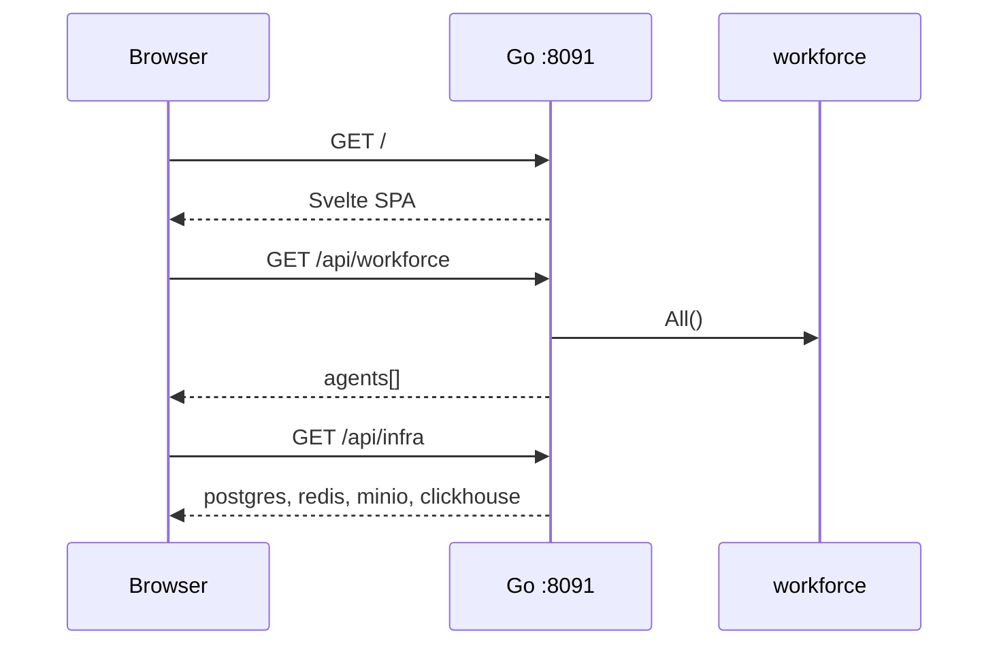

## 2. Text chat (with RAG)

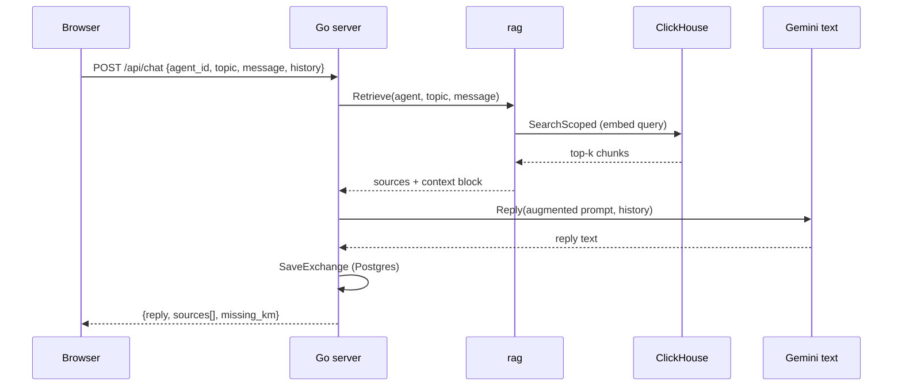

## 3. Voice call

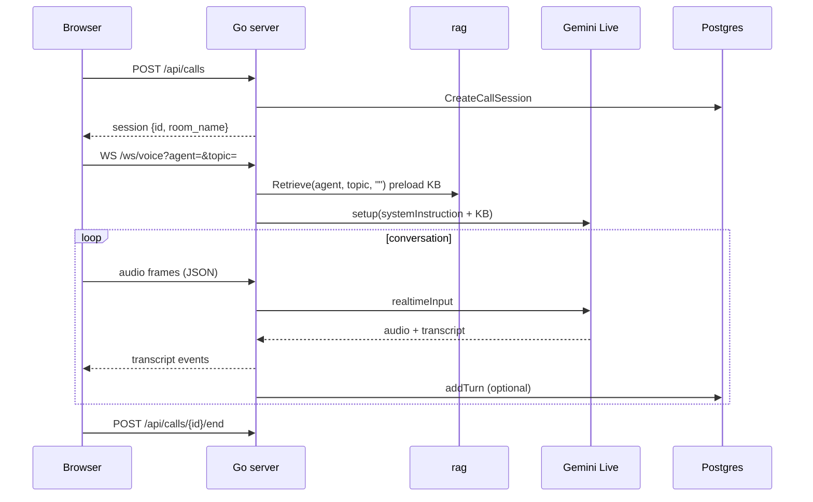

## 4. KM ingest (per avatar)

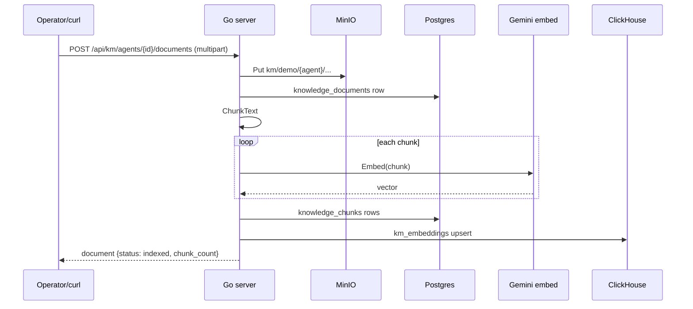

## 5. KM reset (per avatar)

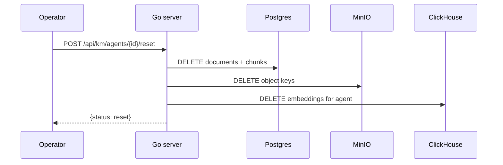

## 6. Call events (SSE)

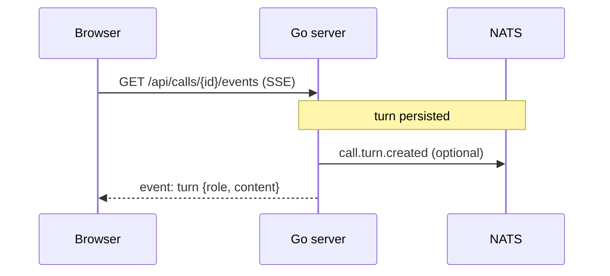

## 6. Auth login (Sprint 3 — draft)

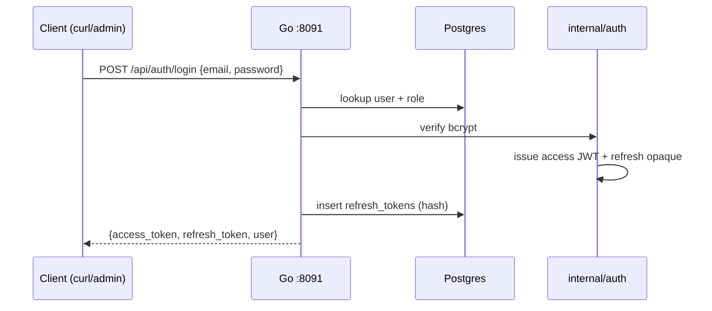

## 7. Protected KM upload (auth enabled)

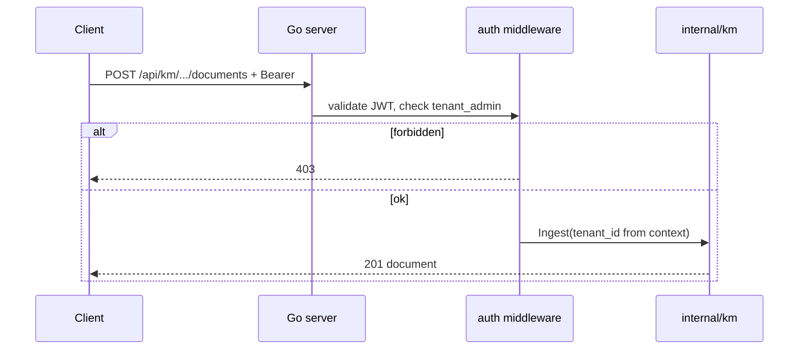

## 8. Dev bypass (`AUTH_DISABLED=true`)

No login required. All handlers use `tenant_id = DEMO_TENANT_ID`. Identical to v0.3.0 flows above.

## State: call session

| Status | Meaning |
| --- | --- |
| `active` | Call in progress; Redis key `monti_jarvis:call:active:{id}` |
| `ended` | `ended_at` set; Redis key removed |

## State: knowledge document

| Status | Meaning |
| --- | --- |
| `uploaded` | MinIO object stored |
| `indexing` | Chunk + embed in progress |
| `indexed` | Postgres + ClickHouse ready |
| `failed` | Embed or index error |

## 9. Package catalog CRUD (Sprint 4)

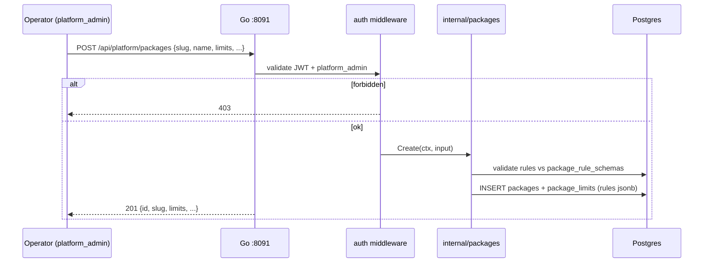

## 10. Assign tenant entitlement (Sprint 4)

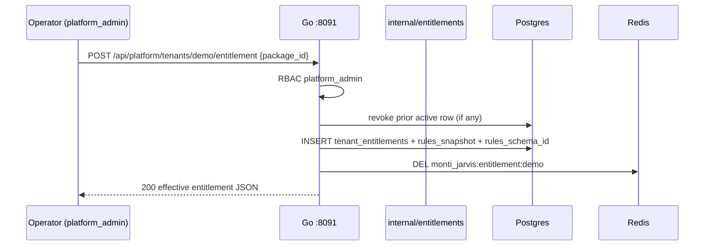

## 11. Entitlement resolve + cache (Sprint 4)

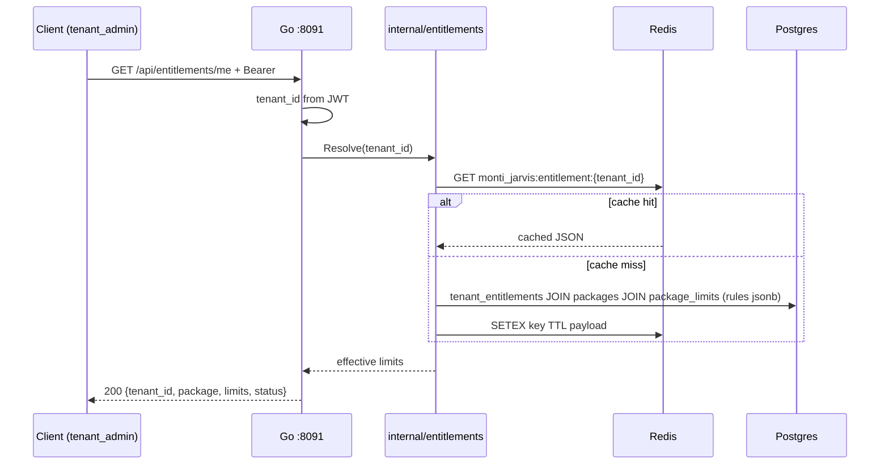

## State: package (Sprint 4)

| Status | Meaning |
| --- | --- |
| `draft` | Not assignable; hidden from default list |
| `active` | Assignable to tenants |
| `archived` | No new assignments; existing entitlements honored until revoked |

## State: tenant entitlement (Sprint 4)

| Status | Meaning |
| --- | --- |
| `active` | Tenant receives package limits (at most one per tenant) |
| `suspended` | Limits withheld; row kept for audit |
| `revoked` | Operator ended entitlement; resolver returns fallback |
| `expired` | `valid_until` passed (Sprint 9+ subscriptions) |

## 12. Platform admin login (Sprint 4)

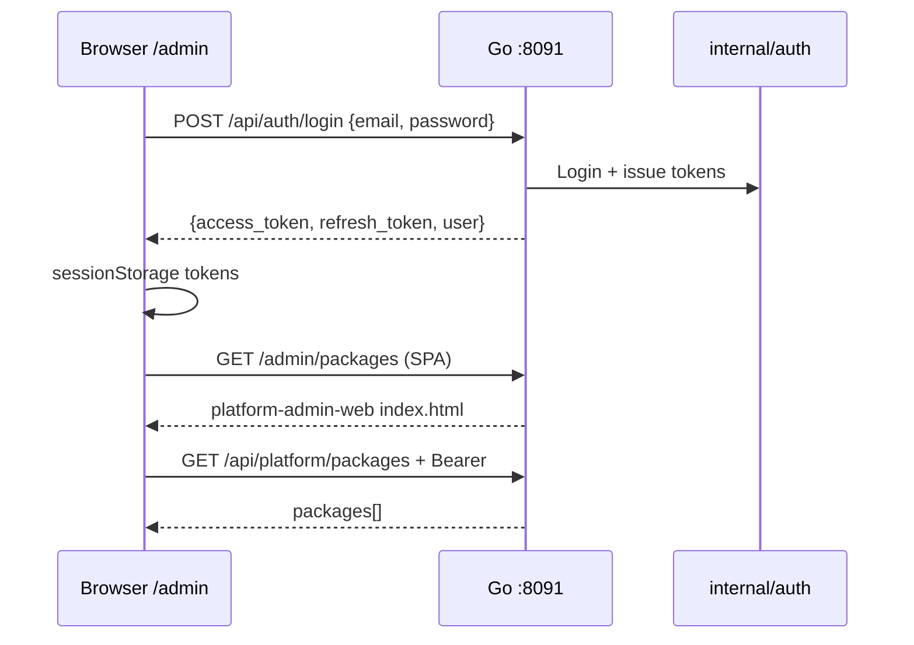

## 13. Platform admin logout (Sprint 4)

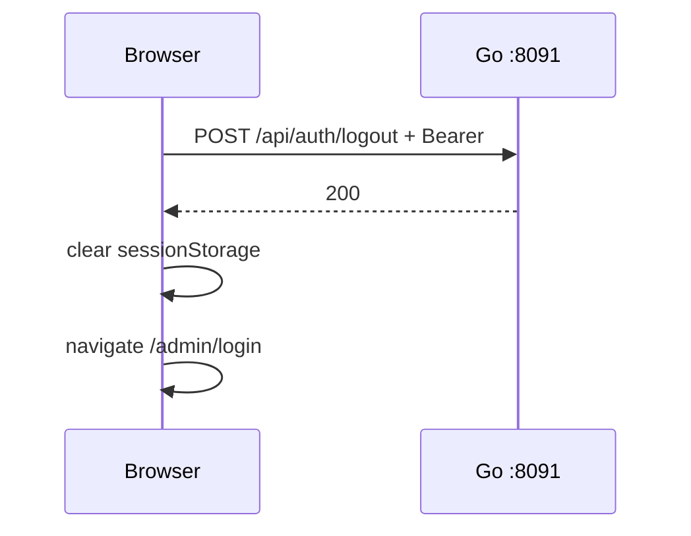

## 14. Avatar catalog CRUD (Sprint 5)

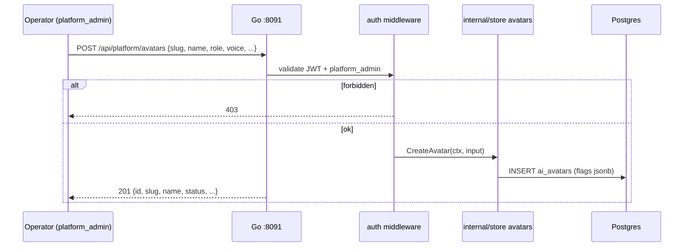

## 15. Assign tenant avatar (Sprint 5)

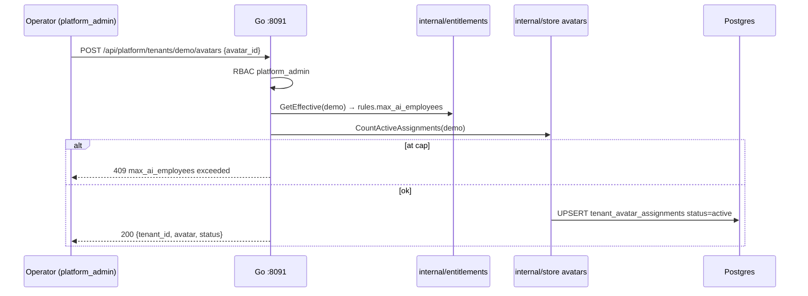

## 16. Workforce resolve (Sprint 5)

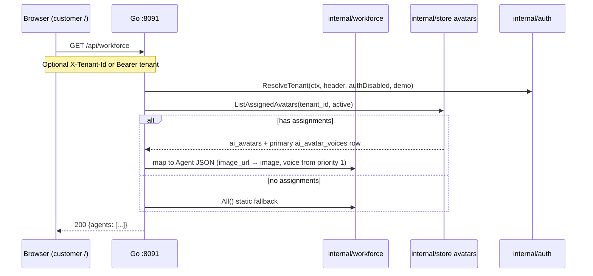

## State: avatar (Sprint 5)

| Status | Meaning |
| --- | --- |
| `draft` | Not assignable; hidden from default platform list |
| `active` | Assignable to tenants; eligible for workforce when assigned |
| `archived` | No new assignments; existing assignments may be disabled by operator |

## State: tenant avatar assignment (Sprint 5)

| Status | Meaning |
| --- | --- |
| `active` | Avatar appears in tenant `/api/workforce` list |
| `disabled` | Assignment revoked; avatar hidden from tenant workforce |

## State: avatar voice profile (Sprint 5)

| Status | Meaning |
| --- | --- |
| `active` | Eligible for primary selection or failover (by `priority`) |
| `disabled` | Skipped by resolver; kept for audit / future enable |

**Failover order:** ascending `priority` among `active` rows for the same `avatar_id`. Sprint 21 applies this during live calls.

## 17. Customer portal agent pick (unchanged UI, Sprint 5 data)

Customer portal still calls `GET /api/workforce` on load. Sprint 5 only changes **data source** when tenant has assignments; UI components unchanged.

## 18. Tenant self-registration (Sprint 6)

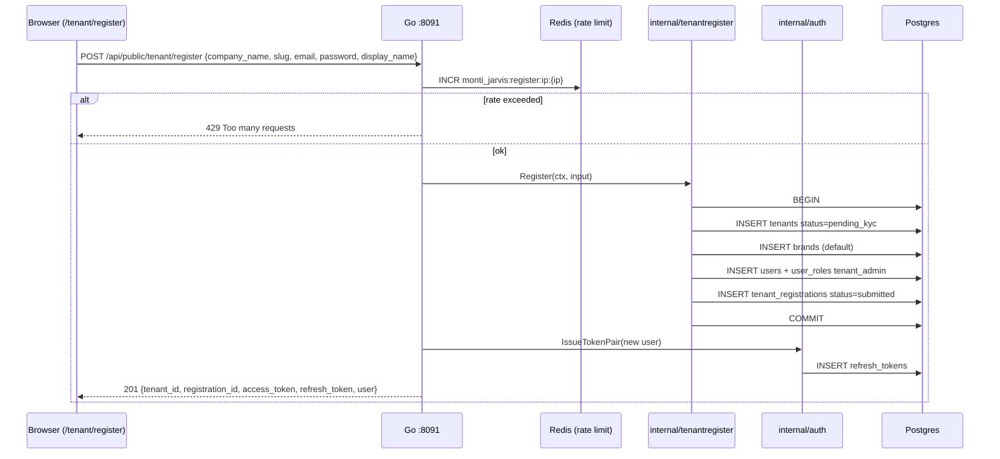

## 19. Registration validation errors (Sprint 6)

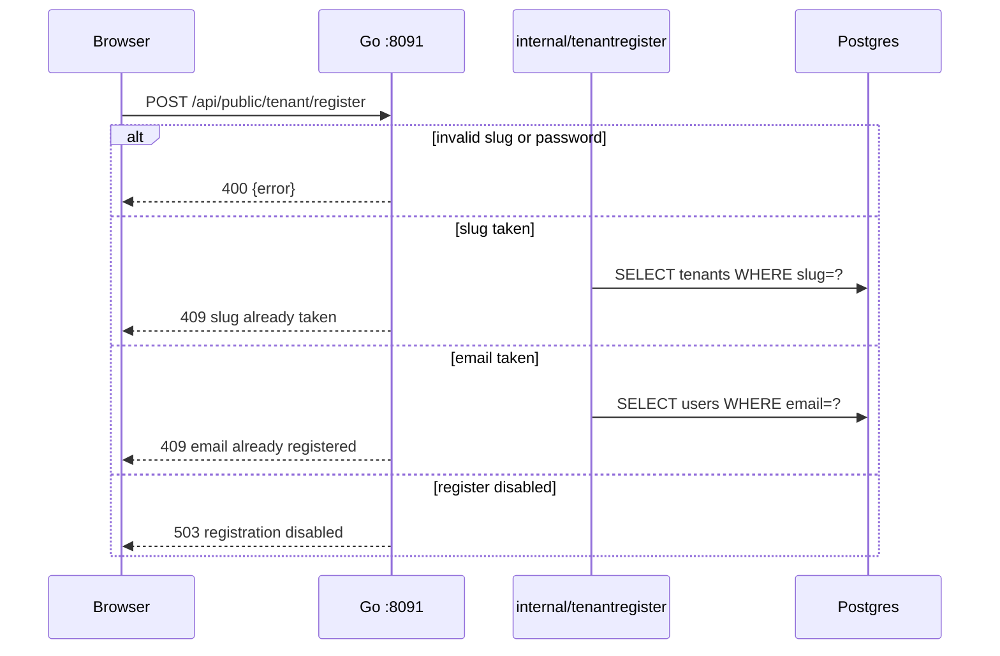

## 20. Platform list pending tenants (Sprint 6)

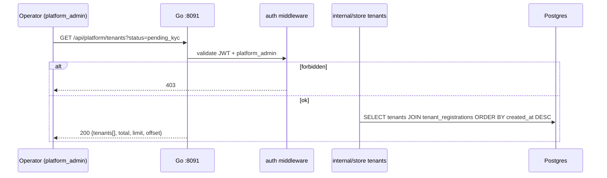

## 21. Pending tenant login (Sprint 6)

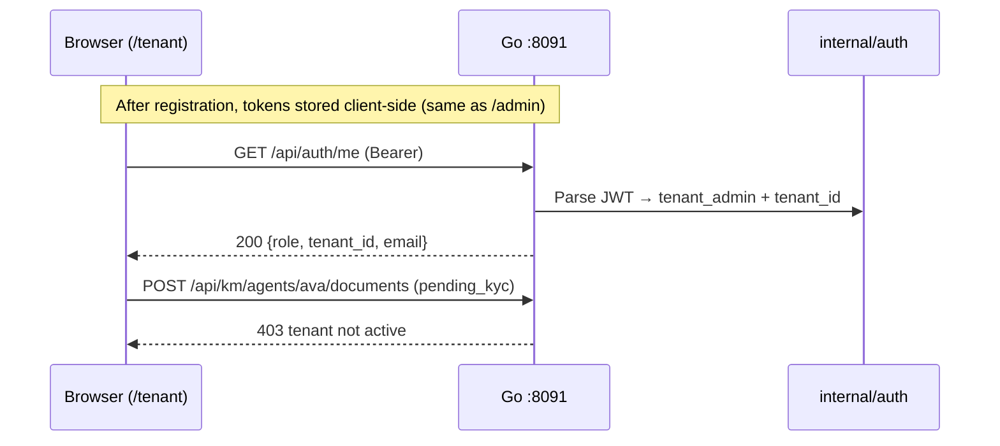

## State: tenant (Sprint 6 extension)

| Status | Meaning |
| --- | --- |
| `pending_kyc` | Self-registered; login OK; KM writes blocked; awaits Sprint 7 approval |
| `active` | Production tenant (seeds, post-KYC) |
| `suspended` | Operator block |

## State: tenant_registration (Sprint 6)

| Status | Meaning |
| --- | --- |
| `submitted` | Signup complete; visible in platform tenant list |

Sprint 7 adds `approved`, `rejected`, reviewer metadata.

## 22. Platform review KYC package (Sprint 7)

```mermaid
sequenceDiagram
  participant Op as Operator (platform_admin)
  participant B as Browser (/admin)
  participant G as Go :8091
  participant M as auth middleware
  participant S as internal/store
  participant DB as Postgres

  Op->>B: Open /admin/tenants/{id}/kyc
  B->>G: GET /api/platform/tenants/{tenant_id}/kyc
  G->>M: validate JWT + platform_admin
  alt forbidden
    M-->>B: 403
  else ok
    S->>DB: SELECT tenants, tenant_registrations, tenant_kyc_profiles
    G-->>B: 200 {tenant, registration, kyc, photo_url, documents[]}
    B->>G: GET /api/assets/kyc/{tenant_id}/photo/...
    G-->>B: image bytes (preview)
  end
```

## 23. Approve KYC (Sprint 7)

```mermaid
sequenceDiagram
  participant Op as Operator (platform_admin)
  participant G as Go :8091
  participant S as internal/store
  participant DB as Postgres
  participant R as internal/resend

  Op->>G: POST /api/platform/tenants/{tenant_id}/kyc/approve
  G->>S: ApproveTenantKYC(ctx, tenant_id, reviewer_id)
  alt tenant not pending_kyc or kyc not submitted
    S-->>G: conflict
    G-->>Op: 409
  else ok
    S->>DB: BEGIN
    S->>DB: UPDATE tenants SET status=active
    S->>DB: UPDATE tenant_registrations SET status=approved, reviewed_*
    S->>DB: UPDATE tenant_kyc_profiles SET status=approved, reviewed_*
    S->>DB: COMMIT
    G->>R: SendKYCApprovedEmail(admin_email) (async, best-effort)
    G-->>Op: 200 {tenant_id, status: active, kyc_status: approved}
  end
```

## 24. Reject KYC (Sprint 7)

```mermaid
sequenceDiagram
  participant Op as Operator (platform_admin)
  participant G as Go :8091
  participant S as internal/store
  participant DB as Postgres
  participant R as internal/resend

  Op->>G: POST /api/platform/tenants/{tenant_id}/kyc/reject {reason}
  alt missing reason
    G-->>Op: 400
  else ok
    G->>S: RejectTenantKYC(ctx, tenant_id, reviewer_id, reason)
    alt kyc not submitted
      S-->>G: conflict
      G-->>Op: 409
    else ok
      S->>DB: BEGIN
      S->>DB: UPDATE tenant_registrations SET status=rejected, rejection_reason
      S->>DB: UPDATE tenant_kyc_profiles SET status=rejected, reviewed_*
      Note over DB: tenants.status stays pending_kyc
      S->>DB: COMMIT
      G->>R: SendKYCRejectedEmail(admin_email, reason)
      G-->>Op: 200 {tenant_id, registration_status: rejected}
    end
  end
```

## State: tenant_kyc_profiles (Sprint 6–7)

| Status | Meaning |
| --- | --- |
| `draft` | Tenant editing contact/photo/docs |
| `submitted` | Awaiting platform review |
| `approved` | Platform approved; tenant is `active` |
| `rejected` | Platform rejected; tenant may resubmit (stretch) |

## State: tenant_registration (Sprint 7)

| Status | Meaning |
| --- | --- |
| `submitted` | Signup complete |
| `approved` | KYC approved; tenant `active` |
| `rejected` | KYC rejected; `rejection_reason` set |

See [06-auth-spec.md](06-auth-spec.md), [08-packages-spec.md](08-packages-spec.md), [10-avatars-spec.md](10-avatars-spec.md), [11-tenant-register-spec.md](11-tenant-register-spec.md), [12-kyc-tenant-spec.md](12-kyc-tenant-spec.md), [09-platform-admin-portal-spec.md](09-platform-admin-portal-spec.md), [04-api-spec.md](04-api-spec.md), [05-ux-ui.md](05-ux-ui.md).