# ER Diagram — Monti Jarvis

Database `monti_jarvis`, Postgres schema `callcenter`. ClickHouse database `monti_jarvis` for vectors/analytics.

## Audit columns (standard)

Every durable Postgres table in `callcenter` carries four audit fields (migration `001_audit_columns_postgres`, `internal/store/audit.go`):

| Column | Type | Notes |
| --- | --- | --- |
| `created_at` | `timestamptz` | Row insert time; default `now()` |
| `updated_at` | `timestamptz` | Auto-set on `UPDATE` via `touch_updated_at()` trigger |
| `created_by` | `text` | Actor user id; default `'system'`; set from JWT via `internal/auditctx` |
| `updated_by` | `text` | Last mutator user id; default `'system'` |

**Audited tables today:** `calls`, `messages`, `call_sessions`, `call_turns`, `knowledge_documents`, `knowledge_chunks`, `tenants`, `users`, `user_roles`, `refresh_tokens`, `package_rule_schemas`, `packages`, `package_limits`, `tenant_entitlements`, `ai_avatars`, `ai_avatar_voices`, `tenant_avatar_assignments`, `tenant_registrations`, `brands`, `tenant_kyc_profiles`, `payment_gateway_configs`, `payment_callback_events`, `payment_orders`. Provider catalog tables (`embedding_models`, `voice_providers`) follow the same pattern when created.

ClickHouse analytics tables use `created_at`, `updated_at`, `created_by`, `updated_by` (`002_audit_columns_clickhouse` + `EnsureAuthEventsSchema`).

## Postgres (`callcenter`)

```mermaid
erDiagram
  tenants ||--o{ user_roles : scopes
  users ||--o{ user_roles : has
  users ||--o{ refresh_tokens : has
  tenants ||--o{ call_sessions : owns
  tenants ||--o{ knowledge_documents : owns
  tenants ||--o{ tenant_entitlements : entitled
  tenants ||--o{ tenant_avatar_assignments : assigns
  tenants ||--|| tenant_registrations : registered_via
  tenants ||--|| tenant_kyc_profiles : kyc_package
  tenants ||--o{ brands : owns
  ai_avatars ||--o{ tenant_avatar_assignments : enabled_for
  ai_avatars ||--o{ ai_avatar_voices : speaks_with
  voice_providers ||--o{ ai_avatar_voices : provides
  package_rule_schemas ||--o{ package_limits : shapes
  package_rule_schemas ||--o{ tenant_entitlements : snapshot_schema
  packages ||--o{ tenant_entitlements : grants
  packages ||--|| package_limits : defines
  embedding_models ||--o{ knowledge_index_runs : indexes_with
  voice_providers ||--o{ call_sessions : uses
  voice_providers ||--o{ ai_employee_configs : default_voice
  knowledge_documents ||--o{ knowledge_index_runs : versioned_by
  knowledge_index_runs ||--o{ knowledge_chunks : produces
  calls ||--o{ messages : has
  call_sessions ||--o{ call_turns : has

  tenants {
    text id PK
    text slug UK
    text name
    text status
    note "pending_kyc active suspended"
    timestamptz created_at
    timestamptz updated_at
    text created_by
    text updated_by
  }

  tenant_registrations {
    text id PK
    text tenant_id FK UK
    text company_name
    text admin_email
    text status
    text rejection_reason
    timestamptz reviewed_at
    text reviewed_by
    timestamptz created_at
    timestamptz updated_at
    text created_by
    text updated_by
  }

  tenant_kyc_profiles {
    text tenant_id PK FK
    text contact_name
    text contact_phone
    text contact_address
    text photo_object_key
    jsonb business_doc_keys
    text status
    timestamptz submitted_at
    timestamptz reviewed_at
    text reviewed_by
    text rejection_reason
    timestamptz created_at
    timestamptz updated_at
    text created_by
    text updated_by
  }

  brands {
    text id PK
    text tenant_id FK UK
    text name
    text status
    timestamptz created_at
    timestamptz updated_at
    text created_by
    text updated_by
  }

  users {
    text id PK
    text email UK
    text password_hash
    text display_name
    text status
    timestamptz created_at
    timestamptz updated_at
    text created_by
    text updated_by
  }

  user_roles {
    text user_id FK
    text role
    text tenant_id FK
    timestamptz created_at
    timestamptz updated_at
    text created_by
    text updated_by
  }

  refresh_tokens {
    text id PK
    text user_id FK
    text token_hash UK
    timestamptz expires_at
    timestamptz revoked_at
    timestamptz created_at
    timestamptz updated_at
    text created_by
    text updated_by
  }

  calls {
    text id PK
    text agent_id
    text title
    timestamptz created_at
    timestamptz updated_at
    text created_by
    text updated_by
  }

  messages {
    bigserial id PK
    text call_id FK
    text role
    text content
    timestamptz created_at
    timestamptz updated_at
    text created_by
    text updated_by
  }

  call_sessions {
    text id PK
    text tenant_id
    text room_name UK
    text voice_provider_id FK
    text status
    timestamptz started_at
    timestamptz ended_at
    text recording_key
    timestamptz created_at
    timestamptz updated_at
    text created_by
    text updated_by
  }

  call_turns {
    bigserial id PK
    text call_id FK
    text role
    text content
    jsonb source_chunk_ids
    timestamptz created_at
    timestamptz updated_at
    text created_by
    text updated_by
  }

  embedding_models {
    text id PK
    text provider
    text model_key
    int dimensions
    text status
    timestamptz created_at
    timestamptz updated_at
    text created_by
    text updated_by
  }

  voice_providers {
    text id PK
    text provider
    text model_key
    text modality
    text status
    timestamptz created_at
    timestamptz updated_at
    text created_by
    text updated_by
  }

  ai_employee_configs {
    text agent_id PK
    text tenant_id FK
    text voice_provider_id FK
    text text_provider_id FK
    text embedding_model_id FK
    timestamptz created_at
    timestamptz updated_at
    text created_by
    text updated_by
  }

  knowledge_documents {
    text id PK
    text tenant_id
    text agent_id
    text filename
    text object_key
    text mime
    text status
    text km_scope
    int content_version
    int chunk_count
    timestamptz created_at
    timestamptz updated_at
    text created_by
    text updated_by
  }

  knowledge_index_runs {
    text id PK
    text document_id FK
    text tenant_id
    text embedding_model_id FK
    int index_version
    text status
    timestamptz started_at
    timestamptz completed_at
    timestamptz created_at
    timestamptz updated_at
    text created_by
    text updated_by
  }

  knowledge_chunks {
    text id PK
    text document_id FK
    text index_run_id FK
    text tenant_id
    text agent_id
    int chunk_index
    text content
    text km_scope
    text embedding_model_id FK
    int index_version
    timestamptz created_at
    timestamptz updated_at
    text created_by
    text updated_by
  }

  package_rule_schemas {
    text id PK
    int version UK
    text name
    jsonb fields
    text status
    timestamptz created_at
    timestamptz updated_at
    text created_by
    text updated_by
  }

  packages {
    text id PK
    text slug UK
    text name
    text status
    int price_cents
    text currency
    text billing_period
    timestamptz created_at
    timestamptz updated_at
    text created_by
    text updated_by
  }

  package_limits {
    text package_id PK_FK
    text rules_schema_id FK
    jsonb rules
    timestamptz created_at
    timestamptz updated_at
    text created_by
    text updated_by
  }

  tenant_entitlements {
    text id PK
    text tenant_id FK
    text package_id FK
    text rules_schema_id FK
    jsonb rules_snapshot
    text status
    timestamptz valid_from
    timestamptz valid_until
    timestamptz created_at
    timestamptz updated_at
    text created_by
    text updated_by
  }

  ai_avatars {
    text id PK
    text slug UK
    text name
    text role
    text trait
    text color
    text image_url
    text greeting
    text status
    jsonb flags
    timestamptz created_at
    timestamptz updated_at
    text created_by
    text updated_by
  }

  ai_avatar_voices {
    text id PK
    text avatar_id FK
    text voice_provider_id FK
    text voice_id
    text voice
    int priority
    text status
    timestamptz created_at
    timestamptz updated_at
    text created_by
    text updated_by
  }

  tenant_avatar_assignments {
    text tenant_id FK
    text avatar_id FK
    text status
    timestamptz created_at
    timestamptz updated_at
    text created_by
    text updated_by
  }

  payment_gateway_configs {
    text id PK
    text provider
    text mode
    text status
    text merchant_code
    text api_key
    text md5_key
    text base_url
    int route_no
    text currency
    text callback_url
    text return_url
    timestamptz created_at
    timestamptz updated_at
    text created_by
    text updated_by
  }

  payment_callback_events {
    text id PK
    text provider
    text transaction_id UK
    text order_no
    text payment_status
    text amount
    text customer_id
    text payload_hash
    timestamptz received_at
    timestamptz created_at
    timestamptz updated_at
    text created_by
    text updated_by
  }

  payment_orders {
    text id PK
    text tenant_id FK
    text package_id FK
    text order_no UK
    int amount_cents
    text currency
    text status
    text provider
    text transaction_id
    text payment_url
    timestamptz paid_at
    timestamptz created_at
    timestamptz updated_at
    text created_by
    text updated_by
  }

  tenants ||--o{ payment_orders : places
  packages ||--o{ payment_orders : purchased_as
```

### Table notes

| Table | Purpose |
| --- | --- |
| `calls` | Legacy chat session ids from `/api/chat` |
| `messages` | Text chat transcript pairs (caller/agent) |
| `call_sessions` | Voice call sessions; `voice_provider_id` for Gemini/Grok switch *(planned)* |
| `call_turns` | Voice/text turns per call session |
| `knowledge_documents` | KM upload metadata; `content_version` bumps on file replace |
| `knowledge_index_runs` | One embed/index pass per document + **embedding model** + `index_version` *(planned)* |
| `knowledge_chunks` | Chunk text; FK to `index_run_id` and `embedding_model_id` |
| `embedding_models` | Catalog: `gemini-embedding-001`, future models; drives vector compatibility |
| `voice_providers` | Catalog: Gemini Live, Grok Voice, etc. — switchable per agent/tenant |
| `ai_employee_configs` | Per-agent binding of voice, text, and embedding providers *(Sprint 21)* |
| `tenants` | SaaS tenant registry *(Sprint 3)* |
| `users` | Login identities *(Sprint 3)* |
| `user_roles` | RBAC role per user/tenant *(Sprint 3)* |
| `refresh_tokens` | Hashed refresh tokens *(Sprint 3)* |
| `package_rule_schemas` | Versioned JSONB field catalog for package `rules` *(Sprint 4)* |
| `packages` | Commercial catalog — Starter/Pro/Enterprise *(Sprint 4)* |
| `package_limits` | `rules` jsonb per package; shape from `package_rule_schemas` *(Sprint 4)* |
| `tenant_entitlements` | Assignment + `rules_snapshot` at bind time *(Sprint 4)* |
| `ai_avatars` | Platform-managed avatar catalog *(Sprint 5)* |
| `ai_avatar_voices` | Ordered voice profiles per avatar (`voice_provider_id`, `voice_id`, `voice`, `priority`) *(Sprint 5)* |
| `tenant_avatar_assignments` | Which avatars each tenant may use *(Sprint 5)* |
| `payment_gateway_configs` | Singleton platform ChillPay/mock gateway settings *(Sprint 8)* |
| `payment_callback_events` | Idempotent ChillPay callback audit log *(Sprint 8)* |
| `payment_orders` | Tenant checkout orders; ChillPay `order_no` + fulfillment *(Sprint 9)* |

### Indexes

- `knowledge_documents (tenant_id, agent_id)`
- `knowledge_chunks (tenant_id, agent_id, embedding_model_id, index_version)`
- `knowledge_index_runs (document_id, embedding_model_id, index_version)`
- `call_sessions (tenant_id, voice_provider_id)` *(planned)*
- `tenant_avatar_assignments (tenant_id) WHERE status = 'active'` *(Sprint 5)*
- `ai_avatar_voices (avatar_id, priority) WHERE status = 'active'` *(Sprint 5)*
- `payment_orders (tenant_id, status)` *(Sprint 9)*
- `payment_orders (order_no)` unique *(Sprint 9)*

### KM versioning model (planned)

Two version axes keep provider switches safe:

| Field | Layer | Bumps when |
| --- | --- | --- |
| `content_version` | Postgres `knowledge_documents` | Operator uploads/replaces source file |
| `index_version` | `knowledge_index_runs` + chunks + ClickHouse | Re-embed with same or new **embedding model** |

Search and RAG **must** filter on `(tenant_id, embedding_model_id, index_version)` so vectors from `gemini-embedding-001` are never compared to queries from `grok-embed` or another model.

## Provider catalog (Postgres — planned)

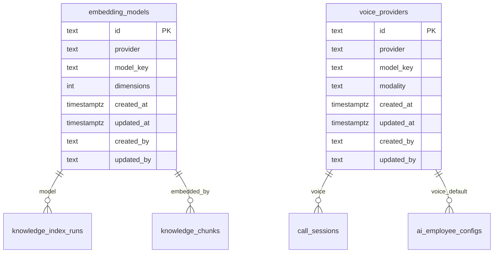
```mermaid
erDiagram
  embedding_models ||--o{ knowledge_index_runs : model
  embedding_models ||--o{ knowledge_chunks : embedded_by
  voice_providers ||--o{ call_sessions : voice
  voice_providers ||--o{ ai_employee_configs : voice_default

  embedding_models {
    text id PK
    text provider
    text model_key
    int dimensions
    timestamptz created_at
    timestamptz updated_at
    text created_by
    text updated_by
  }

  voice_providers {
    text id PK
    text provider
    text model_key
    text modality
    timestamptz created_at
    timestamptz updated_at
    text created_by
    text updated_by
  }
```

Example seed rows:

| `id` | `provider` | `model_key` | Role |
| --- | --- | --- | --- |
| `emb-gemini-001` | `google` | `gemini-embedding-001` | KM embed + query |
| `voice-gemini-live` | `google` | `gemini-2.5-flash-native-audio-latest` | Voice relay |
| `voice-grok` | `xai` | `grok-voice-*` | Future voice failover |

Tenant/agent config (`ai_employee_configs`) points at active `voice_provider_id` and `embedding_model_id`. Switching voice provider does **not** invalidate KM index; switching **embedding model** requires a new `index_version` and re-embed.

## ClickHouse (`monti_jarvis`)

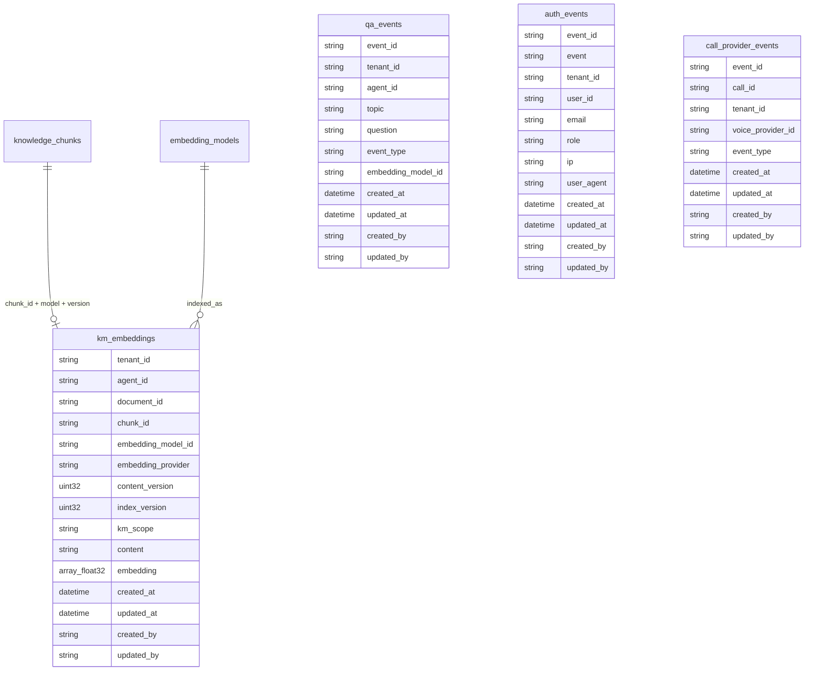
```mermaid
erDiagram
  knowledge_chunks ||--o| km_embeddings : "chunk_id + model + version"
  embedding_models ||--o{ km_embeddings : indexed_as

  km_embeddings {
    string tenant_id
    string agent_id
    string document_id
    string chunk_id
    string embedding_model_id
    string embedding_provider
    uint32 content_version
    uint32 index_version
    string km_scope
    string content
    array_float32 embedding
    datetime created_at
    datetime updated_at
    string created_by
    string updated_by
  }

  qa_events {
    string event_id
    string tenant_id
    string agent_id
    string topic
    string question
    string event_type
    string embedding_model_id
    datetime created_at
    datetime updated_at
    string created_by
    string updated_by
  }

  auth_events {
    string event_id
    string event
    string tenant_id
    string user_id
    string email
    string role
    string ip
    string user_agent
    datetime created_at
    datetime updated_at
    string created_by
    string updated_by
  }

  call_provider_events {
    string event_id
    string call_id
    string tenant_id
    string voice_provider_id
    string event_type
    datetime created_at
    datetime updated_at
    string created_by
    string updated_by
  }
```

### ClickHouse notes

| Column | Purpose |
| --- | --- |
| `embedding_model_id` | FK to Postgres catalog; **required** on search filter |
| `embedding_provider` | Denormalized vendor (`google`, `xai`) for analytics |
| `content_version` | Matches Postgres document content generation |
| `index_version` | Matches `knowledge_index_runs`; invalidate old vectors on re-index |
| `chunk_id` | Join key to Postgres `knowledge_chunks.id` |
| `created_at` / `updated_at` / `created_by` / `updated_by` | Audit fields on all analytics tables (shipped Sprint 3) |
| `auth_events` | NATS auth lifecycle mirror (`auth.user.logged_in`, `logged_out`, etc.) |

**Search rule:** `WHERE tenant_id = ? AND agent_id = ? AND embedding_model_id = ? AND index_version = active AND km_scope IN (?)` — never mix models in cosine ranking.

**Sprint 2 today:** `km_embeddings` uses `km_version` as a single field; migration path renames/splits into `content_version` + `index_version` + `embedding_model_id` (default `emb-gemini-001` for existing rows).

## Cross-store relationships

```text
Postgres knowledge_chunks.id  ──►  ClickHouse km_embeddings.chunk_id
Postgres embedding_models.id  ──►  km_embeddings.embedding_model_id
Postgres voice_providers.id   ──►  call_sessions.voice_provider_id
Postgres index_run.id         ──►  knowledge_chunks.index_run_id
```

Voice path (Gemini → Grok failover) updates `call_sessions.voice_provider_id` and logs `call_provider_events`; KM vectors stay tied to **embedding model**, not voice provider.

## MinIO (object keys)

```
monti-jarvis/
  calls/                    # future recordings
  km/{tenant_id}/{agent_id}/{doc_id}/original/{filename}
  kyc/{tenant_id}/          # Sprint 6 — photo + docs (see internal/store/tenantkyc_assets.go)
    photo.{ext}
    docs/{filename}
```

## Redis (ephemeral)

| Key pattern | TTL | Fields |
| --- | --- | --- |
| `monti_jarvis:call:{session_id}` | 24h | agent_id, updated_at (legacy chat) |
| `monti_jarvis:call:active:{id}` | 24h | tenant_id, room_name, status, started_at |
| `monti_jarvis:entitlement:{tenant_id}` | 15m (env) | package slug, status, effective limits JSON *(Sprint 4)* |
| `monti_jarvis:register:ip:{ip}` | 1h | registration attempt counter *(Sprint 6)* |

## Workforce (Sprint 5 — DB + fallback)

- **Primary:** `ai_avatars` + `tenant_avatar_assignments` → `GET /api/workforce` per tenant.
- **Fallback:** `internal/workforce/workforce.go` static catalog when tenant has zero active assignments.
- **Sprint 21:** `ai_employee_configs` provider bindings; may extend or alias `ai_avatars`.

## Implementation phases

| Phase | KM / provider scope |
| --- | --- |
| **v0.3.0 (shipped)** | Single embed model env var; `km_version` column; Gemini voice only |
| **Sprint 3–4** | Provider catalog tables stub; default `emb-gemini-001` / `voice-gemini-live` seeds |
| **Sprint 15** | Tenant selects embedding model; re-index workflow bumps `index_version` |
| **Sprint 21** | `ai_employee_configs` binds voice + embed providers per avatar |
| **Failover** | Runtime voice provider switch via `voice_providers`; KM unchanged until embed model changes |

## Future entities (roadmap)

| Sprint | Tables |
| --- | --- |
| 4 ✅ v0.5.0 | `package_rule_schemas`, `packages`, `package_limits`, `tenant_entitlements` |
| 5 ✅ v0.6.0 | `ai_avatars`, `ai_avatar_voices`, `tenant_avatar_assignments` |
| 6 ✅ v0.7.0 | `tenant_registrations`, `brands`, `tenant_kyc_profiles`; `tenants.status` + `pending_kyc` |
| 7 ✅ v0.8.0 | KYC review columns on `tenant_kyc_profiles` + `tenant_registrations`; approve/reject lifecycle |
| 8 ✅ v0.9.0 | `payment_gateway_configs`, `payment_callback_events` |
| 9–12 ✅ v1.3.0 | `payment_orders`, `payment_documents`, `tenant_tax_profiles`, billing ops |
| 13 ✅ v1.4.0 | Redis quota/rate-limit keys (no required DDL) |
| 14 ✅ v1.5.0 | `tenant_embed_configs` |
| 15 ✅ v1.6.0 | Tenant KM store + `km_gaps`; no `km_scope_assignments` table required |
| 16 ✅ v1.7.0 | `tenant_settings`, `tenant_call_limits` |
| 17 ✅ v1.8.0 | `call_sessions.source`; preview uses existing call model |
| 18 ✅ v1.9.0 | `customer_tiers`, `customer_groups` |
| 19 🔄 v2.0.0 | `customers`, `customer_group_members`, `customer_import_jobs`, `customer_domain_rules` |
| 21 | Runtime voice failover + `ai_employee_configs` embedding bindings (voice stays on `ai_avatar_voices`) |
| 22 ✅ v2.3.0 | `conversation_records`, `conversation_archive_objects`, `knowledge_gap_candidates` |
| 23 (in progress) | `tickets`, `ticket_events` |
| backlog | optional `quota_usage_events` audit (not in S13 commitment) |

## Sprint 13 — Quota (Redis + existing Postgres reads)

**Decision:** MVP ships **without** new Postgres tables. Limits come from existing `tenant_entitlements` / `package_limits`; KM and avatar usage from existing tables; concurrent/minutes/rate from Redis.

### Existing entities used for usage (no schema change)

| Entity | Usage dimension |
| --- | --- |
| `tenant_entitlements` + `package_limits.rules` | All limit ceilings |
| KM document store (existing ingest tables) | `max_km_documents` |
| `tenant_avatar_assignments` | `max_ai_employees` |

### Redis entities — Sprint 13

| Key pattern | Type | TTL | Purpose |
| --- | --- | --- | --- |
| `{prefix}quota:{tenant}:concurrent` | string/int | `QUOTA_CONCURRENT_TTL` | Active call slots |
| `{prefix}quota:{tenant}:minutes:{YYYYMM}` | string/int | none (month key) | Monthly voice minutes (UTC) |
| `{prefix}rl:{tenant}:chat:{YYYYMMDDHHMM}` | string/int | ~2m | Chat rate window |
| `{prefix}rl:{tenant}:km:{YYYYMMDDHHMM}` | string/int | ~2m | KM write rate window |
| `{prefix}rl:{tenant}:voice:{YYYYMMDDHHMM}` | string/int | ~2m | Voice open rate window |
| `{prefix}entitlement:{tenant}` | JSON | existing | Entitlement cache (S4) |

`prefix` = `REDIS_PREFIX` default `monti_jarvis:`.

### Explicit non-goal table (do not create in S13)

`quota_usage_events` deferred — would need full audit columns (`created_at`, `updated_at`, `created_by`, `updated_by`) if added later.

## Sprint 14 — tenant_embed_configs

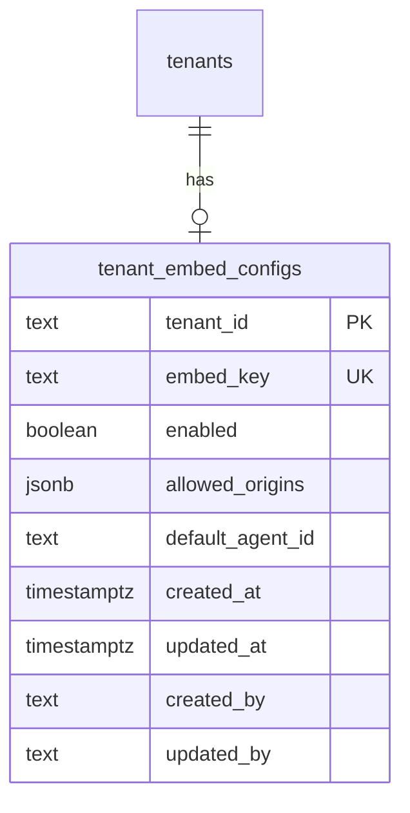
```mermaid
erDiagram
  tenants ||--o| tenant_embed_configs : has
  tenant_embed_configs {
    text tenant_id PK
    text embed_key UK
    boolean enabled
    jsonb allowed_origins
    text default_agent_id
    timestamptz created_at
    timestamptz updated_at
    text created_by
    text updated_by
  }
```

## Sprint 15 — KM lifecycle + km_gaps

S15 productizes **tenant-admin** access to existing S2 KM entities and adds **`km_gaps`** for unanswered customer questions (FAQ backlog).

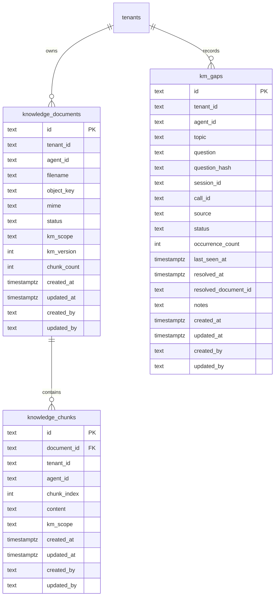
```mermaid
erDiagram
  tenants ||--o{ knowledge_documents : owns
  tenants ||--o{ km_gaps : records
  knowledge_documents ||--o{ knowledge_chunks : contains
  knowledge_documents {
    text id PK
    text tenant_id
    text agent_id
    text filename
    text object_key
    text mime
    text status
    text km_scope
    int km_version
    int chunk_count
    timestamptz created_at
    timestamptz updated_at
    text created_by
    text updated_by
  }
  knowledge_chunks {
    text id PK
    text document_id FK
    text tenant_id
    text agent_id
    int chunk_index
    text content
    text km_scope
    timestamptz created_at
    timestamptz updated_at
    text created_by
    text updated_by
  }
  km_gaps {
    text id PK
    text tenant_id
    text agent_id
    text topic
    text question
    text question_hash
    text session_id
    text call_id
    text source
    text status
    int occurrence_count
    timestamptz last_seen_at
    timestamptz resolved_at
    text resolved_document_id
    text notes
    timestamptz created_at
    timestamptz updated_at
    text created_by
    text updated_by
  }
```

### `km_gaps` (new — S15)

| Column | Type | Notes |
| --- | --- | --- |
| `id` | text PK | |
| `tenant_id` | text NOT NULL | Isolation |
| `agent_id` | text | Workforce agent at ask time |
| `topic` | text | Caller topic tab |
| `question` | text | Customer question (original) |
| `question_hash` | text | sha256(lower(trim(question))) for dedupe |
| `session_id` / `call_id` | text | Optional correlation |
| `source` | text | `chat` \| `voice` \| `embed` |
| `status` | text | `open` \| `resolved` \| `dismissed` \| `converted` |
| `occurrence_count` | int | Bumped on repeat same hash |
| `last_seen_at` | timestamptz | Last missing_km hit |
| `resolved_at` | timestamptz null | When closed |
| `resolved_document_id` | text | Optional link after KM upload |
| `notes` | text | Tenant notes |
| audit | | `created_at`, `updated_at`, `created_by`, `updated_by` |

**Unique:** `(tenant_id, agent_id, question_hash)`  
**Index:** `(tenant_id, status, last_seen_at DESC)`

**Write path:** when chat RAG sets `missing_km=true` → `RecordKMGap` (Postgres) **and** existing ClickHouse `qa_events` (`event_type=missing_km`).

**Tenant APIs:** `GET /api/tenant/km/gaps`, `PATCH /api/tenant/km/gaps/{id}`

### ClickHouse (existing)

| Table | S15 delete filter |
| --- | --- |
| `monti_jarvis.km_embeddings` | `tenant_id` + `document_id` (single doc) or `tenant_id` + `agent_id` (reset) |

Columns (shipped S2): `tenant_id`, `agent_id`, `document_id`, `chunk_id`, `km_scope`, `km_version`, `content`, `embedding`.

### MinIO object key layout

```text
km/{tenant_id}/{agent_id}/{document_id}/original/{filename}
```

### Delete cascade (document-level) — implement in `internal/km`

1. Load doc by id; require `doc.tenant_id == jwt.tenant_id` else 404  
2. ClickHouse: `ALTER … DELETE WHERE tenant_id AND document_id` (existing client helper)  
3. MinIO: delete `object_key`  
4. Postgres: delete document (chunks via `ON DELETE CASCADE`)

### Document status (code constants)

| status | UI label | Meaning |
| --- | --- | --- |
| `uploaded` | Processing | Row created, not yet indexed |
| `indexing` | Processing | Chunking/embedding in progress |
| `indexed` | Ready | Available for RAG |
| `failed` | Failed | Ingest error |

**Scope values (`km_scope`):** `general` | `billing` | `technical`

### Explicit non-goals (do not create in S15)

| Entity | Why deferred |
| --- | --- |
| `km_versions` / publish logs | Approval workflow later |
| `tenant_agent_scope_overrides` | Use hard-map + document scope |
| `knowledge_folders` | Flat list per agent is enough |

## Sprint 16 — tenant_settings + tenant_call_limits

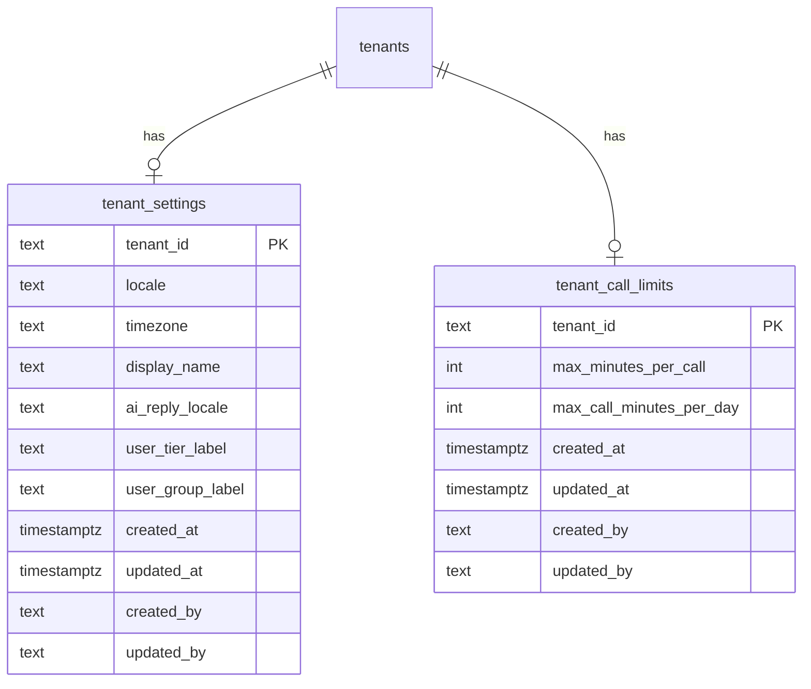
```mermaid
erDiagram
  tenants ||--o| tenant_settings : has
  tenants ||--o| tenant_call_limits : has
  tenant_settings {
    text tenant_id PK
    text locale
    text timezone
    text display_name
    text ai_reply_locale
    text user_tier_label
    text user_group_label
    timestamptz created_at
    timestamptz updated_at
    text created_by
    text updated_by
  }
  tenant_call_limits {
    text tenant_id PK
    int max_minutes_per_call
    int max_call_minutes_per_day
    timestamptz created_at
    timestamptz updated_at
    text created_by
    text updated_by
  }
```

**Redis:** `{prefix}call_daily:{tenant}:{YYYYMMDD}` minutes used (tenant timezone day).

## Sprint 17 — preview sessions

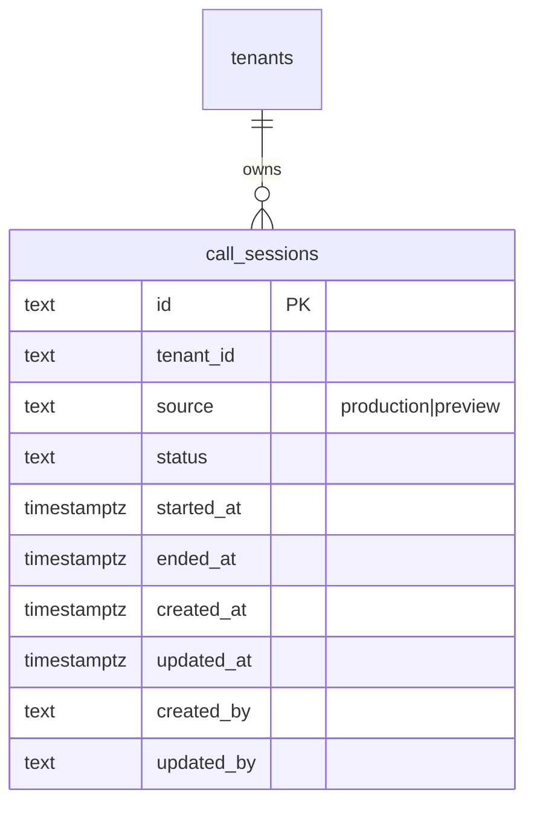
```mermaid
erDiagram
  tenants ||--o{ call_sessions : owns
  call_sessions {
    text id PK
    text tenant_id
    text source "production|preview"
    text status
    timestamptz started_at
    timestamptz ended_at
    timestamptz created_at
    timestamptz updated_at
    text created_by
    text updated_by
  }
```

| Change | Notes |
| --- | --- |
| `call_sessions.source` | Default `production`; preview APIs set `preview` |
| Redis `preview:concurrent:{tenant}` | Soft concurrent voice preview slots |

**No new tables required** if column add on existing `call_sessions` is preferred over separate `preview_sessions`.

## Sprint 18 — customer_tiers + customer_groups

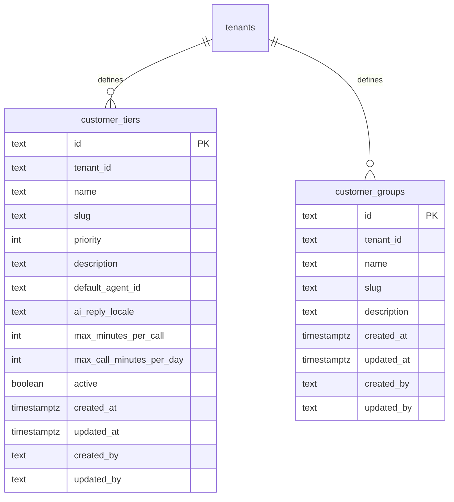
```mermaid
erDiagram
  tenants ||--o{ customer_tiers : defines
  tenants ||--o{ customer_groups : defines
  customer_tiers {
    text id PK
    text tenant_id
    text name
    text slug
    int priority
    text description
    text default_agent_id
    text ai_reply_locale
    int max_minutes_per_call
    int max_call_minutes_per_day
    boolean active
    timestamptz created_at
    timestamptz updated_at
    text created_by
    text updated_by
  }
  customer_groups {
    text id PK
    text tenant_id
    text name
    text slug
    text description
    timestamptz created_at
    timestamptz updated_at
    text created_by
    text updated_by
  }
```

**Future (S19+):** `customers.tier_id` → `customer_tiers`, optional group membership.

## Sprint 19 — customer accounts, imports, and domain rules

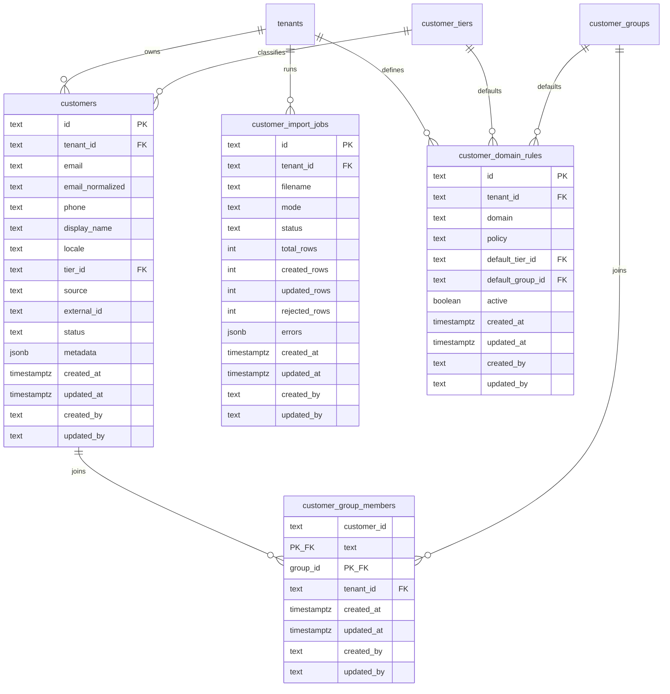
```mermaid
erDiagram
  tenants ||--o{ customers : owns
  customer_tiers ||--o{ customers : classifies
  tenants ||--o{ customer_import_jobs : runs
  tenants ||--o{ customer_domain_rules : defines
  customer_tiers ||--o{ customer_domain_rules : defaults
  customer_groups ||--o{ customer_domain_rules : defaults
  customers ||--o{ customer_group_members : joins
  customer_groups ||--o{ customer_group_members : joins

  customers {
    text id PK
    text tenant_id FK
    text email
    text email_normalized
    text phone
    text display_name
    text locale
    text tier_id FK
    text source
    text external_id
    text status
    jsonb metadata
    timestamptz created_at
    timestamptz updated_at
    text created_by
    text updated_by
  }

  customer_group_members {
    text customer_id PK_FK
    text group_id PK_FK
    text tenant_id FK
    timestamptz created_at
    timestamptz updated_at
    text created_by
    text updated_by
  }

  customer_import_jobs {
    text id PK
    text tenant_id FK
    text filename
    text mode
    text status
    int total_rows
    int created_rows
    int updated_rows
    int rejected_rows
    jsonb errors
    timestamptz created_at
    timestamptz updated_at
    text created_by
    text updated_by
  }

  customer_domain_rules {
    text id PK
    text tenant_id FK
    text domain
    text policy
    text default_tier_id FK
    text default_group_id FK
    boolean active
    timestamptz created_at
    timestamptz updated_at
    text created_by
    text updated_by
  }
```

### Constraints and indexes

| Entity | Rule |
| --- | --- |
| `customers` | unique `(tenant_id, email_normalized)` when email exists |
| `customers` | unique `(tenant_id, source, external_id)` when external id exists |
| `customers` | `status IN ('active','inactive')`; delete API sets inactive |
| `customer_group_members` | PK `(customer_id, group_id)`; service verifies same tenant |
| `customer_import_jobs` | `mode IN ('dry_run','commit')`; state follows §56 workflow |
| `customer_domain_rules` | unique `(tenant_id, domain)`; policy allow/deny |

TASK-0087 uses the idempotent `internal/store` ensure-schema mechanism. No Redis, ClickHouse, or MinIO entity is added. CSV bytes are not retained.

## Sprint 20 — customer OTP auth, sessions, and auth settings

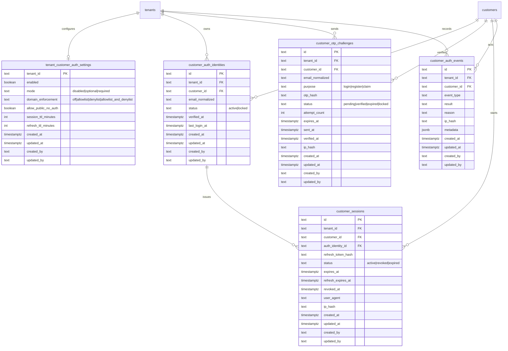
```mermaid
erDiagram
  tenants ||--o| tenant_customer_auth_settings : configures
  tenants ||--o{ customer_auth_identities : owns
  customers ||--o{ customer_auth_identities : authenticates
  tenants ||--o{ customer_otp_challenges : sends
  customers ||--o{ customer_otp_challenges : verifies
  customers ||--o{ customer_sessions : starts
  customer_auth_identities ||--o{ customer_sessions : issues
  tenants ||--o{ customer_auth_events : records
  customers ||--o{ customer_auth_events : acts

  tenant_customer_auth_settings {
    text tenant_id PK
    boolean enabled
    text mode "disabled|optional|required"
    text domain_enforcement "off|allowlist|denylist|allowlist_and_denylist"
    boolean allow_public_no_auth
    int session_ttl_minutes
    int refresh_ttl_minutes
    timestamptz created_at
    timestamptz updated_at
    text created_by
    text updated_by
  }

  customer_auth_identities {
    text id PK
    text tenant_id FK
    text customer_id FK
    text email_normalized
    text status "active|locked"
    timestamptz verified_at
    timestamptz last_login_at
    timestamptz created_at
    timestamptz updated_at
    text created_by
    text updated_by
  }

  customer_otp_challenges {
    text id PK
    text tenant_id FK
    text customer_id FK
    text email_normalized
    text purpose "login|register|claim"
    text otp_hash
    text status "pending|verified|expired|locked"
    int attempt_count
    timestamptz expires_at
    timestamptz sent_at
    timestamptz verified_at
    text ip_hash
    timestamptz created_at
    timestamptz updated_at
    text created_by
    text updated_by
  }

  customer_sessions {
    text id PK
    text tenant_id FK
    text customer_id FK
    text auth_identity_id FK
    text refresh_token_hash
    text status "active|revoked|expired"
    timestamptz expires_at
    timestamptz refresh_expires_at
    timestamptz revoked_at
    text user_agent
    text ip_hash
    timestamptz created_at
    timestamptz updated_at
    text created_by
    text updated_by
  }

  customer_auth_events {
    text id PK
    text tenant_id FK
    text customer_id FK
    text event_type
    text result
    text reason
    text ip_hash
    jsonb metadata
    timestamptz created_at
    timestamptz updated_at
    text created_by
    text updated_by
  }
```

### Constraints and indexes

| Entity | Rule |
| --- | --- |
| `tenant_customer_auth_settings` | One row per tenant; lazy default `enabled=false`, `mode=disabled`, `allow_public_no_auth=true` |
| `customer_auth_identities` | Unique `(tenant_id, email_normalized)` for active email identity |
| `customer_auth_identities` | Unique `(tenant_id, customer_id)` unless future multiple-login methods are explicitly added |
| `customer_auth_identities` | No password fields; OTP is the only SPRINT-020 customer credential mechanism |
| `customer_otp_challenges` | Stores OTP hash only; no plaintext OTP, password, OAuth token, or reset token |
| `customer_otp_challenges` | Indexed by `(tenant_id, email_normalized, status, expires_at)` for resend/rate checks |
| `customer_sessions` | Unique refresh token hash; indexed by `(tenant_id, customer_id, status, expires_at)` |
| `customer_auth_events` | Append-only auth audit; no secrets in `metadata` |

### Redis

| Key | Purpose |
| --- | --- |
| `monti_jarvis:customer_session:{session_id}` | Hot customer session cache with access-token TTL |
| `monti_jarvis:rate:customer_auth:{tenant}:{email_hash}` | OTP request/verify attempt rate limit |
| `monti_jarvis:customer_otp:{challenge_id}` | Optional hot OTP challenge cache with OTP TTL |
| Existing quota/rate keys | Authenticated chat/voice must continue using tenant/package dimensions and include customer context in attribution |

No ClickHouse or MinIO entity is added in SPRINT-020. Conversation analytics can later record `customer_id` once conversation records ship.

## Sprint 21 — workforce auth policy and customer usage ledger

SPRINT-021 extends existing S20 customer auth settings and S13 quota primitives. It may add a compact usage ledger if existing call rows are not sufficient for daily customer limit accounting.

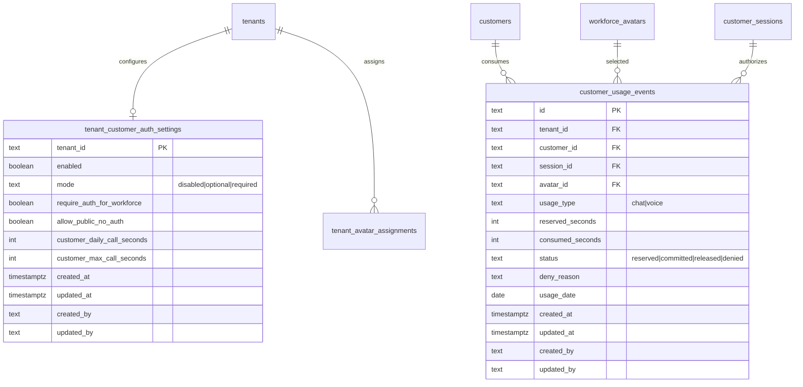
```mermaid
erDiagram
  tenants ||--o| tenant_customer_auth_settings : configures
  tenants ||--o{ tenant_avatar_assignments : assigns
  customers ||--o{ customer_usage_events : consumes
  workforce_avatars ||--o{ customer_usage_events : selected
  customer_sessions ||--o{ customer_usage_events : authorizes

  tenant_customer_auth_settings {
    text tenant_id PK
    boolean enabled
    text mode "disabled|optional|required"
    boolean require_auth_for_workforce
    boolean allow_public_no_auth
    int customer_daily_call_seconds
    int customer_max_call_seconds
    timestamptz created_at
    timestamptz updated_at
    text created_by
    text updated_by
  }

  customer_usage_events {
    text id PK
    text tenant_id FK
    text customer_id FK
    text session_id FK
    text avatar_id FK
    text usage_type "chat|voice"
    int reserved_seconds
    int consumed_seconds
    text status "reserved|committed|released|denied"
    text deny_reason
    date usage_date
    timestamptz created_at
    timestamptz updated_at
    text created_by
    text updated_by
  }
```

### Sprint 21 Redis quota keys

| Key | Purpose |
| --- | --- |
| `monti_jarvis:quota:{tenant}:customer:{customer}:day:{yyyymmdd}` | Daily customer call/chat time counter |
| `monti_jarvis:quota:{tenant}:customer:{customer}:avatar:{avatar}:day:{yyyymmdd}` | Optional per-avatar attribution |
| `monti_jarvis:rate:{tenant}:customer:{customer}:chat` | Customer chat rate limiter |
| `monti_jarvis:rate:{tenant}:customer:{customer}:call` | Customer call start limiter |

Migration placeholder: `scripts/migrations/021_customer_workforce_quota.sql`.

## Sprint 22 — conversation records, archive objects, and knowledge gaps

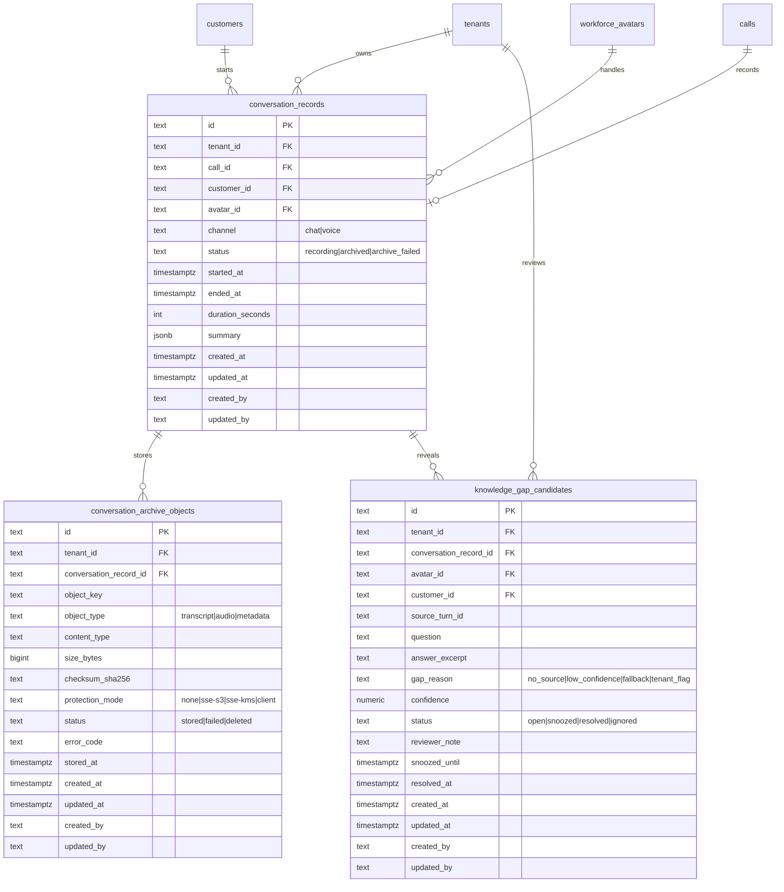
```mermaid
erDiagram
  tenants ||--o{ conversation_records : owns
  customers ||--o{ conversation_records : starts
  workforce_avatars ||--o{ conversation_records : handles
  calls ||--o| conversation_records : records
  conversation_records ||--o{ conversation_archive_objects : stores
  conversation_records ||--o{ knowledge_gap_candidates : reveals
  tenants ||--o{ knowledge_gap_candidates : reviews

  conversation_records {
    text id PK
    text tenant_id FK
    text call_id FK
    text customer_id FK
    text avatar_id FK
    text channel "chat|voice"
    text status "recording|archived|archive_failed"
    timestamptz started_at
    timestamptz ended_at
    int duration_seconds
    jsonb summary
    timestamptz created_at
    timestamptz updated_at
    text created_by
    text updated_by
  }

  conversation_archive_objects {
    text id PK
    text tenant_id FK
    text conversation_record_id FK
    text object_key
    text object_type "transcript|audio|metadata"
    text content_type
    bigint size_bytes
    text checksum_sha256
    text protection_mode "none|sse-s3|sse-kms|client"
    text status "stored|failed|deleted"
    text error_code
    timestamptz stored_at
    timestamptz created_at
    timestamptz updated_at
    text created_by
    text updated_by
  }

  knowledge_gap_candidates {
    text id PK
    text tenant_id FK
    text conversation_record_id FK
    text avatar_id FK
    text customer_id FK
    text source_turn_id
    text question
    text answer_excerpt
    text gap_reason "no_source|low_confidence|fallback|tenant_flag"
    numeric confidence
    text status "open|snoozed|resolved|ignored"
    text reviewer_note
    timestamptz snoozed_until
    timestamptz resolved_at
    timestamptz created_at
    timestamptz updated_at
    text created_by
    text updated_by
  }
```

### Sprint 22 MinIO and ClickHouse

| Store | Contract |
| --- | --- |
| MinIO | `monti-jarvis/calls/{tenant_id}/{call_id}/transcript.json`, `metadata.json`, optional `audio.*` |
| Postgres | Source of truth for record/gap lifecycle and object metadata |
| ClickHouse | No new required table in S22; later dashboards may project record/gap aggregates |

Migration placeholder: `scripts/migrations/022_conversation_records_knowledge_gaps.sql`.

## Sprint 23 — tickets and human escalation

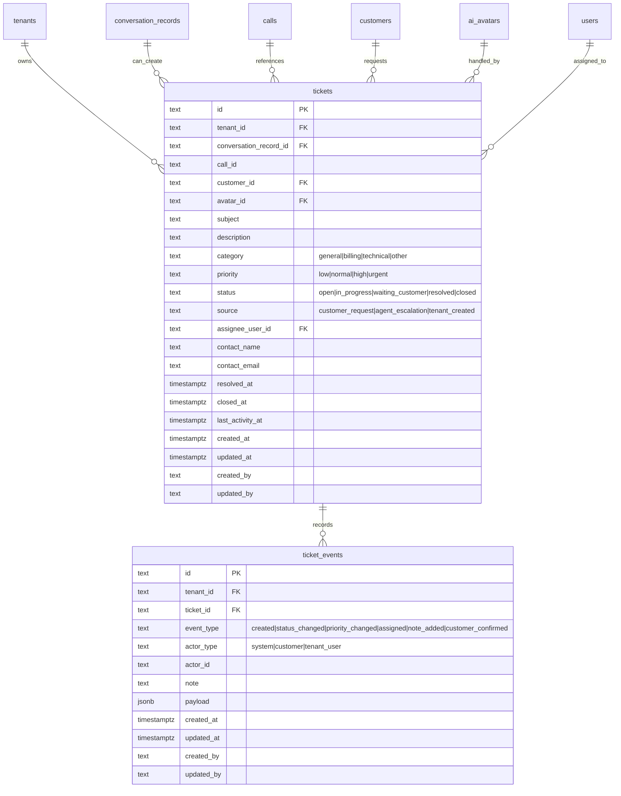
```mermaid
erDiagram
  tenants ||--o{ tickets : owns
  conversation_records ||--o{ tickets : can_create
  calls ||--o{ tickets : references
  customers ||--o{ tickets : requests
  ai_avatars ||--o{ tickets : handled_by
  tickets ||--o{ ticket_events : records
  users ||--o{ tickets : assigned_to

  tickets {
    text id PK
    text tenant_id FK
    text conversation_record_id FK
    text call_id
    text customer_id FK
    text avatar_id FK
    text subject
    text description
    text category "general|billing|technical|other"
    text priority "low|normal|high|urgent"
    text status "open|in_progress|waiting_customer|resolved|closed"
    text source "customer_request|agent_escalation|tenant_created"
    text assignee_user_id FK
    text contact_name
    text contact_email
    timestamptz resolved_at
    timestamptz closed_at
    timestamptz last_activity_at
    timestamptz created_at
    timestamptz updated_at
    text created_by
    text updated_by
  }

  ticket_events {
    text id PK
    text tenant_id FK
    text ticket_id FK
    text event_type "created|status_changed|priority_changed|assigned|note_added|customer_confirmed"
    text actor_type "system|customer|tenant_user"
    text actor_id
    text note
    jsonb payload
    timestamptz created_at
    timestamptz updated_at
    text created_by
    text updated_by
  }
```

### Sprint 23 storage contracts

| Store | Contract |
| --- | --- |
| Postgres | Source of truth for tenant ticket state and append-only operator/customer events |
| Redis | `monti_jarvis:ticket:idempotency:{tenant_id}:{key}` with a bounded TTL; optional per-customer daily abuse guard |
| NATS | `ticket.created` and `ticket.updated` with tenant and ticket metadata only |
| ClickHouse | No new table; ticket analytics are deferred |
| MinIO | Reuse Sprint 22 conversation archive links; no new ticket object path |

Migration placeholder: `scripts/migrations/023_tickets_human_escalation.sql`.

See [01-architecture.md](01-architecture.md) · [08-packages-spec.md](08-packages-spec.md) · [10-avatars-spec.md](10-avatars-spec.md) · [11-tenant-register-spec.md](11-tenant-register-spec.md) · [12-kyc-tenant-spec.md](12-kyc-tenant-spec.md) · [13-payment-gateway-spec.md](13-payment-gateway-spec.md) · [14-buy-package-spec.md](14-buy-package-spec.md) · [16-quota-rate-limit-spec.md](16-quota-rate-limit-spec.md) · [17-embed-to-web-spec.md](17-embed-to-web-spec.md) · [18-tenant-scope-km-spec.md](18-tenant-scope-km-spec.md) · [19-tenant-settings-limits-spec.md](19-tenant-settings-limits-spec.md) · [20-tenant-test-preview-spec.md](20-tenant-test-preview-spec.md) · [21-customer-tier-spec.md](21-customer-tier-spec.md) · [22-customer-account-import-spec.md](22-customer-account-import-spec.md) · [23-customer-auth-spec.md](23-customer-auth-spec.md) · [24-authenticated-workforce-selection-spec.md](24-authenticated-workforce-selection-spec.md) · [25-conversation-records-knowledge-gaps-spec.md](25-conversation-records-knowledge-gaps-spec.md) · [02-workflow.md](02-workflow.md) · [04-api-spec.md](04-api-spec.md) · [05-ux-ui.md](05-ux-ui.md).

## Sprint 24 - customer satisfaction review and tenant statistics

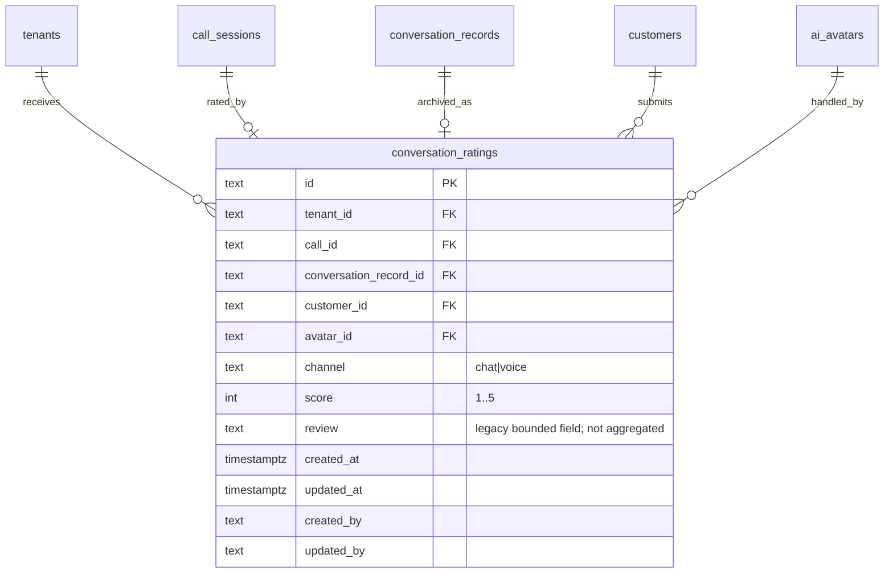
```mermaid
erDiagram
  tenants ||--o{ conversation_ratings : receives
  call_sessions ||--o| conversation_ratings : rated_by
  conversation_records ||--o| conversation_ratings : archived_as
  customers ||--o{ conversation_ratings : submits
  ai_avatars ||--o{ conversation_ratings : handled_by

  conversation_ratings {
    text id PK
    text tenant_id FK
    text call_id FK
    text conversation_record_id FK
    text customer_id FK
    text avatar_id FK
    text channel "chat|voice"
    int score "1..5"
    text review "legacy bounded field; not aggregated"
    timestamptz created_at
    timestamptz updated_at
    text created_by
    text updated_by
  }
```

### Sprint 24 storage contract

| Store | Contract |
| --- | --- |
| Postgres | `conversation_ratings` is the source of truth; one row per `(tenant_id, call_id)` with tenant/date/avatar/channel indexes. |
| Redis | No new key; active call state remains in existing session keys. |
| ClickHouse | No new table; aggregate statistics use Postgres until Sprint 25 dashboard projection. |
| MinIO | Reuse `calls/{tenant_id}/{call_id}/` archive objects; rating submission does not alter audio or transcript objects. |

Migration placeholder: `scripts/migrations/024_customer_satisfaction_reviews.sql`.

All new/extended audit fields are `created_at`, `updated_at`, `created_by`, and `updated_by`; the migration must preserve the existing `conversation_ratings` rows and unique tenant/call constraint.

See [27-customer-satisfaction-statistics-spec.md](27-customer-satisfaction-statistics-spec.md), [02-workflow.md](02-workflow.md), [04-api-spec.md](04-api-spec.md), and [05-ux-ui.md](05-ux-ui.md).

## Sprint 25 - tenant call-center analytics (ClickHouse)

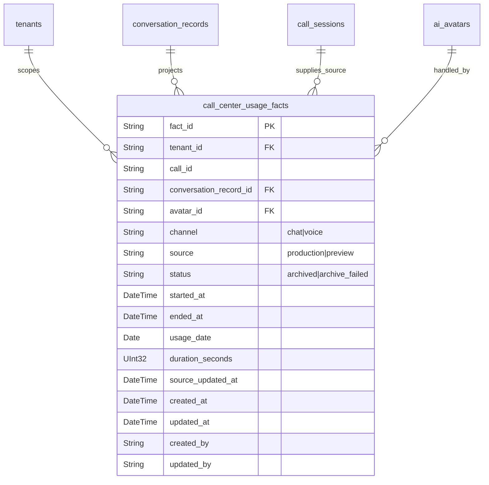
```mermaid
erDiagram
  tenants ||--o{ call_center_usage_facts : scopes
  conversation_records ||--o{ call_center_usage_facts : projects
  call_sessions ||--o{ call_center_usage_facts : supplies_source
  ai_avatars ||--o{ call_center_usage_facts : handled_by

  call_center_usage_facts {
    String fact_id PK
    String tenant_id FK
    String call_id
    String conversation_record_id FK
    String avatar_id FK
    String channel "chat|voice"
    String source "production|preview"
    String status "archived|archive_failed"
    DateTime started_at
    DateTime ended_at
    Date usage_date
    UInt32 duration_seconds
    DateTime source_updated_at
    DateTime created_at
    DateTime updated_at
    String created_by
    String updated_by
  }
```

The relationships above are logical cross-store links. ClickHouse does not enforce Postgres foreign keys; the projector validates the tenant and source ids before writing a fact.

### Sprint 25 storage contract

| Store | Contract |
| --- | --- |
| Postgres | Source of truth: `conversation_records`, `call_sessions`, tenant timezone/call limits, and package entitlements. No new Postgres table. |
| Redis | Existing `monti_jarvis:quota:{tenant}:minutes:{YYYYMM}` and related quota keys remain authoritative for enforcement. No new key. |
| ClickHouse | New `call_center_usage_facts` `ReplacingMergeTree` table with tenant/date ordering and audit columns. |
| MinIO | No new object. Existing `calls/{tenant_id}/{call_id}/` archive objects are not read into dashboard facts. |
| NATS | No required new event. Projection may run from the existing close/archive call path and a replay job. |

Migration/bootstrap placeholder: `scripts/migrations/025_call_center_analytics.sql`.

The ClickHouse table excludes customer id, email, phone, contact name, transcript content, rating comments, and audio paths. `fact_id` is deterministic so retries and bounded replay do not create duplicate logical sessions.

See [28-call-center-statistics-spec.md](28-call-center-statistics-spec.md), [02-workflow.md](02-workflow.md), [04-api-spec.md](04-api-spec.md), and [05-ux-ui.md](05-ux-ui.md).

## Sprint 26 - tenant system performance monitoring

Sprint 26 introduces no persisted entity. The monitoring snapshot is an ephemeral, bounded in-process read model assembled from existing dependency clients and the Sprint 25 analytics freshness result.

### Sprint 26 storage contract

| Store | Contract |
| --- | --- |
| Postgres | Existing `Store.Health` ping only. No new table, migration, audit columns, or monitoring rows. |
| Redis | Existing client `PING` only. No `monti_jarvis:` monitoring key. |
| ClickHouse | Existing health ping and call-center freshness read. No new table or raw analytics payload. |
| MinIO | Existing configured-bucket probe only. No new object and no object listing in the tenant response. |
| NATS | Existing enabled state. No new subject or event. |
| LiveKit | Existing configured state. No room, token, or customer data. |
| Gemini | Existing enabled state. No prompt, transcript, or provider response data. |
| In-process state | No persisted monitoring state or cross-tenant cache is introduced. |

There is no ER diagram or migration for this sprint because adding a monitoring table would exceed the approved scope. The logical relationships are service probes to existing stores, not foreign keys.

See [29-tenant-system-performance-spec.md](29-tenant-system-performance-spec.md), [02-workflow.md](02-workflow.md), [04-api-spec.md](04-api-spec.md), and [05-ux-ui.md](05-ux-ui.md).

## Sprint 27 - mobile call API and SDK

Sprint 27 introduces no new Postgres entity. The mobile contract is a versioned facade over existing call, customer-session, workforce-assignment, quota, turn, and rating records.

~~~mermaid
erDiagram
  tenants ||--o{ customer_sessions : authenticates
  tenants ||--o{ call_sessions : owns
  customers ||--o{ customer_sessions : starts
  customers ||--o{ call_sessions : places
  ai_avatars ||--o{ tenant_avatar_assignments : enabled_for
  ai_avatars ||--o{ call_sessions : handles
  tenant_avatar_assignments }o--|| tenants : scoped_to
  call_sessions ||--o{ call_turns : contains
  call_sessions ||--o| conversation_ratings : receives

  call_sessions {
    String id PK
    String tenant_id FK
    String customer_id FK
    String avatar_id FK
    String room_name
    String status
    DateTime started_at
    DateTime ended_at
    String recording_key
    DateTime created_at
    DateTime updated_at
    String created_by
    String updated_by
  }

  customer_sessions {
    String id PK
    String tenant_id FK
    String customer_id FK
    String refresh_token_hash
    DateTime expires_at
    DateTime revoked_at
    DateTime created_at
    DateTime updated_at
    String created_by
    String updated_by
  }

  conversation_ratings {
    String id PK
    String tenant_id FK
    String call_id FK
    Integer score
    String review
    DateTime created_at
    DateTime updated_at
    String created_by
    String updated_by
  }
~~~

The diagram shows logical relationships only. Existing migrations and store bootstrap remain authoritative; Sprint 27 does not add a migration.

### Sprint 27 storage contract

| Store | Contract |
| --- | --- |
| Postgres | Reuse call_sessions, call_turns, customer_sessions, ai_avatars, tenant_avatar_assignments, and conversation_ratings. No new table. |
| Redis | Reuse monti_jarvis:call:active:{call_id}; add only a bounded mobile idempotency response key with expiry. No audio or transcript payload. |
| NATS | No required new subject. Existing call lifecycle events remain compatible. |
| LiveKit / Gemini | Provider relay remains server-side. Mobile clients receive only the normalized WebSocket event envelope. |
| MinIO | Existing calls/{tenant_id}/{call_id}/ archive objects remain unchanged. |
| ClickHouse | No new table or mobile-specific fact. Completed calls continue through the existing archive/projection path. |

### Audit and isolation

All persisted records retain created_at, updated_at, created_by, and updated_by. The mobile API resolves tenant context from trusted auth/routing context, verifies caller ownership on every call operation, and never treats a request-body tenant_id as authoritative.

See 30-mobile-call-api-sdk-spec.md, 02-workflow.md, 04-api-spec.md, and 05-ux-ui.md.

## Sprint 28 - cross-tenant audit log

Sprint 28 adds no new Postgres domain table. Existing Postgres audit columns and `internal/auditctx` remain the source for row mutation context. The event stream is an immutable ClickHouse projection fed by an instance-local backend spool.

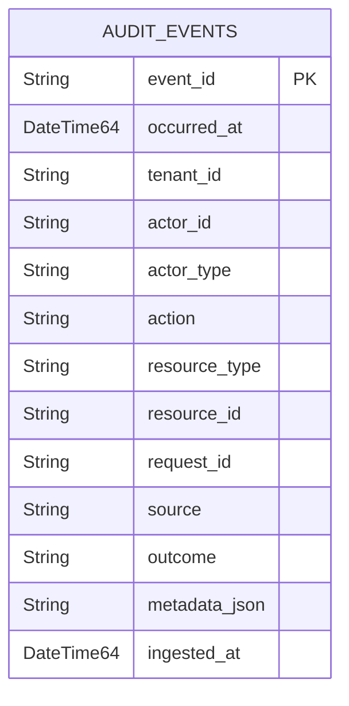
```mermaid
erDiagram
  AUDIT_EVENTS {
    String event_id PK
    DateTime64 occurred_at
    String tenant_id
    String actor_id
    String actor_type
    String action
    String resource_type
    String resource_id
    String request_id
    String source
    String outcome
    String metadata_json
    DateTime64 ingested_at
  }
```

`AUDIT_EVENTS` is a logical ClickHouse entity; ClickHouse does not enforce Postgres foreign keys. `event_id` is the logical identity used to make retries safe. The physical table uses `ReplacingMergeTree(ingested_at)` with `ORDER BY (tenant_id, occurred_at, event_id)`, and platform queries use `FINAL` or an equivalent deduplication query.

### Sprint 28 storage contract

| Store | Contract |
| --- | --- |
| Postgres | No new table. Existing `created_at`, `updated_at`, `created_by`, `updated_by` columns and `internal/auditctx` provide mutation context. |
| Backend filesystem | Instance-local `AUDIT_LOG_DIR`; active and closed `audit_log_YYYYMMDD-HH-MM-SS.jsonl` files plus atomic acknowledgement markers. |
| ClickHouse | New `audit_events` `ReplacingMergeTree` table with allowlisted event fields and redacted `metadata_json`; migration/bootstrap must be idempotent. |
| Redis | No audit payloads or delivery truth. Existing Redis DB 4 and `monti_jarvis:` prefix remain unchanged. |
| MinIO | No audit object path. Audit files are local operational spool files, not conversation archives. |

### Local file lifecycle

| State | Representation | Transition |
| --- | --- | --- |
| Active | Open `.jsonl` file | Writer appends bounded JSON lines. |
| Closed | Closed `.jsonl` file | Rotation makes it eligible for worker claim. |
| Transferring | Exclusive claim/lock | Worker sends all batches to ClickHouse. |
| Acknowledged | Atomic `.uploaded` marker with count/checksum/time | Complete insert response has been received. |
| Expired | File and marker older than retention | Worker deletes only after acknowledgement and age checks. |
| Retained failure | Closed file without valid marker | Retry; never delete because of age alone. |

The ClickHouse schema must be created by the runtime ensure-schema path and have a matching idempotent migration script, for example `scripts/migrations/003_audit_events_clickhouse.sql`, when implementation begins. No audit file or marker is shared between server instances.

See 31-cross-tenant-audit-log-spec.md, 02-workflow.md, 04-api-spec.md, and 05-ux-ui.md.

## Sprint 29 - platform system performance monitoring

Sprint 29 introduces no persisted entity. The platform snapshot is a request-time, bounded read model assembled from existing dependency clients, tenant registry, Sprint 25 analytics projection, Sprint 26 observability service, and Sprint 28 audit writer health.

### Sprint 29 storage contract

| Store | Contract |
| --- | --- |
| Postgres | Read active tenant metadata only; no new table or audit columns. |
| Redis | Existing dependency `PING` probe only; no monitoring keys and no snapshot cache. |
| ClickHouse | Read existing call-center analytics freshness per tenant; no new table or raw conversation data. |
| MinIO | Existing configured bucket probe only; no object listing or new path. |
| NATS / LiveKit / Gemini | Normalize configured/enabled state or bounded probe result; no message, room, prompt, or provider data is serialized. |
| Audit writer | Read Sprint 28 delivery status and bounded counts; never expose spool paths, marker contents, or event metadata. |

The logical `PLATFORM_PERFORMANCE_SNAPSHOT` is ephemeral and is not a database entity. No migration is required. See 32-platform-system-performance-spec.md, 02-workflow.md §83, 04-api-spec.md, and 05-ux-ui.md.

## Sprint 30 - platform call-center statistics by tenant

Sprint 30 introduces no new persisted entity. The dashboard is an ephemeral aggregate read model composed from the existing ClickHouse call facts and redacted Postgres enrichment sources.

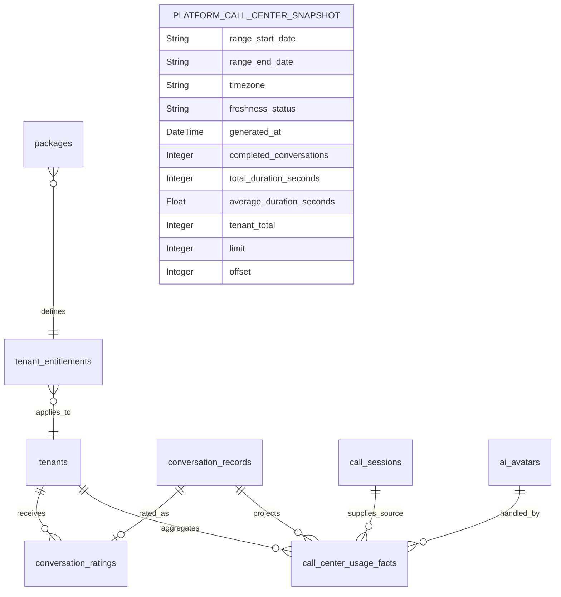
```mermaid
erDiagram
  tenants ||--o{ call_center_usage_facts : aggregates
  conversation_records ||--o{ call_center_usage_facts : projects
  call_sessions ||--o{ call_center_usage_facts : supplies_source
  ai_avatars ||--o{ call_center_usage_facts : handled_by
  tenants ||--o{ conversation_ratings : receives
  conversation_records ||--o| conversation_ratings : rated_as
  tenant_entitlements }o--|| tenants : applies_to
  packages }o--|| tenant_entitlements : defines

  PLATFORM_CALL_CENTER_SNAPSHOT {
    String range_start_date
    String range_end_date
    String timezone
    String freshness_status
    DateTime generated_at
    Integer completed_conversations
    Integer total_duration_seconds
    Float average_duration_seconds
    Integer tenant_total
    Integer limit
    Integer offset
  }
```

`PLATFORM_CALL_CENTER_SNAPSHOT` is a logical response model only. It is not stored in Postgres, Redis, ClickHouse, MinIO, or a process cache. ClickHouse remains the activity source; Postgres is used only for allowlisted tenant metadata, rating aggregates, and active package labels.

### Sprint 30 storage contract

| Store | Contract |
| --- | --- |
| Postgres | Read active tenant identity, tenant timezone fallback, `conversation_ratings` score aggregates, `tenant_entitlements`, and package names. No new table or migration. |
| Redis | No new statistics key. Existing quota counters remain authoritative for enforcement and are not rewritten by the dashboard. |
| ClickHouse | Reuse `call_center_usage_facts` with `FINAL`; group by tenant, channel, and avatar over the inclusive `usage_date` range. No new table. |
| MinIO | No reads or writes. Conversation archive objects are outside the aggregate contract. |
| Audit writer | No new event is emitted for a read-only dashboard request. Existing platform access logging remains subject to the Sprint 28 policy. |

### Aggregate source rules

| Metric | Source | Rule |
| --- | --- | --- |
| Completed conversations, duration, channel, avatar | ClickHouse `call_center_usage_facts` | Count only `status = 'archived'` facts in the requested range using `FINAL`. |
| Freshness | ClickHouse `max(updated_at)` | Use the latest fact projection timestamp; classify stale after the existing five-minute threshold. |
| Satisfaction | Postgres `conversation_ratings` joined to completed records | Return reviewed count, average score, completion rate, and 1–5 distribution only. Never return review text. |
| Package label | Postgres active entitlement/package | Return package name/status only; do not alter entitlements or quota counters. |
| Range usage | ClickHouse duration aggregate | Expose selected-range call minutes as a reporting metric, separate from current enforcement counters. |

No foreign keys are added because the ClickHouse relationships remain logical cross-store links. Existing audit columns on Postgres records remain unchanged.

See 33-platform-call-center-statistics-spec.md, 02-workflow.md §84, 04-api-spec.md, and 05-ux-ui.md.
