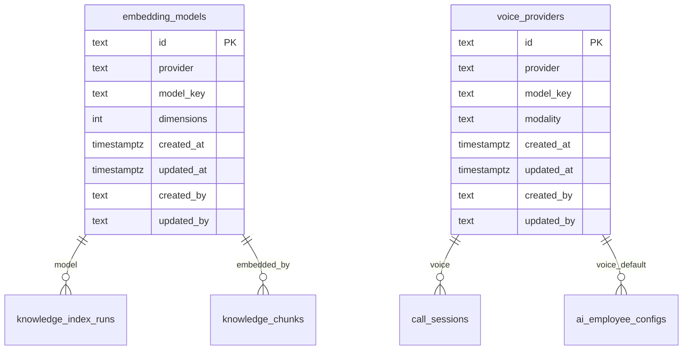
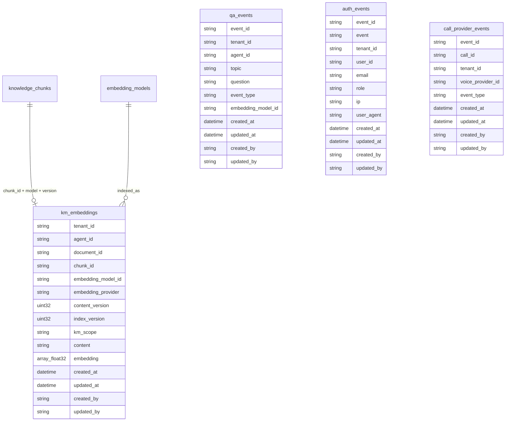

# ER Diagram — Monti Jarvis

Database `monti_jarvis`, Postgres schema `callcenter`. ClickHouse database `monti_jarvis` for vectors/analytics.

## Audit columns (standard)

Every durable Postgres table in `callcenter` carries four audit fields (migration `001_audit_columns_postgres`, `internal/store/audit.go`):

| Column | Type | Notes |
| --- | --- | --- |
| `created_at` | `timestamptz` | Row insert time; default `now()` |
| `updated_at` | `timestamptz` | Auto-set on `UPDATE` via `touch_updated_at()` trigger |
| `created_by` | `text` | Actor user id; default `'system'`; set from JWT via `internal/auditctx` |
| `updated_by` | `text` | Last mutator user id; default `'system'` |

**Audited tables today:** `calls`, `messages`, `call_sessions`, `call_turns`, `knowledge_documents`, `knowledge_chunks`, `tenants`, `users`, `user_roles`, `refresh_tokens`, `package_rule_schemas`, `packages`, `package_limits`, `tenant_entitlements`, `ai_avatars`, `ai_avatar_voices`, `tenant_avatar_assignments`, `tenant_registrations`, `brands`, `tenant_kyc_profiles`. Provider catalog tables (`embedding_models`, `voice_providers`) follow the same pattern when created.

ClickHouse analytics tables use `created_at`, `updated_at`, `created_by`, `updated_by` (`002_audit_columns_clickhouse` + `EnsureAuthEventsSchema`).

## Postgres (`callcenter`)

```mermaid
erDiagram
  tenants ||--o{ user_roles : scopes
  users ||--o{ user_roles : has
  users ||--o{ refresh_tokens : has
  tenants ||--o{ call_sessions : owns
  tenants ||--o{ knowledge_documents : owns
  tenants ||--o{ tenant_entitlements : entitled
  tenants ||--o{ tenant_avatar_assignments : assigns
  tenants ||--|| tenant_registrations : registered_via
  tenants ||--|| tenant_kyc_profiles : kyc_package
  tenants ||--o{ brands : owns
  ai_avatars ||--o{ tenant_avatar_assignments : enabled_for
  ai_avatars ||--o{ ai_avatar_voices : speaks_with
  voice_providers ||--o{ ai_avatar_voices : provides
  package_rule_schemas ||--o{ package_limits : shapes
  package_rule_schemas ||--o{ tenant_entitlements : snapshot_schema
  packages ||--o{ tenant_entitlements : grants
  packages ||--|| package_limits : defines
  embedding_models ||--o{ knowledge_index_runs : indexes_with
  voice_providers ||--o{ call_sessions : uses
  voice_providers ||--o{ ai_employee_configs : default_voice
  knowledge_documents ||--o{ knowledge_index_runs : versioned_by
  knowledge_index_runs ||--o{ knowledge_chunks : produces
  calls ||--o{ messages : has
  call_sessions ||--o{ call_turns : has

  tenants {
    text id PK
    text slug UK
    text name
    text status
    note "pending_kyc active suspended"
    timestamptz created_at
    timestamptz updated_at
    text created_by
    text updated_by
  }

  tenant_registrations {
    text id PK
    text tenant_id FK UK
    text company_name
    text admin_email
    text status
    text rejection_reason
    timestamptz reviewed_at
    text reviewed_by
    timestamptz created_at
    timestamptz updated_at
    text created_by
    text updated_by
  }

  tenant_kyc_profiles {
    text tenant_id PK FK
    text contact_name
    text contact_phone
    text contact_address
    text photo_object_key
    jsonb business_doc_keys
    text status
    timestamptz submitted_at
    timestamptz reviewed_at
    text reviewed_by
    text rejection_reason
    timestamptz created_at
    timestamptz updated_at
    text created_by
    text updated_by
  }

  brands {
    text id PK
    text tenant_id FK UK
    text name
    text status
    timestamptz created_at
    timestamptz updated_at
    text created_by
    text updated_by
  }

  users {
    text id PK
    text email UK
    text password_hash
    text display_name
    text status
    timestamptz created_at
    timestamptz updated_at
    text created_by
    text updated_by
  }

  user_roles {
    text user_id FK
    text role
    text tenant_id FK
    timestamptz created_at
    timestamptz updated_at
    text created_by
    text updated_by
  }

  refresh_tokens {
    text id PK
    text user_id FK
    text token_hash UK
    timestamptz expires_at
    timestamptz revoked_at
    timestamptz created_at
    timestamptz updated_at
    text created_by
    text updated_by
  }

  calls {
    text id PK
    text agent_id
    text title
    timestamptz created_at
    timestamptz updated_at
    text created_by
    text updated_by
  }

  messages {
    bigserial id PK
    text call_id FK
    text role
    text content
    timestamptz created_at
    timestamptz updated_at
    text created_by
    text updated_by
  }

  call_sessions {
    text id PK
    text tenant_id
    text room_name UK
    text voice_provider_id FK
    text status
    timestamptz started_at
    timestamptz ended_at
    text recording_key
    timestamptz created_at
    timestamptz updated_at
    text created_by
    text updated_by
  }

  call_turns {
    bigserial id PK
    text call_id FK
    text role
    text content
    jsonb source_chunk_ids
    timestamptz created_at
    timestamptz updated_at
    text created_by
    text updated_by
  }

  embedding_models {
    text id PK
    text provider
    text model_key
    int dimensions
    text status
    timestamptz created_at
    timestamptz updated_at
    text created_by
    text updated_by
  }

  voice_providers {
    text id PK
    text provider
    text model_key
    text modality
    text status
    timestamptz created_at
    timestamptz updated_at
    text created_by
    text updated_by
  }

  ai_employee_configs {
    text agent_id PK
    text tenant_id FK
    text voice_provider_id FK
    text text_provider_id FK
    text embedding_model_id FK
    timestamptz created_at
    timestamptz updated_at
    text created_by
    text updated_by
  }

  knowledge_documents {
    text id PK
    text tenant_id
    text agent_id
    text filename
    text object_key
    text mime
    text status
    text km_scope
    int content_version
    int chunk_count
    timestamptz created_at
    timestamptz updated_at
    text created_by
    text updated_by
  }

  knowledge_index_runs {
    text id PK
    text document_id FK
    text tenant_id
    text embedding_model_id FK
    int index_version
    text status
    timestamptz started_at
    timestamptz completed_at
    timestamptz created_at
    timestamptz updated_at
    text created_by
    text updated_by
  }

  knowledge_chunks {
    text id PK
    text document_id FK
    text index_run_id FK
    text tenant_id
    text agent_id
    int chunk_index
    text content
    text km_scope
    text embedding_model_id FK
    int index_version
    timestamptz created_at
    timestamptz updated_at
    text created_by
    text updated_by
  }

  package_rule_schemas {
    text id PK
    int version UK
    text name
    jsonb fields
    text status
    timestamptz created_at
    timestamptz updated_at
    text created_by
    text updated_by
  }

  packages {
    text id PK
    text slug UK
    text name
    text status
    int price_cents
    text currency
    text billing_period
    timestamptz created_at
    timestamptz updated_at
    text created_by
    text updated_by
  }

  package_limits {
    text package_id PK_FK
    text rules_schema_id FK
    jsonb rules
    timestamptz created_at
    timestamptz updated_at
    text created_by
    text updated_by
  }

  tenant_entitlements {
    text id PK
    text tenant_id FK
    text package_id FK
    text rules_schema_id FK
    jsonb rules_snapshot
    text status
    timestamptz valid_from
    timestamptz valid_until
    timestamptz created_at
    timestamptz updated_at
    text created_by
    text updated_by
  }

  ai_avatars {
    text id PK
    text slug UK
    text name
    text role
    text trait
    text color
    text image_url
    text greeting
    text status
    jsonb flags
    timestamptz created_at
    timestamptz updated_at
    text created_by
    text updated_by
  }

  ai_avatar_voices {
    text id PK
    text avatar_id FK
    text voice_provider_id FK
    text voice_id
    text voice
    int priority
    text status
    timestamptz created_at
    timestamptz updated_at
    text created_by
    text updated_by
  }

  tenant_avatar_assignments {
    text tenant_id FK
    text avatar_id FK
    text status
    timestamptz created_at
    timestamptz updated_at
    text created_by
    text updated_by
  }
```

### Table notes

| Table | Purpose |
| --- | --- |
| `calls` | Legacy chat session ids from `/api/chat` |
| `messages` | Text chat transcript pairs (caller/agent) |
| `call_sessions` | Voice call sessions; `voice_provider_id` for Gemini/Grok switch *(planned)* |
| `call_turns` | Voice/text turns per call session |
| `knowledge_documents` | KM upload metadata; `content_version` bumps on file replace |
| `knowledge_index_runs` | One embed/index pass per document + **embedding model** + `index_version` *(planned)* |
| `knowledge_chunks` | Chunk text; FK to `index_run_id` and `embedding_model_id` |
| `embedding_models` | Catalog: `gemini-embedding-001`, future models; drives vector compatibility |
| `voice_providers` | Catalog: Gemini Live, Grok Voice, etc. — switchable per agent/tenant |
| `ai_employee_configs` | Per-agent binding of voice, text, and embedding providers *(Sprint 21)* |
| `tenants` | SaaS tenant registry *(Sprint 3)* |
| `users` | Login identities *(Sprint 3)* |
| `user_roles` | RBAC role per user/tenant *(Sprint 3)* |
| `refresh_tokens` | Hashed refresh tokens *(Sprint 3)* |
| `package_rule_schemas` | Versioned JSONB field catalog for package `rules` *(Sprint 4)* |
| `packages` | Commercial catalog — Starter/Pro/Enterprise *(Sprint 4)* |
| `package_limits` | `rules` jsonb per package; shape from `package_rule_schemas` *(Sprint 4)* |
| `tenant_entitlements` | Assignment + `rules_snapshot` at bind time *(Sprint 4)* |
| `ai_avatars` | Platform-managed avatar catalog *(Sprint 5)* |
| `ai_avatar_voices` | Ordered voice profiles per avatar (`voice_provider_id`, `voice_id`, `voice`, `priority`) *(Sprint 5)* |
| `tenant_avatar_assignments` | Which avatars each tenant may use *(Sprint 5)* |

### Indexes

- `knowledge_documents (tenant_id, agent_id)`
- `knowledge_chunks (tenant_id, agent_id, embedding_model_id, index_version)`
- `knowledge_index_runs (document_id, embedding_model_id, index_version)`
- `call_sessions (tenant_id, voice_provider_id)` *(planned)*
- `tenant_avatar_assignments (tenant_id) WHERE status = 'active'` *(Sprint 5)*
- `ai_avatar_voices (avatar_id, priority) WHERE status = 'active'` *(Sprint 5)*

### KM versioning model (planned)

Two version axes keep provider switches safe:

| Field | Layer | Bumps when |
| --- | --- | --- |
| `content_version` | Postgres `knowledge_documents` | Operator uploads/replaces source file |
| `index_version` | `knowledge_index_runs` + chunks + ClickHouse | Re-embed with same or new **embedding model** |

Search and RAG **must** filter on `(tenant_id, embedding_model_id, index_version)` so vectors from `gemini-embedding-001` are never compared to queries from `grok-embed` or another model.

## Provider catalog (Postgres — planned)



Example seed rows:

| `id` | `provider` | `model_key` | Role |
| --- | --- | --- | --- |
| `emb-gemini-001` | `google` | `gemini-embedding-001` | KM embed + query |
| `voice-gemini-live` | `google` | `gemini-2.5-flash-native-audio-latest` | Voice relay |
| `voice-grok` | `xai` | `grok-voice-*` | Future voice failover |

Tenant/agent config (`ai_employee_configs`) points at active `voice_provider_id` and `embedding_model_id`. Switching voice provider does **not** invalidate KM index; switching **embedding model** requires a new `index_version` and re-embed.

## ClickHouse (`monti_jarvis`)



### ClickHouse notes

| Column | Purpose |
| --- | --- |
| `embedding_model_id` | FK to Postgres catalog; **required** on search filter |
| `embedding_provider` | Denormalized vendor (`google`, `xai`) for analytics |
| `content_version` | Matches Postgres document content generation |
| `index_version` | Matches `knowledge_index_runs`; invalidate old vectors on re-index |
| `chunk_id` | Join key to Postgres `knowledge_chunks.id` |
| `created_at` / `updated_at` / `created_by` / `updated_by` | Audit fields on all analytics tables (shipped Sprint 3) |
| `auth_events` | NATS auth lifecycle mirror (`auth.user.logged_in`, `logged_out`, etc.) |

**Search rule:** `WHERE tenant_id = ? AND agent_id = ? AND embedding_model_id = ? AND index_version = active AND km_scope IN (?)` — never mix models in cosine ranking.

**Sprint 2 today:** `km_embeddings` uses `km_version` as a single field; migration path renames/splits into `content_version` + `index_version` + `embedding_model_id` (default `emb-gemini-001` for existing rows).

## Cross-store relationships

```text
Postgres knowledge_chunks.id  ──►  ClickHouse km_embeddings.chunk_id
Postgres embedding_models.id  ──►  km_embeddings.embedding_model_id
Postgres voice_providers.id   ──►  call_sessions.voice_provider_id
Postgres index_run.id         ──►  knowledge_chunks.index_run_id
```

Voice path (Gemini → Grok failover) updates `call_sessions.voice_provider_id` and logs `call_provider_events`; KM vectors stay tied to **embedding model**, not voice provider.

## MinIO (object keys)

```
monti-jarvis/
  calls/                    # future recordings
  km/{tenant_id}/{agent_id}/{doc_id}/original/{filename}
  kyc/{tenant_id}/          # Sprint 6 — photo + docs (see internal/store/tenantkyc_assets.go)
    photo.{ext}
    docs/{filename}
```

## Redis (ephemeral)

| Key pattern | TTL | Fields |
| --- | --- | --- |
| `monti_jarvis:call:{session_id}` | 24h | agent_id, updated_at (legacy chat) |
| `monti_jarvis:call:active:{id}` | 24h | tenant_id, room_name, status, started_at |
| `monti_jarvis:entitlement:{tenant_id}` | 15m (env) | package slug, status, effective limits JSON *(Sprint 4)* |
| `monti_jarvis:register:ip:{ip}` | 1h | registration attempt counter *(Sprint 6)* |

## Workforce (Sprint 5 — DB + fallback)

- **Primary:** `ai_avatars` + `tenant_avatar_assignments` → `GET /api/workforce` per tenant.
- **Fallback:** `internal/workforce/workforce.go` static catalog when tenant has zero active assignments.
- **Sprint 21:** `ai_employee_configs` provider bindings; may extend or alias `ai_avatars`.

## Implementation phases

| Phase | KM / provider scope |
| --- | --- |
| **v0.3.0 (shipped)** | Single embed model env var; `km_version` column; Gemini voice only |
| **Sprint 3–4** | Provider catalog tables stub; default `emb-gemini-001` / `voice-gemini-live` seeds |
| **Sprint 15** | Tenant selects embedding model; re-index workflow bumps `index_version` |
| **Sprint 21** | `ai_employee_configs` binds voice + embed providers per avatar |
| **Failover** | Runtime voice provider switch via `voice_providers`; KM unchanged until embed model changes |

## Future entities (roadmap)

| Sprint | Tables |
| --- | --- |
| 4 ✅ v0.5.0 | `package_rule_schemas`, `packages`, `package_limits`, `tenant_entitlements` |
| 5 ✅ v0.6.0 | `ai_avatars`, `ai_avatar_voices`, `tenant_avatar_assignments` |
| 6 ✅ v0.7.0 | `tenant_registrations`, `brands`, `tenant_kyc_profiles`; `tenants.status` + `pending_kyc` |
| 7 🔄 v0.8.0 | KYC review columns on `tenant_kyc_profiles` + `tenant_registrations`; approve/reject lifecycle |
| 15 | `km_scope_assignments`, tenant-driven re-index |
| 21 | Runtime voice failover + `ai_employee_configs` embedding bindings (voice stays on `ai_avatar_voices`) |
| 22 | `conversation_records` (ClickHouse denorm) |

See [01-architecture.md](01-architecture.md) · [08-packages-spec.md](08-packages-spec.md) · [10-avatars-spec.md](10-avatars-spec.md) · [11-tenant-register-spec.md](11-tenant-register-spec.md) · [12-kyc-tenant-spec.md](12-kyc-tenant-spec.md) · blueprint §15.3 Embedding Provider · §16.4 KM domains.