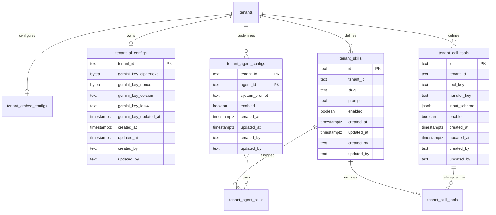

# Tenant AI Configuration and Embed Auth — Design Spec

**Sprint:** SPRINT-043 · **Release target:** v2.17.0  
**Feature:** [FEAT-0037](../01-features/FEAT-0037-tenant-ai-config-extensibility.md)  
**Depends on:** [17-embed-to-web-spec.md](17-embed-to-web-spec.md), [18-tenant-scope-km-spec.md](18-tenant-scope-km-spec.md), [19-tenant-settings-limits-spec.md](19-tenant-settings-limits-spec.md), [23-customer-auth-spec.md](23-customer-auth-spec.md), [37-theme-color-customization-spec.md](37-theme-color-customization-spec.md)

## 1. Goals

- Let a tenant explicitly require customer authentication for its embed while
  preserving the existing public embed when `auth_required=false`.
- Separate core infrastructure environment values from grouped operational and
  product configuration without breaking local `make restart` behavior.
- Let a tenant use an encrypted Gemini key, a bounded agent prompt, allowlisted
  call tools, and prompt/tool skills without exposing secrets or crossing tenant
  boundaries.
- Keep the platform Gemini key as the default only when the tenant has not
  configured a key; a configured tenant key must not silently fall back after a
  provider failure.

## 2. Non-goals (Sprint 43)

- A marketplace or arbitrary third-party skill execution.
- Arbitrary HTTP, shell, SQL, JavaScript, or webhook tools.
- Multi-provider LLM selection or replacing Gemini platform-wide.
- Customer identity redesign, KYC, billing, quota policy, or a new auth
  protocol. Sprint 43 reuses the existing OTP/session contract.

## 3. Decisions

| Decision | Contract |
| --- | --- |
| Embed auth | Add `auth_required boolean` to `tenant_embed_configs`, default `false`. Public resolve returns the flag; chat/voice requests carry the embed key so the server can enforce it. |
| Tenant context | `X-Monti-Embed-Key` plus validated `X-Embed-Parent-Origin` is the public context for HTTP; WebSocket uses `embed_key` and `parent_origin` query parameters. `X-Tenant-Id` remains a local `AUTH_DISABLED` compatibility hint only. |
| Secret storage | Encrypt the tenant Gemini key with AES-256-GCM using a deployment-only `TENANT_SECRET_ENCRYPTION_KEY`; store ciphertext, nonce, key version, and last four characters only. |
| Prompt precedence | Immutable platform safety policy → built-in workforce prompt → tenant agent prompt → assigned skill prompts → locale/RAG context → closing safety reminder. Tenant text is bounded and cannot replace the platform policy. |
| Tool execution | Store declarative Gemini function schemas plus an allowlisted `handler_key`; dispatch only registered in-process handlers. No tenant-supplied executable code or network target. |
| Skill composition | A skill owns bounded prompt text and references tenant tools through a join table. Assignment is tenant + agent scoped and validated before runtime use. |
| Configuration files | `infra/.env.<APP_ENV>` is the core file. Optional `CONFIG_GROUPS=ai,ops,email,features` loads `infra/.env.<APP_ENV>.<group>`; process environment wins, duplicate group keys fail startup. |

## 4. Environment and configuration groups

### 4.1 File layout

| Group | Example file | Contains |
| --- | --- | --- |
| core | `infra/.env.dev` / `infra/.env.prod` | App bind, Postgres, Redis DB 4, MinIO, ClickHouse, NATS, LiveKit, JWT and secret-encryption key |
| ai | `infra/.env.dev.ai` | Platform Gemini key/model defaults and AI usage pricing |
| ops | `infra/.env.dev.ops` | Audit spool, monitoring, rate-limit, quota, and rollout switches |
| email | `infra/.env.dev.email` | Resend and OAuth provider configuration |
| features | `infra/.env.dev.features` | Feature flags and optional integrations such as mobile/Twilio |

Group files are optional and gitignored when they contain secrets. Commit only
`.example` templates. `APP_ENV` selects the file stem and `CONFIG_GROUPS` is a
comma-separated allowlist. Loading order is core, groups in the declared order,
then process environment; a key defined in more than one file is a startup
configuration error unless the process environment explicitly overrides it.
The legacy `infra/.env.<APP_ENV>` file remains valid as the core file, so
existing development commands continue to work.

### 4.2 Required runtime variables

| Variable | Default | Rule |
| --- | --- | --- |
| `CONFIG_GROUPS` | empty | Comma-separated `ai,ops,email,features`; unknown groups fail startup. |
| `TENANT_SECRET_ENCRYPTION_KEY` | unset | Required when tenant Gemini keys are enabled; base64-encoded 32-byte key. |
| `TENANT_SECRET_KEY_VERSION` | `v1` | Stored with ciphertext for planned key rotation. |
| `GEMINI_API_KEY` | empty | Platform fallback key; never returned by any API. |
| `GEMINI_MODEL` | `gemini-flash-latest` | Platform default text model. |
| `GEMINI_LIVE_MODEL` | `gemini-2.5-flash-native-audio-latest` | Platform default voice model. |

Configuration endpoints do not expose environment values. `/healthz` and
monitoring report only group load state (`loaded`, `disabled`, `invalid`) and
never file paths, key names, or values.

## 5. Data model (Postgres `callcenter`)

All new tables use `created_at`, `updated_at`, `created_by`, and `updated_by`.
Tenant ids come from trusted auth/context and are never accepted as a writable
cross-tenant selector.

### 5.1 Existing `tenant_embed_configs` delta

| Column | Type | Notes |
| --- | --- | --- |
| `auth_required` | boolean not null default false | When true, customer auth is required for chat/voice initiated with this embed. |

### 5.2 `tenant_ai_configs`

One row per tenant; stores no plaintext provider key.

| Column | Type | Notes |
| --- | --- | --- |
| `tenant_id` | text PK | FK → `tenants.id` ON DELETE CASCADE |
| `gemini_key_ciphertext` | bytea null | AES-256-GCM ciphertext |
| `gemini_key_nonce` | bytea null | Unique nonce per save |
| `gemini_key_version` | text null | Encryption key version |
| `gemini_key_last4` | text null | Display metadata only |
| `gemini_key_updated_at` | timestamptz null | Rotation/replacement timestamp |
| audit columns | — | Standard audit columns |

### 5.3 `tenant_agent_configs`

| Column | Type | Notes |
| --- | --- | --- |
| `tenant_id` | text | FK → `tenants.id`; composite PK part |
| `agent_id` | text | Logical FK to assigned workforce agent; composite PK part |
| `system_prompt` | text null | Max 8,000 Unicode characters; tenant text is untrusted context |
| `enabled` | boolean not null default true | Allows reset/disable without deleting history |
| audit columns | — | Standard audit columns |

### 5.4 `tenant_call_tools`

| Column | Type | Notes |
| --- | --- | --- |
| `id` | text PK | Server-generated identifier |
| `tenant_id` | text | FK → `tenants.id` |
| `tool_key` | text | Unique within tenant; `[a-z][a-z0-9_]{1,63}` |
| `display_name` | text | Max 120 characters |
| `description` | text | Max 500 characters; sent to Gemini |
| `handler_key` | text | Server allowlist key, e.g. `create_ticket` |
| `input_schema` | jsonb | JSON Schema subset; max 32 KiB |
| `enabled` | boolean not null default false | Disabled by default until explicitly enabled |
| audit columns | — | Standard audit columns |

### 5.5 `tenant_skills`, `tenant_skill_tools`, and `tenant_agent_skills`

`tenant_skills` stores bounded prompt bundles. Join rows are tenant-scoped and
use composite uniqueness to prevent cross-tenant references.

| Table | Key fields | Contract |
| --- | --- | --- |
| `tenant_skills` | `id`, `tenant_id`, `slug`, `name`, `prompt`, `enabled` | Prompt max 8,000 chars; slug unique per tenant |
| `tenant_skill_tools` | `tenant_id`, `skill_id`, `tool_id` | Both ids must belong to the same tenant; unique pair |
| `tenant_agent_skills` | `tenant_id`, `agent_id`, `skill_id` | Assignment unique per tenant/agent/skill |



### 5.6 Redis and MinIO

| Store | Contract |
| --- | --- |
| Redis DB 4 | Optional short-lived `monti_jarvis:ai:config:{tenant_id}` metadata cache; never cache plaintext Gemini keys, prompts, or tool arguments. Invalidation follows tenant config writes. |
| MinIO | No Sprint 43 objects. Keys and prompts remain in Postgres; no browser localStorage persistence. |

## 6. Runtime behavior

1. Resolve tenant context from a trusted tenant-admin token, a validated embed
   key, or the existing local demo context. Reject a body/header tenant switch.
2. Load the tenant AI config and decrypt the Gemini key only for the request or
   voice session. If no tenant key exists, use the platform client. If a tenant
   key exists but cannot decrypt or provider-call fails, fail closed for that
   request and return `ai_provider_unavailable`.
3. Load the assigned agent prompt, enabled skills, and enabled tools. Every row
   is filtered by the resolved tenant id and assigned agent.
4. Build the prompt with the precedence in §3. RAG excerpts are delimited data;
   they cannot alter safety policy or tool permissions.
5. Send only the allowlisted tool declarations to Gemini. For a function call,
   validate arguments against the stored schema, dispatch the registered
   handler with tenant/customer context, cap calls at three per turn, and send
   a redacted tool result back to Gemini.
6. Record only safe metadata (provider/model, key source `tenant|platform`,
   tool key, success/failure, and usage) in existing metering/audit paths.
   Never record keys, prompt secrets, full tool arguments, or raw provider
   credentials.

## 7. API summary

See [04-api-spec.md](04-api-spec.md) §§ Sprint 43. Quick list:

| Method | Path | Role |
| --- | --- | --- |
| `GET/PUT` | `/api/tenant/embed` | `tenant_admin` |
| `GET/PUT/DELETE` | `/api/tenant/ai/gemini-key` | `tenant_admin` |
| `GET/PUT` | `/api/tenant/ai/prompts/{agent_id}` | `tenant_admin` |
| `GET/POST` | `/api/tenant/ai/tools` | `tenant_admin` |
| `PUT/DELETE` | `/api/tenant/ai/tools/{id}` | `tenant_admin` |
| `GET/POST` | `/api/tenant/ai/skills` | `tenant_admin` |
| `PUT/DELETE` | `/api/tenant/ai/skills/{id}` | `tenant_admin` |
| `PUT` | `/api/tenant/ai/skills/{id}/assignment` | `tenant_admin` |
| `GET` | `/api/public/embed/{embed_key}` | public, origin-bound |
| `POST` | `/api/chat` | public/customer, embed-context aware |
| `GET` | `/ws/voice` | public/customer, embed-context aware |

## 8. RBAC and security

| Action | `platform_admin` | `tenant_admin` | `customer` | Public embed |
| --- | --- | --- | --- | --- |
| Read/update own embed auth | no direct cross-tenant write | yes | no | read `auth_required` only |
| Set/read tenant Gemini key | no plaintext access | set/replace/delete; metadata only | no | no |
| Manage prompts/tools/skills | no direct tenant write | own tenant only | no | no |
| Use configured prompt/tools/skills | through tenant-scoped runtime only | through preview/runtime | through chat/voice | only through resolved embed context |
| Bypass customer auth when `auth_required=true` | no | no | with valid session | no |

Security invariants:

- `tenant_id` is derived from auth/embed resolution, never accepted as a
  writable selector on tenant APIs.
- Tenant admin APIs require active `tenant_admin`; `AUTH_DISABLED` does not
  bypass them. Local public chat/voice remains compatible only when the embed
  is configured with `auth_required=false`.
- Key writes are audit events with metadata only. API responses return
  `{configured, last4, key_version, updated_at}` and never ciphertext or
  plaintext.
- Tool handlers are compiled into the server allowlist. Tool schema, skill
  prompt, and assignment validation reject URLs, executable code, SQL, and
  cross-tenant ids.

## 9. Verification

```bash
make test
make build
cd apps/tenant-web && npm run check && npm run build
cd apps/customer-web && npm run check && npm run build
git diff --check

# Config groups
APP_ENV=dev CONFIG_GROUPS=ai,ops make restart
# duplicate/unknown groups fail startup; process env precedence is deterministic

# Embed auth
curl -i -H 'X-Monti-Embed-Key: emb_required' \
  -H 'X-Embed-Parent-Origin: https://shop.example' \
  http://localhost:8091/api/chat
# expected: 401 customer_auth_required before customer session

# Secret contract
curl -s -X PUT -H 'Authorization: Bearer …' \
  -H 'Content-Type: application/json' \
  -d '{"api_key":"tenant-secret"}' \
  http://localhost:8091/api/tenant/ai/gemini-key
# expected: configured metadata only; logs/API/DB query never expose plaintext
```

## 10. Acceptance mapping

| FEAT-0037 criterion | Design evidence |
| --- | --- |
| Embed auth true/false | §3 decision, §6 runtime, API § Sprint 43, workflow 93–94 |
| Grouped configuration | §4 and workflow 96 |
| Tenant Gemini key | §5.2, §6, §8, API key endpoints |
| Custom system prompt | §5.3, §6, prompt endpoint |
| Tenant tools | §5.4, §6 handler allowlist, tool CRUD |
| Tenant skills | §5.5, §6 assignments, skill CRUD |

## Approver sign-off

| Role | Name | Date | Approved |
| --- | --- | --- | --- |
| PM | | | ☐ |
| Dev | | | ☐ |
