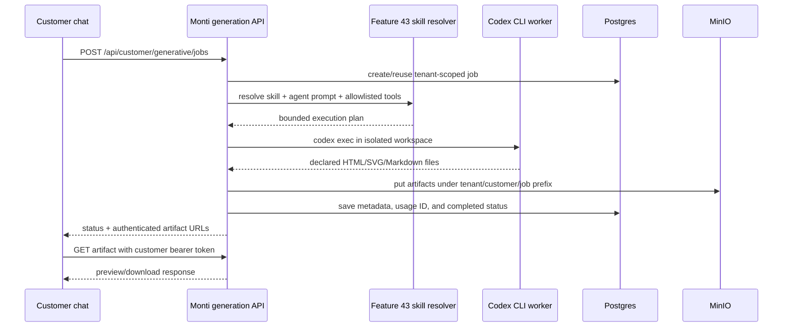

# Roadmap 45 — Codex CLI Skills and Downloadable Artifacts (ON HOLD)

> **ON HOLD:** This is a proposal only. No customer or tenant may invoke a
> Codex/CLI process; implementation requires a separate security review and
> explicit re-approval.

## 1. Purpose

Roadmap 45 introduces a bounded Codex CLI execution path that turns a tenant’s
Feature 43 skills into customer-facing artifacts: HTML catalogs, SVG/image
assets, and Markdown or PDF-ready reports.

The first example is a travel-guide planner that produces a downloadable travel
catalog from structured destination data.

Feature 43 supplies the tenant-owned configuration surface:

- bounded system prompts;
- tenant skills made from prompt bundles;
- tenant-owned, allowlisted tools;
- tenant and agent assignment boundaries;
- audit-safe configuration and secret handling.

Roadmap 45 supplies the commercial and operational controls:

- package entitlements and quota dimensions;
- storage accounting for generated artifacts;
- idempotent usage events;
- tenant/platform usage and billing projections;
- retry, isolation, and concurrent-load verification.

This design extends the S43/S44 contracts. It does not turn tenant skills into
arbitrary shell scripts.

## 2. Current baseline and gap

Feature 43 currently stores declarative skills and allowlisted server handlers.
Feature 44 provides a unified customer generation job and artifact contract,
but only the Claude adapter is usable today; Codex is explicitly
`not_configured`.

Roadmap 45 must add a bounded Codex adapter with these fixed properties:

1. The server chooses the `codex` executable and fixed CLI flags.
2. The tenant/customer supplies data and bounded instructions, not shell args.
3. The process runs in an isolated temporary workspace with a timeout and size
   limits.
4. The process may write only declared output files.
5. The server validates, stores, meters, and authorizes every artifact.

## 3. Scope

### In scope

- A reusable `travel-guide-catalog` skill stored under `.agents/skills/`.
- Tenant skill selection and assignment through the Feature 43 AI surface.
- A server-side Codex CLI adapter behind the existing generation job API.
- HTML, SVG/image, Markdown report, and optional PDF-ready output files.
- Private chat download links or authenticated artifact downloads.
- Roadmap 45 storage, generation, rate, and usage accounting.
- Retry, timeout, tenant isolation, audit redaction, and UAT coverage.

### Out of scope

- Customer-provided shell commands, executable scripts, or arbitrary CLI flags.
- `danger-full-access` Codex execution for customer jobs.
- Unrestricted web browsing or an unapproved travel-data marketplace.
- Treating a ChatGPT subscription login as a server-side multi-tenant runtime.
- Training or fine-tuning a model.

## 4. Skill setup

Codex skills are directories containing a `SKILL.md` file. The skill should
describe the workflow and output contract; the application controls execution,
input files, credentials, and artifact persistence.

Repository location:

```text
.agents/
└── skills/
    └── travel-guide-catalog/
        ├── SKILL.md
        └── references/
            └── catalog-schema.json
```

Example `.agents/skills/travel-guide-catalog/SKILL.md`:

```md
---
name: travel-guide-catalog
description: Generate a downloadable travel guide catalog from structured destination data. Use for travel brochures, destination catalogs, itinerary plans, and travel reports.
---

# Travel Guide Catalog

Read `input/travel-guide.json` and follow the output contract below.

Create only these files:

- `output/travel-guide-catalog.html`
- `output/travel-guide-catalog.svg`
- `output/travel-guide-report.md`

The HTML must contain:

- a title and cover section;
- one card per destination;
- country, city, duration, price, currency, and highlights;
- a clear itinerary/planning section;
- responsive and print-friendly CSS;
- no JavaScript and no external network requests.

The SVG must be a simple printable cover illustration or route diagram. Do not
fetch remote images and do not embed tracking pixels.

The Markdown report must include:

1. trip overview;
2. destination-by-destination plan;
3. assumptions and exclusions;
4. customer follow-up questions.

Use only values present in `input/travel-guide.json`. Never invent hotel
availability, flight schedules, prices, visa rules, or live weather.

Do not modify files outside the current workspace. Do not execute commands that
are not required to create the declared output files. Verify every output file
exists and is non-empty before finishing.
```

The skill is declarative. The platform adapter, not the skill, decides whether
Codex may run, which directory is writable, and which output files are accepted.

## 5. Feature 43 mapping

| Feature 43 capability | Roadmap 45 use |
| --- | --- |
| Tenant system prompt | Adds tenant tone, language, brand, and formatting preferences before the skill prompt. |
| Tenant skill | Selects the bounded travel-catalog workflow and output contract. |
| Skill assignment | Determines which agents or customer workspaces may use the skill. |
| Allowlisted tool | Optional compiled handler such as `save_catalog_draft`; never a raw shell/webhook tool. |
| Tenant isolation | Resolves tenant/customer context before creating the generation job and object prefix. |
| Encrypted secret storage | Stores a tenant Codex API key, if BYOK is approved; never returns it to the browser. |
| Audit metadata | Records skill ID, provider, output type, status, and usage IDs without raw prompt, key, or artifact body. |

Prompt precedence remains:

```text
platform safety policy
  → fixed Codex adapter policy
  → tenant agent system prompt
  → assigned Feature 43 skill prompt
  → validated travel-guide input data
  → customer request
```

Travel data is treated as untrusted data. It cannot override the safety policy,
enable tools, or change the output directory.

## 6. Travel-guide use case

### Customer request

> Plan a seven-day northern Thailand trip for two adults in November. Create a
> polished catalog with Chiang Mai, Chiang Rai, and Pai. Show estimated package
> prices in THB, but mark all prices as planning estimates.

### Structured job input

```json
{
  "title": "Northern Thailand Discovery",
  "audience": "Two adults",
  "month": "November",
  "currency": "THB",
  "price_label": "Planning estimate only",
  "destinations": [
    {
      "country": "Thailand",
      "city": "Chiang Mai",
      "duration_days": 3,
      "price_estimate": 18900,
      "highlights": ["Old City temples", "Doi Suthep", "Night Bazaar"]
    },
    {
      "country": "Thailand",
      "city": "Chiang Rai",
      "duration_days": 2,
      "price_estimate": 12900,
      "highlights": ["White Temple", "Blue Temple", "Local markets"]
    },
    {
      "country": "Thailand",
      "city": "Pai",
      "duration_days": 2,
      "price_estimate": 9900,
      "highlights": ["Pai Canyon", "Hot springs", "Walking Street"]
    }
  ]
}
```

### Expected outputs

| Output | Artifact | Chat behavior |
| --- | --- | --- |
| HTML catalog | `travel-guide-catalog.html` | Show a sandboxed preview and a Download button. |
| Image | `travel-guide-catalog.svg` | Show the cover/route diagram and offer Download. |
| Report | `travel-guide-report.md` | Show a short summary and offer Download. |

Codex is a coding agent, so SVG is the recommended first image format. A later
image-provider adapter may add PNG/JPEG generation without changing the job or
artifact contract.

## 7. Job and API flow



### Proposed job request

This extends the S44 job body with a skill reference and structured input:

```http
POST /api/customer/generative/jobs
Authorization: Bearer <customer-token>
Content-Type: application/json
Idempotency-Key: travel-plan-2026-11-chiang-mai
```

```json
{
  "provider": "codex",
  "skill": "travel-guide-catalog",
  "output_types": ["html", "image", "report"],
  "prompt": "Create the Northern Thailand Discovery catalog.",
  "input": {
    "source": "customer-provided-json",
    "path": "input/travel-guide.json"
  }
}
```

The server must validate the skill and output types before starting Codex. The
customer cannot select a binary, working directory, environment variable,
command argument, or arbitrary tool.

## 8. Codex CLI worker contract

The worker creates a unique temporary directory:

```text
var/generative-jobs/{job_id}/
├── input/
│   └── travel-guide.json
└── output/
```

Illustrative invocation:

```bash
codex exec \
  --cd "$JOB_DIR" \
  --sandbox workspace-write \
  --ask-for-approval never \
  --ephemeral \
  --json \
  '$travel-guide-catalog Read input/travel-guide.json and create the declared HTML, SVG, and Markdown outputs.'
```

The production adapter must also:

- use a fixed, allowlisted Codex binary path;
- pass only a server-managed `CODEX_API_KEY` or approved encrypted BYOK key;
- set a hard timeout and output-size limit;
- reject undeclared files and path traversal;
- capture JSONL progress without storing raw prompts or generated bodies in audit;
- remove the temporary workspace after artifact persistence;
- use `workspace-write`, never `danger-full-access`;
- use a stable idempotency key so retries do not duplicate artifacts or usage.

`--full-auto` should not be used in new automation; explicit sandbox flags make
the permission boundary visible. See the [Codex manual](https://developers.openai.com/codex/codex-manual.md)
and [skills documentation](https://developers.openai.com/plugins/build/skills).

## 9. Artifact response and chat download

Completed jobs return metadata, not inline untrusted HTML:

```json
{
  "id": "gen_01J...",
  "status": "completed",
  "provider": "codex",
  "skill": "travel-guide-catalog",
  "artifacts": [
    {
      "id": "gart_html_01J...",
      "type": "html",
      "mime": "text/html; charset=utf-8",
      "filename": "travel-guide-catalog.html",
      "size_bytes": 28431,
      "sha256": "...",
      "url": "/api/customer/generative/artifacts/gart_html_01J..."
    }
  ]
}
```

The chat response should be concise:

```text
Your Northern Thailand travel catalog is ready.

- HTML catalog — Preview · Download
- Route image — Preview · Download
- Planning report — Download
```

Artifact reads must remain tenant/customer-authorized, private, `no-store`,
and `nosniff`. HTML previews use a sandboxed iframe. Download actions fetch the
artifact with the customer bearer token and create a browser object URL; the
browser must not receive a provider secret.

## 10. Roadmap 45 quota and usage contract

Generation must participate in the same entitlement and usage authorities as
calls, mobile, KM, avatars, and storage:

| Dimension | What is counted | When it commits |
| --- | --- | --- |
| Generation jobs | One logical job per idempotency key | When the job is accepted, subject to package/rate policy |
| Codex execution | Runtime seconds and provider token/cost metadata | After a terminal provider result is known |
| Artifact storage | Successful MinIO bytes | After the object and metadata commit succeeds |
| Artifact retention | Retained bytes by tenant/customer | While the artifact exists |
| Retry | No second logical job or usage event | Reuse the original job ID and event ID |

Rejected or preflight-failed jobs must not consume package usage. Storage usage
must change only after successful MinIO writes and deletes. Usage events must
include tenant, job, provider, skill, output type, dimension, unit, and period,
but never raw prompt text, credentials, CLI output, or artifact bodies.

## 11. Security and failure states

| Condition | Response |
| --- | --- |
| Missing customer auth | `401 customer_auth_required` |
| Skill not assigned to tenant/agent | `403 skill_not_allowed` |
| Codex provider not configured | `409 provider_not_configured` |
| CLI timeout | `failed` / `provider_timeout` |
| Undeclared output file | `failed` / `artifact_contract_violation` |
| Artifact too large | `failed` / `artifact_too_large` |
| Cross-tenant artifact read | `404 not_found` |
| Rate/quota exhausted | `429 quota_exceeded` |
| Duplicate request | Existing job returned; no duplicate artifact or usage event |

Never expose the Codex command line, API key, raw subprocess stderr, raw prompt,
or generated body in audit events or error messages.

## 12. Implementation slices

| Slice | Outcome | Depends on |
| --- | --- | --- |
| S45-A Skill contract | Add `travel-guide-catalog` skill, schema, assignment, and output allowlist. | S43 |
| S45-B Codex adapter | Fixed binary/flags, isolated workspace, timeout, JSONL progress, bounded files. | S44 job API |
| S45-C Artifact/chat delivery | Persist HTML/SVG/report metadata, authenticated preview/download, retention. | S45-B |
| S45-D Entitlement and usage | Add generation/runtime/storage dimensions and idempotent metering. | S45 package catalog |
| S45-E Verification | Two-tenant isolation, retries, quota exhaustion, malformed output, and concurrent jobs. | All above |

## 13. Acceptance criteria

1. A tenant admin can assign `travel-guide-catalog` to an agent using Feature 43
   skill management.
2. An authenticated customer can submit the travel-guide plan with
   `provider=codex` and receive a terminal job status.
3. The job produces HTML, SVG/image, and Markdown report artifacts under the
   owning tenant/customer prefix.
4. Chat shows artifact names and authenticated Preview/Download actions.
5. A second tenant cannot read the job, artifact, input, or temporary workspace.
6. Codex cannot receive arbitrary customer shell commands, flags, or paths.
7. Retries reuse the logical job and usage event and do not duplicate artifacts.
8. Package quota, rate limits, storage bytes, audit, and AI usage reconcile on a
   controlled fixture.
9. A Codex timeout, malformed output, oversized output, or missing credential
   produces a safe user-facing failure code.

## 14. Decision required before implementation

Roadmap 45 must approve one credential model for the first Codex slice:

- **Recommended:** platform-managed Codex API key, server-side only, with
  tenant package quota and usage metering;
- **Optional later:** tenant BYOK Codex API key encrypted using the Feature 43
  deployment secret mechanism;
- **Deferred:** subscription/login credentials until a server-safe provider
  contract exists.

This decision prevents a customer’s local Codex or ChatGPT session from being
treated as a portable multi-tenant backend credential.
