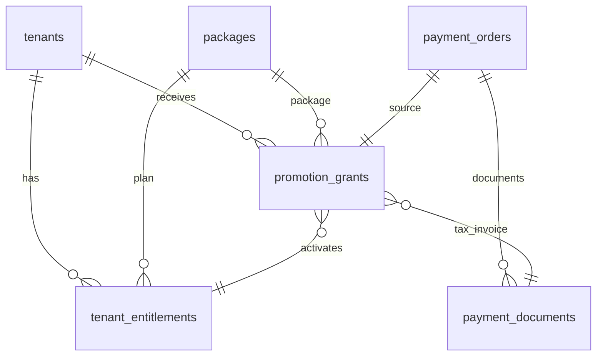

# DES-0046 — Admin Promotional Package Grant

**Sprint:** SPRINT-050 · **Release target:** v2.22.0  
**Feature:** [FEAT-0042](../01-features/FEAT-0042-admin-promotion-package-grant.md)  
**Tasks:** [TASK-0182](../04-tasks/TASK-0182.md), [TASK-0183](../04-tasks/TASK-0183.md),
[TASK-0184](../04-tasks/TASK-0184.md)  
**Depends on:** [08-packages-spec.md](08-packages-spec.md),
[14-buy-package-spec.md](14-buy-package-spec.md),
payment documents / tax invoice paths from Sprints 9–12

## 1. Goals

- Platform administrators can **grant a promotional quota package** to a tenant
  from admin web without ChillPay checkout.
- Every successful grant **must**:
  1. set the selected package as the tenant's **sole active plan/entitlement**, and
  2. **issue a tax invoice** for that tenant.
- Grant is **atomic**: plan + tax invoice succeed together or neither is left applied.
- Reuse existing catalog (`packages`), entitlement authority
  (`tenant_entitlements`), order + document model (`payment_orders`,
  `payment_documents`) — do not invent a parallel commerce store.

## 2. Non-goals (Sprint 50)

- Shared Cloud / Dedicated VM catalog redesign (SPRINT-051)
- Billing scheduler, dunning, proration
- Tenant self-serve promotional checkout
- Changing ChillPay paid fulfillment semantics
- Referral bonus-quota ledger changes (S46)
- Public product-web entitlement grants
- Automatic email delivery of tax invoices
- Hard-coded tax rates outside the existing VAT split helper / finance config

## 3. Problem with today's assign path

| Path | Active plan | Tax invoice |
| --- | --- | --- |
| Tenant checkout paid (S9) | yes | yes (receipt + tax; post-commit best-effort today) |
| `POST …/entitlement` admin assign | yes | **no** |
| **S50 promotion grant** | **yes (required)** | **yes (required, same TX)** |

Plain entitlement assign remains for non-commercial ops if needed, but the
**supported promotional grant** path always pairs plan + tax invoice.

## 4. Environment

No new required env vars. Uses existing Postgres `callcenter` schema, Redis
entitlement cache (`monti_jarvis:entitlement:{tenant_id}`), and seller branding /
tenant tax profile tables.

| Existing | Use |
| --- | --- |
| `platform_seller_branding` | Seller block on tax invoice |
| `tenant_tax_profiles` / registration / KYC | Buyer name, address, tax id |
| Entitlement cache TTL | Invalidate after grant |

## 5. Data model

### Reuse: `payment_orders` as promotion commercial source

Promotion grants create a **paid order** that is never sent to a payment
provider:

| Field | Promotion value |
| --- | --- |
| `status` | `paid` |
| `provider` | `promotion` |
| `payment_method` | `promotion` |
| `transaction_id` | empty or `promo_{grant_id}` |
| `payment_url` | empty |
| `paid_at` | grant time |
| `amount_cents` | default `0` (complimentary); optional override ≤ catalog list or explicit admin amount |
| `currency` | package currency (e.g. `764`) |
| `order_no` | unique short id, prefix `PR` (alphanumeric, ≤20 if shared ChillPay constraints matter for uniqueness only) |

### New: `promotion_grants` (audit ledger)

Migration: `scripts/migrations/033_promotion_grants.sql`

| Column | Type | Notes |
| --- | --- | --- |
| `id` | text PK | `pgr_` + id |
| `tenant_id` | text FK → tenants | |
| `package_id` | text FK → packages | |
| `order_id` | text FK → payment_orders | commercial document source |
| `entitlement_id` | text | active entitlement created by this grant |
| `tax_invoice_id` | text | issued `payment_documents.id` (`doc_type=tax_invoice`) |
| `reason` | text NOT NULL | required operator reason |
| `idempotency_key` | text | optional; unique per tenant when set |
| `valid_until` | timestamptz | optional plan end |
| `amount_cents` | int | amount used on order/invoice |
| `status` | text | `issued` \| `failed` (failed only if pre-commit) |
| audit | | `created_at`, `updated_at`, `created_by`, `updated_by` |

**Constraints:**

- Unique `(tenant_id, idempotency_key)` where `idempotency_key <> ''`
- Index `(tenant_id, created_at DESC)`
- Index `(order_id)` unique (one grant row per promotion order)

### Reuse: `tenant_entitlements`

- Revoke prior `status=active` for tenant
- Insert new row `status=active` with `rules_snapshot` from package
- Set `valid_until` when provided
- Entitlement id must be unique (use `ent_` + tenant + package + short id, same
  pattern as paid fulfillment)

### Reuse: `payment_documents`

- Insert **at least** `doc_type = tax_invoice`, `status = issued`
- Optional companion `receipt` when `amount_cents > 0` (parity with paid path);
  tax invoice remains **mandatory** even when amount is 0
- Buyer/seller fields from existing resolvers
- Doc number: `TAX-{order_no}` (suffix if reissue)



## 6. Grant algorithm (atomic)

Inside a single Postgres transaction:

1. Lock tenant existence; reject if missing.
2. Load package; require `status = active` (not archived).
3. If `idempotency_key` present and prior grant exists → return prior success
   payload (no second invoice).
4. Insert `payment_orders` as `paid` / `promotion`.
5. `UPDATE tenant_entitlements SET status='revoked'` for active rows.
6. `INSERT tenant_entitlements` active with rules snapshot + optional
   `valid_until`.
7. Resolve buyer/seller; insert `payment_documents` tax_invoice (`issued`).
8. Insert `promotion_grants` linking order, entitlement, tax invoice, reason.
9. Commit.
10. After commit: invalidate Redis entitlement cache for tenant; audit event
    if audit pipeline available (no secrets).

**Failure rules:**

- Any step 4–8 error → full rollback; no active plan change; no tax invoice.
- Do **not** follow paid checkout's "entitlement first, documents best-effort
  after commit" pattern for promotions — invoice is mandatory.

## 7. API summary

| Method | Path | Role | Description |
| --- | --- | --- | --- |
| `POST` | `/api/platform/tenants/{tenant_id}/promotion-grants` | `platform_admin` | Create grant (active plan + tax invoice) |
| `GET` | `/api/platform/tenants/{tenant_id}/promotion-grants` | `platform_admin` | List grants for tenant (newest first) |
| `GET` | `/api/platform/promotion-grants/{grant_id}` | `platform_admin` | Grant detail including invoice number |

Plain entitlement routes remain:

| Method | Path | Notes |
| --- | --- | --- |
| `POST` | `/api/platform/tenants/{tenant_id}/entitlement` | Assign only — **no invoice** (not the promo path) |

Full request/response: [04-api-spec.md](04-api-spec.md) § Sprint 50.

## 8. RBAC

| Action | platform_admin | tenant_admin | customer |
| --- | --- | --- | --- |
| Create promotion grant | yes | no | no |
| List grants for any tenant | yes | no | no |
| Read own entitlement | yes | yes (own) | no |
| Read own tax invoice (existing billing docs) | yes | yes (own tenant docs) | no |

## 9. Admin UX

Extend `/admin/tenants/[id]/entitlement` with a **Promotion grant** card:

- Package select (active only)
- Required reason
- Optional valid_until
- Optional amount (default 0)
- Confirm copy: “Sets active plan and issues tax invoice”
- Success: package name + tax invoice document number + link to receipts console

Wireframes: [05-ux-ui.md](05-ux-ui.md) § Sprint 50.

## 10. Error codes

| HTTP | Code | When |
| ---: | --- | --- |
| 400 | `INVALID_BODY` | missing package_id or reason |
| 400 | `PACKAGE_NOT_ACTIVE` | package archived/missing active |
| 404 | `TENANT_NOT_FOUND` | unknown tenant |
| 404 | `PACKAGE_NOT_FOUND` | unknown package |
| 403 | `FORBIDDEN` | non-platform admin |
| 409 | `IDEMPOTENCY_CONFLICT` | same key with different payload |
| 422 | `TAX_PROFILE_INCOMPLETE` | optional strict mode if finance requires buyer tax id (default: allow empty tax id with fallback buyer name) |
| 500 | `GRANT_FAILED` | unexpected store failure after validation |

Default buyer resolution matches paid path: fall back to tenant id / registration
name when tax profile is empty; do not block grant unless product later enables
strict tax mode.

## 11. Verification

```bash
# Schema
scripts/migrate.sh   # includes 033_promotion_grants.sql

# Tests
go test ./internal/store ./internal/entitlements ./cmd/server -count=1 \
  -run 'Promotion|Entitlement|TaxInvoice|PaymentDoc'

# Admin UI
cd apps/platform-admin-web && npm run check

# Manual
# 1. Admin opens /admin/tenants/{id}/entitlement
# 2. Grant promotion package with reason
# 3. Active plan shows new package
# 4. Tax invoice appears in receipts console for tenant
# 5. Retry with same idempotency_key returns same grant (no duplicate invoice)
```

## 12. Risks and mitigations

| Risk | Mitigation |
| --- | --- |
| Half-applied grant | Single transaction; tests force invoice insert failure |
| Duplicate invoices on retry | Idempotency key + unique issued doc per order type |
| Confusion with plain assign | Distinct API + UI “Promotion grant” |
| Zero-amount tax invoice | Allowed for complimentary promo; amount override supported |
| Entitlement cache stale | Invalidate after successful commit |

## 13. Out of scope handoff to S51

S51 commercial modes, scheduler, and catalog versioning must not break S50
promotion grants: grants continue to target catalog `packages` ids and
`payment_documents` tax invoices.

## See also

- Workflow §116–117
- ER Sprint 50
- API Sprint 50
- UX A50
- [FEAT-0042](../01-features/FEAT-0042-admin-promotion-package-grant.md)
- [SPRINT-050](../03-sprints/SPRINT-050.md)
