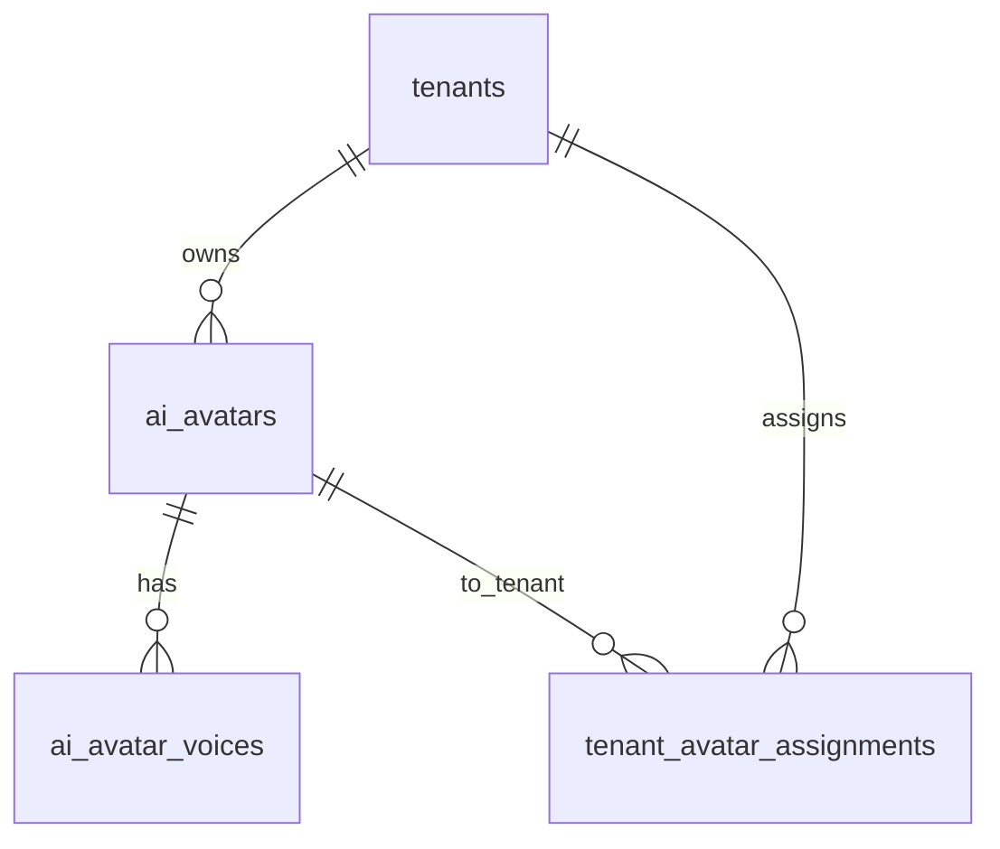

# DES-0047 — Tenant Avatar Create & Active Cap

**Sprint:** SPRINT-052 · **Release target:** v2.24.0  
**Feature:** [FEAT-0043](../01-features/FEAT-0043-tenant-avatar-create-active-cap.md)  
**Tasks:** [TASK-0185](../04-tasks/TASK-0185.md), [TASK-0186](../04-tasks/TASK-0186.md),
[TASK-0187](../04-tasks/TASK-0187.md)  
**Depends on:** [10-avatars-spec.md](10-avatars-spec.md),
[16-quota-rate-limit-spec.md](16-quota-rate-limit-spec.md)

## 1. Goals

- Tenant admins create and manage a **private avatar library**.
- **Create** is not limited by package avatar count.
- **Activate** is hard-capped by effective `max_ai_employees` (package + valid
  S46 bonus on `ai_employees`).
- Customer-facing workforce lists only **active** assignments.
- Reuse `ai_avatars`, `ai_avatar_voices`, `tenant_avatar_assignments` — no
  second workforce authority.

## 2. Non-goals

- HeyGen / third-party generation
- Marketplace / cross-tenant sharing of tenant-owned avatars
- Removing platform catalog or platform assign APIs
- Changing storage product economics beyond clarifying independence from
  avatar **count**
- S51 commercial plan redesign

## 3. Policy

| Action | Enforcement |
| --- | --- |
| Create library avatar | Auth + validation only; **no** `CheckAIEmployees` |
| Update metadata / portrait | Owner tenant only; storage byte quota may apply on upload |
| Activate | `CheckAIEmployees(active+1)`; assignment → `active` |
| Deactivate | Assignment → `disabled`; frees slot |
| Archive avatar | Soft-archive catalog row; must not stay workforce-active |

Effective active limit:

```text
limit = package.rules.max_ai_employees + valid_bonus(ai_employees)
active = COUNT(tenant_avatar_assignments WHERE tenant_id=? AND status='active')
activate allowed iff active < limit
```

Use existing `internal/quota.CheckAIEmployees` / bonus-aware path on activate
only (same as platform assign, without demo override for tenant self-service).

## 4. Data model

### Extend `ai_avatars`

Migration: `scripts/migrations/034_tenant_owned_avatars.sql` (+ `ensureAvatarsSchema`).

| Column | Type | Notes |
| --- | --- | --- |
| `owner_tenant_id` | text NULL FK → tenants | `NULL` = platform catalog; non-null = tenant-owned |
| (existing) | | slug, name, role, trait, color, image_url, greeting, status, flags, audit |

**Slug uniqueness:** keep global unique slug; tenant creates use
`t-{tenant_slug}-{short}` or `t{tenant_fp}-{name-slug}-{id8}` to avoid collision.

**Indexes:** `(owner_tenant_id)` where not null; existing PK/slug UK.

### `tenant_avatar_assignments` (unchanged shape)

| status | Meaning |
| --- | --- |
| `active` | Counts toward package cap; visible to workforce |
| `disabled` | Library only; not workforce |

Create flow:

1. Insert `ai_avatars` with `owner_tenant_id = tenant`, catalog `status=active`
   (or `draft` if preferred for unpublished metadata).
2. Upsert assignment `status=disabled` (library).
3. Optional voice row with default provider.

Activate: assignment `disabled` → `active` with cap check.  
Deactivate: `active` → `disabled`.

### MinIO

Portrait objects under existing tenant-safe prefix, e.g.
`avatars/{tenant_id}/{avatar_id}/…` (align with current asset patterns).
Bytes may count toward storage usage if upload pipeline already meters; do not
block **create without portrait** for storage reasons.



## 5. API summary

**Auth:** `tenant_admin` (or tenant admin JWT) for all `/api/tenant/avatars*`.

| Method | Path | Cap check | Description |
| --- | --- | --- | --- |
| `GET` | `/api/tenant/avatars` | no | Library + active flag + cap summary |
| `POST` | `/api/tenant/avatars` | **no** | Create library avatar (inactive) |
| `GET` | `/api/tenant/avatars/{id}` | no | Get if owned or assigned to tenant |
| `PUT` | `/api/tenant/avatars/{id}` | no | Update owned avatar metadata |
| `POST` | `/api/tenant/avatars/{id}/activate` | **yes** | Set assignment active |
| `POST` | `/api/tenant/avatars/{id}/deactivate` | no | Set assignment disabled |
| `DELETE` | `/api/tenant/avatars/{id}` | no | Archive owned avatar; force disable assignment |

Cap summary on list response:

```json
{
  "avatars": [ /* … */ ],
  "cap": {
    "active": 2,
    "limit": 5,
    "remaining": 3
  }
}
```

Platform routes remain for catalog and assign; platform list may filter
`owner_tenant_id IS NULL` for global catalog screens.

Full contract: [04-api-spec.md](04-api-spec.md) § Sprint 52.

## 6. RBAC

| Action | platform_admin | tenant_admin | customer |
| --- | --- | --- | --- |
| Create tenant avatar | optional support | yes (own) | no |
| Activate own avatar | yes (existing assign) | yes (own, capped) | no |
| List other tenant library | yes | no | no |
| Workforce select | n/a | n/a | active only |

## 7. Workforce integration

`GET /api/workforce` continues to resolve from **active**
`tenant_avatar_assignments` (+ existing static fallback if any). Tenant-owned
inactive rows never appear.

## 8. Error codes

| HTTP | Code | When |
| ---: | --- | --- |
| 400 | `INVALID_BODY` | missing name/slug |
| 403 | `FORBIDDEN` | wrong role / wrong tenant |
| 404 | `AVATAR_NOT_FOUND` | not owned / not assigned |
| 409 | `quota_exceeded` / max AI employees | activate at cap |
| 409 | `AVATAR_ARCHIVED` | activate archived |

## 9. Verification

```bash
# create beyond package limit of 2
curl -sS -X POST /api/tenant/avatars -d '{"name":"A1",...}'  # ok inactive
curl -sS -X POST /api/tenant/avatars -d '{"name":"A2",...}'
curl -sS -X POST /api/tenant/avatars -d '{"name":"A3",...}'
curl -sS -X POST /api/tenant/avatars/A1/activate  # ok
curl -sS -X POST /api/tenant/avatars/A2/activate  # ok if limit 2
curl -sS -X POST /api/tenant/avatars/A3/activate  # 409
curl -sS /api/workforce  # only A1,A2
```

## 10. See also

- Workflow §118–119
- ER Sprint 52
- API Sprint 52
- UX T52
- [SPRINT-052](../03-sprints/SPRINT-052.md)
