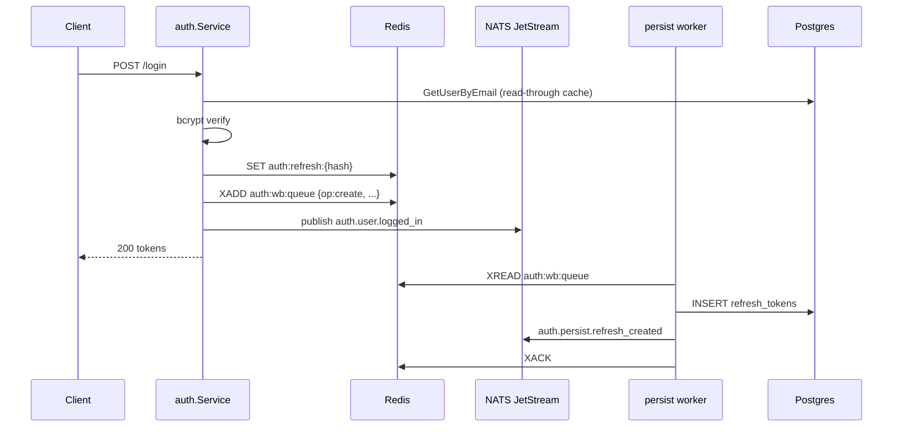

# Auth Cache & Events Specification

> **Status: REVIEW PENDING** — Do not implement until approved.

**Extends:** [auth-spec.md](auth-spec.md) (DES-0006)  
**Blueprint:** [monti_multi_tenant_ai_call_center_blueprint.md](../../monti_multi_tenant_ai_call_center_blueprint.md) §10 NATS, §12.2 Redis  
**Current baseline:** Sprint 3 auth — Postgres-only refresh tokens, synchronous store writes, NATS used only for `call.*` events.

## 1. Problem

Today auth is **correct but synchronous and Postgres-heavy**:

| Operation | Current path | Pain |
| --- | --- | --- |
| Login | Postgres user lookup + bcrypt + Postgres refresh insert | Every login hits DB twice |
| Refresh | Postgres refresh lookup + revoke + insert | Hot path on every token rotation |
| Logout | Postgres revoke UPDATE | Acceptable latency, no fan-out |
| `/api/auth/me` | Postgres user + roles | Repeated on every admin call |
| Audit | `created_by` / `updated_by` on rows only | No real-time security/ops stream |

Redis and NATS are already in the stack (calls use both) but **auth ignores them**. This spec adds:

1. **Read-through cache** (Redis) for hot auth reads  
2. **Write-behind** (Redis first → async Postgres) for refresh lifecycle  
3. **Event-driven** side effects (NATS publish → consumers) for audit, analytics, and future workers  

## 2. Goals

1. Cut Postgres round-trips on login, refresh, and `/me` under normal load.
2. Publish **durable auth lifecycle events** for audit, security monitoring, and Sprint 4+ (rate limits, entitlements).
3. Preserve **Sprint 3 contracts** — same HTTP API, JWT claims, RBAC matrix; `AUTH_DISABLED=true` unchanged.
4. **Degrade gracefully** when Redis or NATS is down (sync Postgres fallback).

## 3. Non-goals (this iteration)

- OAuth / SAML / MFA  
- Distributed session cluster across multiple Go replicas (single-process write-behind worker is OK for dev/small prod)  
- JWT denylist for access tokens (optional future; access TTL stays short at 15m)  
- Separate `identity-service` microservice — stays in `internal/auth` monolith  
- Customer login UI  

## 4. Architecture overview

```text
                    ┌─────────────────────────────────────────┐
 HTTP /api/auth/*   │  cmd/server + internal/auth             │
                    │  ┌─────────┐  ┌──────────┐  ┌─────────┐ │
                    │  │ Service │→ │ Cache    │→│ Events  │ │
                    │  │         │  │(Redis RT)│  │ (NATS)  │ │
                    │  └────┬────┘  └────┬─────┘  └────┬────┘ │
                    │       │ write-behind│             │       │
                    │       ▼            ▼             ▼       │
                    │  ┌─────────────────────────────────────┐ │
                    │  │ auth.persist worker (in-process)    │ │
                    │  │ drain Redis queue → Postgres        │ │
                    │  └─────────────────────────────────────┘ │
                    └──────────┬──────────────┬──────────────┘
                               │              │
                    ┌──────────▼──┐    ┌──────▼──────┐
                    │ Redis DB 4  │    │ NATS        │
                    │ monti_jarvis:│    │ Core +      │
                    │ auth:*      │    │ JetStream   │
                    └──────────┬──┘    └──────┬──────┘
                               │              │
                    ┌──────────▼──────────────▼──────────┐
                    │ Postgres callcenter.*               │
                    │ (source of truth, audit columns)    │
                    └─────────────────────────────────────┘
```

### 4.1 Pattern definitions

| Pattern | Where | Behavior |
| --- | --- | --- |
| **Read-through** | User profile, email→id, refresh validation | Read Redis → on miss load Postgres → populate cache with TTL |
| **Write-behind** | Refresh create/revoke, last_login_at (optional) | Write Redis immediately (request path) → enqueue persist job → worker writes Postgres |
| **Event-driven** | Login, logout, refresh, user disabled | Publish NATS event after successful mutation; consumers are async and idempotent |

Postgres remains **source of truth**. Redis is **recoverable** — cold start or flush triggers read-through repopulation.

## 5. Redis key design

Prefix: `monti_jarvis:` (existing `REDIS_PREFIX`). New namespace: `auth:`.

| Key | Type | TTL | Value | Read-through |
| --- | --- | --- | --- | --- |
| `auth:user:{user_id}` | JSON string | 15m (configurable) | `{id, email, display_name, role, tenant_id, status}` | `/me`, refresh user load, RBAC enrichment |
| `auth:user:email:{email_lower}` | string | 15m | `user_id` | Login email resolution |
| `auth:refresh:{token_hash}` | JSON string | = refresh TTL (7d) | `{id, user_id, expires_at, revoked}` | Refresh + logout validation |
| `auth:login:rl:{email_lower}` | string (counter) | 15m sliding | attempt count | Brute-force throttle (Sprint 4 ready) |
| `auth:wb:queue` | Redis Stream | — | persist jobs | Write-behind drain (see §7) |

**Never store:** plaintext refresh token, password hash, or JWT secret in Redis.

### 5.1 Cache invalidation

| Trigger | Keys deleted |
| --- | --- |
| `auth.user.disabled` (future admin) | `auth:user:{id}`, `auth:user:email:*` |
| Role / tenant change | `auth:user:{id}` |
| Logout / refresh rotate | old `auth:refresh:{hash}` |
| User profile update | `auth:user:{id}`, email index if changed |

Invalidation events consumed from NATS `auth.user.updated` (publisher: admin API, future sprint).

## 6. NATS subject design

### 6.1 Core NATS (ephemeral fan-out)

Fast pub/sub for in-process or same-cluster subscribers. Payload includes `event_id`, `tenant_id`, `user_id`, `at` (RFC3339).

| Subject | When | Consumers (initial) |
| --- | --- | --- |
| `auth.user.logged_in` | Successful login | In-process metrics log; future: ClickHouse `qa_events`, security SIEM |
| `auth.user.logged_out` | Logout with refresh revoke | Audit trail |
| `auth.token.refreshed` | Refresh rotation | Session analytics |
| `auth.token.revoked` | Explicit revoke (logout, rotation of old token) | Security monitoring |
| `auth.login.failed` | Bad credentials (no user enumeration in HTTP; event has reason code internally) | Rate-limit worker (Sprint 4) |

### 6.2 JetStream (durable, replayable)

Stream: `MONTI_AUTH`  
Subjects: `auth.>`  
Retention: `limits` — 7 days / 1GB (dev); production TBD  
Purpose: audit replay, new consumer catch-up, write-behind dead-letter

| Subject | Durable? | Notes |
| --- | --- | --- |
| `auth.persist.refresh_created` | Yes | Write-behind ack after Postgres insert |
| `auth.persist.refresh_revoked` | Yes | Write-behind ack after Postgres update |
| `auth.audit` | Yes | Unified audit envelope for all auth mutations |

### 6.3 Event envelope (all auth events)

```json
{
  "event_id": "evt_…",
  "event": "auth.user.logged_in",
  "tenant_id": "demo",
  "user_id": "usr_demo_admin",
  "email": "admin@demo.local",
  "role": "tenant_admin",
  "ip": "127.0.0.1",
  "user_agent": "curl/8.0",
  "at": "2026-07-07T12:00:00Z",
  "meta": {}
}
```

`ip` / `user_agent` from request context (new `internal/auth/httpctx` helper).

### 6.4 Tenant-scoped mirrors (optional, Phase 2)

```text
tenant.{tenant_id}.auth.user.logged_in
```

Publish **both** global and tenant-scoped when `tenant_id` is known. Platform admin (`tenant_id` empty) publishes global only.

## 7. Write-behind flow

### 7.1 Refresh token create (login / refresh)



**Request-path rule:** HTTP handler returns **after Redis SET succeeds**, not after Postgres. If Redis is down → **sync Postgres** (current behavior).

### 7.2 Refresh token revoke (logout / rotation)

1. `SET auth:refresh:{hash}` → `{revoked: true}` (or `DEL`)  
2. Enqueue `{op: revoke, token_hash, updated_by}`  
3. Worker: `UPDATE refresh_tokens SET revoked_at = now()`  
4. Publish `auth.token.revoked`  

**Rotation:** revoke old hash + create new hash in one logical transaction in Redis (Redis `MULTI`); two persist jobs.

### 7.3 Persist worker

| Property | Value |
| --- | --- |
| Location | `internal/auth/persist.go` — goroutine started from `main.go` when `AUTH_WRITE_BEHIND=true` |
| Input | Redis Stream `auth:wb:queue` **or** JetStream `auth.persist.*` (review pick one — recommend **Redis Stream** for simplicity in monolith) |
| Concurrency | 1 worker per process (dev); idempotent on `token_hash` UNIQUE |
| Failure | Retry 3× with backoff → dead-letter stream `auth:wb:dlq` + log warning |
| Health | `/api/infra` adds `auth_write_behind: ok\|lag\|disabled` |

### 7.4 Consistency window

| Scenario | Window | Mitigation |
| --- | --- | --- |
| Refresh valid in Redis, not yet in Postgres | ~100ms–2s | Acceptable; refresh reads Redis first |
| Postgres insert fails permanently | Until ops fix | DLQ alert; Redis entry expires at TTL |
| Multi-instance Go (future) | Duplicate workers | Idempotent UPSERT on `token_hash`; JetStream consumer groups |

## 8. Read-through flows

### 8.1 Login

```mermaid
sequenceDiagram
  participant API as auth.Service
  participant R as Redis
  participant PG as Postgres

  API->>R: GET auth:user:email:{email}
  alt cache hit user_id
    API->>R: GET auth:user:{id}
  else miss
    API->>PG: GetUserByEmail
    API->>R: SET auth:user:{id}, auth:user:email:{email}
  end
  API->>API: VerifyPassword (always from PG hash on first load; hash never cached)
```

**Password hash:** always loaded from Postgres on cache miss only; optionally store hash in cached user blob with **short TTL (60s)** and `AUTH_CACHE_PASSWORD_VERIFY=true` — **default false** for security review.

### 8.2 Refresh

1. `GET auth:refresh:{hash}` — if missing, read-through Postgres `GetRefreshToken`  
2. Validate `revoked` / `expires_at`  
3. Load user via `auth:user:{user_id}` read-through  
4. Rotate (write-behind §7)  

### 8.3 `/api/auth/me`

Read-through `auth:user:{user_id}` only — no Postgres on cache hit.

### 8.4 Middleware (optional Phase 2)

JWT parse stays local (no Redis). Optional `AUTH_CACHE_ENRICH=true` loads `auth:user:{sub}` to detect **disabled user** before handler runs (revocation faster than 15m access TTL).

## 9. HTTP API impact

**No breaking changes** to [api-spec.md](api-spec.md) auth section.

New **observability** only:

```json
// GET /api/infra (additions)
{
  "auth_cache": "ok",
  "auth_events": "ok",
  "auth_write_behind_lag": 0
}
```

## 10. Environment

| Variable | Default | Description |
| --- | --- | --- |
| `AUTH_CACHE_ENABLED` | `true` when `REDIS_URL` set | Read-through user + refresh |
| `AUTH_WRITE_BEHIND_ENABLED` | `true` when Redis + NATS set | Async Postgres persist for refresh |
| `AUTH_EVENTS_ENABLED` | `true` when `NATS_URL` set | Publish lifecycle events |
| `AUTH_USER_CACHE_TTL` | `15m` | Profile + email index |
| `AUTH_REFRESH_CACHE_TTL` | `168h` | Align with `JWT_REFRESH_TTL` |
| `AUTH_LOGIN_RATE_LIMIT` | `0` (off) | Max attempts per email per 15m; uses Redis counter |

When `AUTH_DISABLED=true`: all above ignored; v0.3.0 behavior.

## 11. Package layout (proposed)

```text
internal/auth/
  cache.go          Redis read-through get/set/invalidate
  events.go         NATS + JetStream publish
  persist.go        Write-behind worker (Redis Stream consumer)
  service.go        Orchestrate: cache → store fallback → events
internal/natsbus/
  auth_events.go    AuthEvent types + subject constants
internal/store/
  auth_cache.go     Thin Redis ops (or keep in auth/cache.go)
```

## 12. Degradation matrix

| Redis | NATS | Postgres | Behavior |
| --- | --- | --- | --- |
| ok | ok | ok | Full: read-through + write-behind + events |
| ok | down | ok | Read-through + **sync** Postgres writes; no events |
| down | ok | ok | Sync Postgres reads/writes; events still publish |
| down | down | ok | **Current Sprint 3** synchronous path |
| * | * | down | 503 on auth endpoints |

Login must **never** fail solely because NATS is down.

## 13. Security notes

- Refresh tokens: only **SHA-256 hash** in Redis and Postgres (unchanged).  
- Login failure events: internal reason codes; HTTP still generic `invalid credentials`.  
- Redis DB index **4** + prefix isolation (no Jarvis Chat leakage).  
- JetStream messages contain PII (`email`) — restrict stream access in production.  
- Write-behind DLQ must not expose token hashes in logs.  

## 14. Test plan (design)

| Layer | Tests |
| --- | --- |
| Unit | Cache hit/miss, invalidation, write-behind job serialization |
| Integration | Redis + Postgres: login → refresh before worker runs → still valid |
| Integration | Redis down → sync Postgres fallback |
| Integration | NATS down → login 200, no event |
| HTTP | `httptest` login/refresh/logout latency regression |
| Manual | `SPRINT-003-manual.md` + cache flush + re-login |

## 15. Implementation phases (for review)

| Phase | Scope | Points (est.) |
| --- | --- | --- |
| **A** | Redis read-through: user + `/me` + login email lookup | 3 |
| **B** | Redis refresh cache + read-through on refresh/logout | 3 |
| **C** | Write-behind worker + Redis Stream queue | 5 |
| **D** | NATS Core events (`logged_in`, `logged_out`, `refreshed`, `revoked`) | 3 |
| **E** | JetStream `MONTI_AUTH` + `auth.audit` durable stream | 3 |
| **F** | Login rate limit + cache invalidation hooks | 2 |

**Suggested sprint placement:** Phase A–D in **SPRINT-003** carry-over or **SPRINT-004** (Packages & entitlements) — PM to decide.

## 16. Resolved decisions (2026-07-07)

| # | Decision |
| --- | --- |
| 1 | **Redis Stream** for write-behind queue (`auth:wb:queue`) |
| 2 | **Cached hash verify** allowed; strip `password_hash` from cache immediately after verify |
| 3 | **`jti` + Redis denylist** on access tokens now; deny on logout/refresh when Bearer present |
| 4 | **JetStream enabled** on `monti-nats` (`-js`); stream `MONTI_AUTH` / `auth.>` |
| 5 | **ClickHouse `auth_events`** table — ingest on publish this sprint |
| 6 | **SPRINT-003** implementation scope |

---

## Approver sign-off

| Role | Name | Date | Approved |
| --- | --- | --- | --- |
| PM | user | 2026-07-07 | ☑ |
| Dev | user | 2026-07-07 | ☑ |
| DevOps | user | 2026-07-07 | ☑ |

**Status:** Implemented in Sprint 3 (Phases A–E).