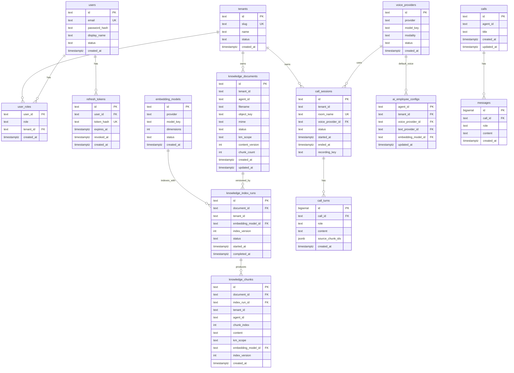
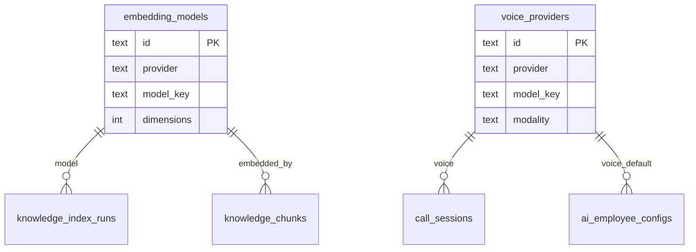
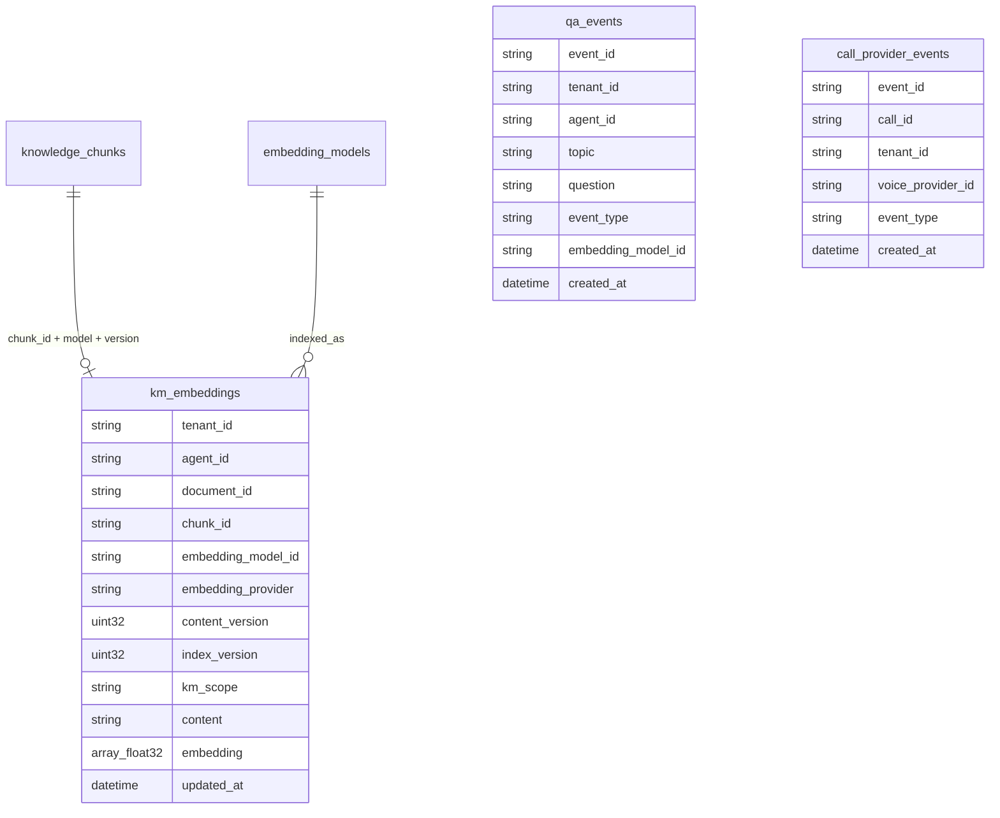

# ER Diagram — Monti Jarvis

Database `monti_jarvis`, Postgres schema `callcenter`. ClickHouse database `monti_jarvis` for vectors/analytics.

## Postgres (`callcenter`)



### Table notes

| Table | Purpose |
| --- | --- |
| `calls` | Legacy chat session ids from `/api/chat` |
| `messages` | Text chat transcript pairs (caller/agent) |
| `call_sessions` | Voice call sessions; `voice_provider_id` for Gemini/Grok switch *(planned)* |
| `call_turns` | Voice/text turns per call session |
| `knowledge_documents` | KM upload metadata; `content_version` bumps on file replace |
| `knowledge_index_runs` | One embed/index pass per document + **embedding model** + `index_version` *(planned)* |
| `knowledge_chunks` | Chunk text; FK to `index_run_id` and `embedding_model_id` |
| `embedding_models` | Catalog: `gemini-embedding-001`, future models; drives vector compatibility |
| `voice_providers` | Catalog: Gemini Live, Grok Voice, etc. — switchable per agent/tenant |
| `ai_employee_configs` | Per-agent binding of voice, text, and embedding providers *(Sprint 21)* |
| `tenants` | SaaS tenant registry *(Sprint 3)* |
| `users` | Login identities *(Sprint 3)* |
| `user_roles` | RBAC role per user/tenant *(Sprint 3)* |
| `refresh_tokens` | Hashed refresh tokens *(Sprint 3)* |

### Indexes

- `knowledge_documents (tenant_id, agent_id)`
- `knowledge_chunks (tenant_id, agent_id, embedding_model_id, index_version)`
- `knowledge_index_runs (document_id, embedding_model_id, index_version)`
- `call_sessions (tenant_id, voice_provider_id)` *(planned)*

### KM versioning model (planned)

Two version axes keep provider switches safe:

| Field | Layer | Bumps when |
| --- | --- | --- |
| `content_version` | Postgres `knowledge_documents` | Operator uploads/replaces source file |
| `index_version` | `knowledge_index_runs` + chunks + ClickHouse | Re-embed with same or new **embedding model** |

Search and RAG **must** filter on `(tenant_id, embedding_model_id, index_version)` so vectors from `gemini-embedding-001` are never compared to queries from `grok-embed` or another model.

## Provider catalog (Postgres — planned)



Example seed rows:

| `id` | `provider` | `model_key` | Role |
| --- | --- | --- | --- |
| `emb-gemini-001` | `google` | `gemini-embedding-001` | KM embed + query |
| `voice-gemini-live` | `google` | `gemini-2.5-flash-native-audio-latest` | Voice relay |
| `voice-grok` | `xai` | `grok-voice-*` | Future voice failover |

Tenant/agent config (`ai_employee_configs`) points at active `voice_provider_id` and `embedding_model_id`. Switching voice provider does **not** invalidate KM index; switching **embedding model** requires a new `index_version` and re-embed.

## ClickHouse (`monti_jarvis`)



### ClickHouse notes

| Column | Purpose |
| --- | --- |
| `embedding_model_id` | FK to Postgres catalog; **required** on search filter |
| `embedding_provider` | Denormalized vendor (`google`, `xai`) for analytics |
| `content_version` | Matches Postgres document content generation |
| `index_version` | Matches `knowledge_index_runs`; invalidate old vectors on re-index |
| `chunk_id` | Join key to Postgres `knowledge_chunks.id` |

**Search rule:** `WHERE tenant_id = ? AND agent_id = ? AND embedding_model_id = ? AND index_version = active AND km_scope IN (?)` — never mix models in cosine ranking.

**Sprint 2 today:** `km_embeddings` uses `km_version` as a single field; migration path renames/splits into `content_version` + `index_version` + `embedding_model_id` (default `emb-gemini-001` for existing rows).

## Cross-store relationships

```text
Postgres knowledge_chunks.id  ──►  ClickHouse km_embeddings.chunk_id
Postgres embedding_models.id  ──►  km_embeddings.embedding_model_id
Postgres voice_providers.id   ──►  call_sessions.voice_provider_id
Postgres index_run.id         ──►  knowledge_chunks.index_run_id
```

Voice path (Gemini → Grok failover) updates `call_sessions.voice_provider_id` and logs `call_provider_events`; KM vectors stay tied to **embedding model**, not voice provider.

## MinIO (object keys)

```
monti-jarvis/
  calls/                    # future recordings
  km/{tenant_id}/{agent_id}/{doc_id}/original/{filename}
```

## Redis (ephemeral)

| Key pattern | TTL | Fields |
| --- | --- | --- |
| `monti_jarvis:call:{session_id}` | 24h | agent_id, updated_at (legacy chat) |
| `monti_jarvis:call:active:{id}` | 24h | tenant_id, room_name, status, started_at |

## Workforce (in-memory, not DB)

Agents `ava`, `max`, `luna`, `neo` defined in `internal/workforce/workforce.go` — Sprint 21 will move to Postgres catalog.

## Implementation phases

| Phase | KM / provider scope |
| --- | --- |
| **v0.3.0 (shipped)** | Single embed model env var; `km_version` column; Gemini voice only |
| **Sprint 3–4** | Provider catalog tables stub; default `emb-gemini-001` / `voice-gemini-live` seeds |
| **Sprint 15** | Tenant selects embedding model; re-index workflow bumps `index_version` |
| **Sprint 21** | `ai_employee_configs` binds voice + embed providers per avatar |
| **Failover** | Runtime voice provider switch via `voice_providers`; KM unchanged until embed model changes |

## Future entities (roadmap)

| Sprint | Tables |
| --- | --- |
| 4+ | `packages`, `entitlements` |
| 6+ | `tenant_registrations`, `brands` |
| 15 | `km_scope_assignments`, tenant-driven re-index |
| 21 | `ai_employees`, `ai_employee_configs` (full catalog) |
| 22 | `conversation_records` (ClickHouse denorm) |

See [architecture.md](architecture.md) · blueprint §15.3 Embedding Provider · §16.4 KM domains.