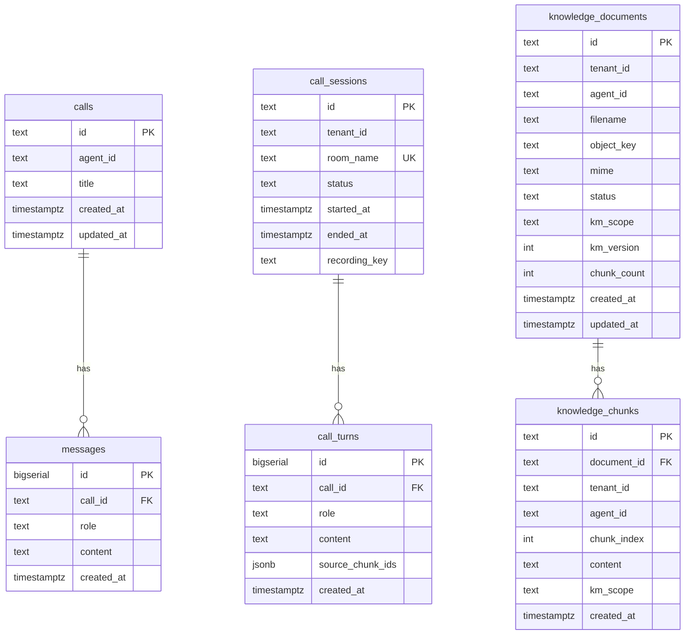
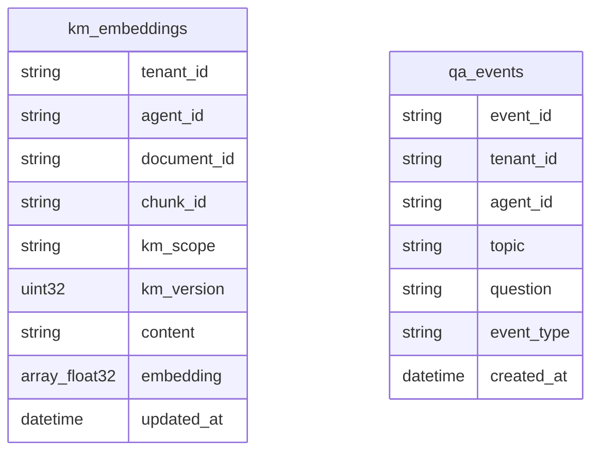

# ER Diagram — Monti Jarvis

Database `monti_jarvis`, Postgres schema `callcenter`. ClickHouse database `monti_jarvis` for vectors/analytics.

## Postgres (`callcenter`)



### Table notes

| Table | Purpose |
| --- | --- |
| `calls` | Legacy chat session ids from `/api/chat` |
| `messages` | Text chat transcript pairs (caller/agent) |
| `call_sessions` | Sprint 1 voice call sessions + tenant |
| `call_turns` | Voice/text turns per call session |
| `knowledge_documents` | KM upload metadata per agent |
| `knowledge_chunks` | Chunk text; links to ClickHouse `chunk_id` |

### Indexes

- `knowledge_documents (tenant_id, agent_id)`
- `knowledge_chunks (tenant_id, agent_id)`

## ClickHouse (`monti_jarvis`)



Vectors are keyed by `(tenant_id, agent_id, document_id, chunk_id)`. Search filters `km_scope` per topic/agent rules in `internal/scope`.

## MinIO (object keys)

```
monti-jarvis/
  calls/                    # future recordings
  km/{tenant_id}/{agent_id}/{doc_id}/original/{filename}
```

## Redis (ephemeral)

| Key pattern | TTL | Fields |
| --- | --- | --- |
| `monti_jarvis:call:{session_id}` | 24h | agent_id, updated_at (legacy chat) |
| `monti_jarvis:call:active:{id}` | 24h | tenant_id, room_name, status, started_at |

## Workforce (in-memory, not DB)

Agents `ava`, `max`, `luna`, `neo` defined in `internal/workforce/workforce.go` — Sprint 21 will move to Postgres catalog.

## Future entities (roadmap)

| Sprint | Tables |
| --- | --- |
| 3 Auth | `users`, `sessions`, `tenant_users` |
| 6+ | `tenants`, `brands`, `packages` |
| 15 | `km_scope_assignments` (tenant admin) |
| 22 | `conversation_records` (ClickHouse denorm) |

See [architecture.md](architecture.md).