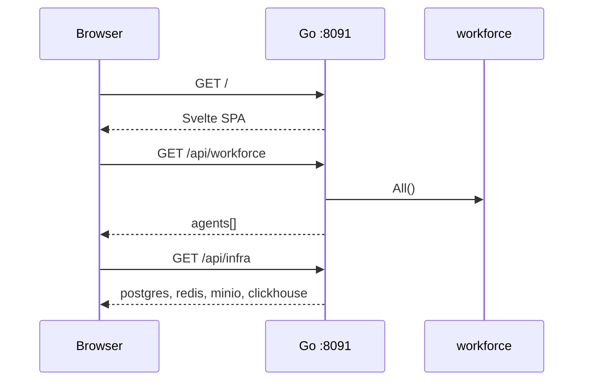
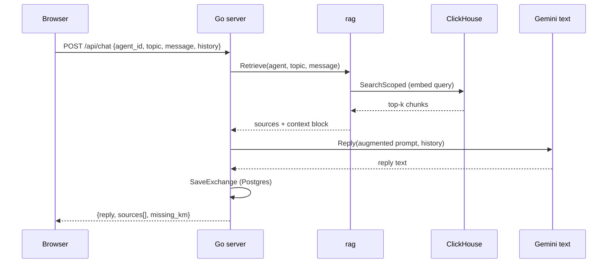
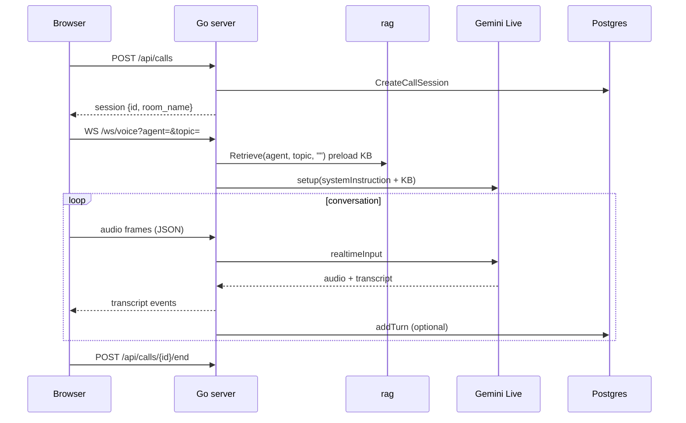
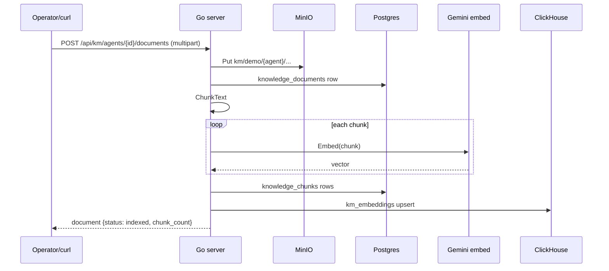
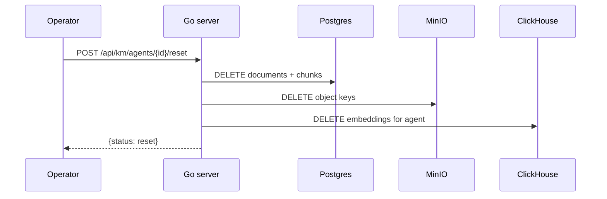
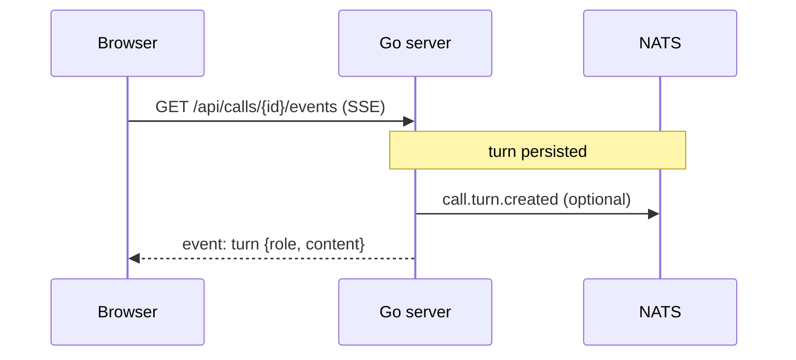

# Workflows — Monti Jarvis

## 1. Portal load

## 2. Text chat (with RAG)

## 3. Voice call

## 4. KM ingest (per avatar)

## 5. KM reset (per avatar)

## 6. Call events (SSE)

## State: call session

| Status | Meaning |
| --- | --- |
| `active` | Call in progress; Redis key `monti_jarvis:call:active:{id}` |
| `ended` | `ended_at` set; Redis key removed |

## State: knowledge document

| Status | Meaning |
| --- | --- |
| `uploaded` | MinIO object stored |
| `indexing` | Chunk + embed in progress |
| `indexed` | Postgres + ClickHouse ready |
| `failed` | Embed or index error |

See [api-spec.md](api-spec.md) and [ux-ui.md](ux-ui.md).